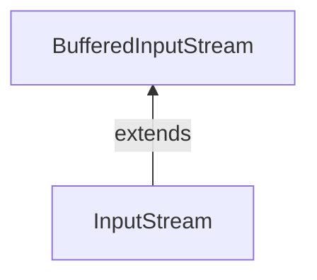

#Java #InputStream  #BufferedInputStream
### Класс BufferedeInputStream ###

2023-12-0112:48

Класс BufferedInputStream пакета java.io используется с другими входными потоками для более эффективного чтения данных (в байтах). Он расширяет абстрактный класс [InputStream](InputStream).

#### Работа BufferedInputStream ####

BufferedInputStream поддерживает внутренний буфер объемом 8192 байта. Во время операции чтения в BufferedInputStream фрагмент байтов считывается с диска и сохраняется во внутреннем буфере. И из внутреннего буфера байты считываются по отдельности. Следовательно, количество обращений к диску уменьшается. Вот почему чтение байтов происходит быстрее с использованием BufferedInputStream.
```java
// Creates a FileInputStream
FileInputStream file = new FileInputStream(String path);
// Creates a BufferedInputStream
BufferedInputStream buffer = new BufferInputStream(file);
```
В приведенном выше примере мы создали BufferdInputStream с именем buffer. Здесь размер внутреннего буфера по умолчанию равен 8192 байтам. Однако мы также можем указать размер внутреннего буфера.
```java
// Creates a BufferedInputStream with specified size internal buffer
BufferedInputStream buffer = new BufferInputStream(file, int size);
```
Буфер поможет быстрее считывать байты из файлов.
#### Методы BufferedInputStream ####

Класс BufferedInputStream предоставляет реализации для различных методов, присутствующих в классе InputStream.
##### Метод read() #####
- read() - считывает один байт из входного потока 
- read(byte[] arr) - считывает байты из потока и сохраняет в указанном массиве 
- read(byte[] arr, int start, int length) - считывает количество байт, равное length, из потока и сохраняет в указанном массиве. Массив, начинающийся с позиции start.

Предположим, у нас есть файл с именем input.txt со следующим содержимым:
```java
This is a line of text inside the file.
```
Давайте попробуем прочитать файл с помощью BufferedInputStream.
```java
import java.io.FileInputStream;

class Main {
    public static void main(String[] args) {
        try {
            // Creates a FileInputStream
            FileInputStream file = new FileInputStream("input.txt");
            // Creates a BufferedInputStream
            BufferedInputStream input = new BufferedInputStream(file);
            // Reads first byte from file
            int i = input .read();
            while (i != -1) {
                System.out.print((char) i);
                // Reads next byte from the file
                i = input.read();
            }
            input.close();
        }
        catch (Exception e) {
            e.getStackTrace();
        }
    }
}
```
Вывод:
<p style="background-color: navy; color: yellow">This is a line of text inside the file.</p>

В приведенном выше примере мы создали буферизованный входной поток с именем buffer вместе с [FileInputStream](FileInputStream). Входной поток связан с файлом input.txt.

```java
FileInputStream file = new FileInputStream("input.txt");
BufferedInputStream buffer = new BufferedInputStream(file);
```
Здесь мы использовали метод read() для считывания массива байтов из внутреннего буфера буферизованного считывателя.
##### Метод available() ####

Чтобы получить количество доступных байт во входном потоке, мы можем использовать метод available(). Например:
```java
import java.io.FileInputStream;
import java.io.BufferedInputStream;

public class Main {

   public static void main(String args[]) {
      try {
         // Suppose, the input.txt file contains the following text
         // This is a line of text inside the file.
         FileInputStream file = new FileInputStream("input.txt");
         // Creates a BufferedInputStream
         BufferedInputStream buffer = new BufferedInputStream(file);
         // Returns the available number of bytes
         System.out.println("Available bytes at the beginning: " + buffer.available());
         // Reads bytes from the file
         buffer.read();
         buffer.read();
         buffer.read();
         // Returns the available number of bytes
         System.out.println("Available bytes at the end: " + buffer.available());
         buffer.close();
      }
      catch (Exception e) {
         e.getStackTrace();
      }
   }
}
```
Вывод:
<p style="background-color: navy; color: yellow">Available bytes at the beginning: 39<br>
Available bytes at the end: 36</p>

В приведенном выше примере: 
1. Сначала мы используем метод available(), чтобы проверить количество доступных байтов во входном потоке. 
2. Затем мы использовали метод read() 3 раза, чтобы прочитать 3 байта из входного потока. 
3. Теперь, после считывания байтов, мы снова проверили доступные байты. На этот раз количество доступных байт уменьшилось на 3.

##### Метод skip() #####

Чтобы отбросить и пропустить указанное количество байт, мы можем использовать метод skip(). Например:
```java
import java.io.FileInputStream;
import java.io.BufferedInputStream;

public class Main {
   public static void main(String args[]) {
      try {
         // Suppose, the input.txt file contains the following text
         // This is a line of text inside the file.
         FileInputStream file = new FileInputStream("input.txt");
         // Creates a BufferedInputStream
         BufferedInputStream buffer = new BufferedInputStream(file);
         // Skips the 5 bytes
         buffer.skip(5);
         System.out.println("Input stream after skipping 5 bytes:");
         // Reads the first byte from input stream
         int i = buffer.read();
         while (i != -1) {
            System.out.print((char) i);
            // Reads next byte from the input stream
            i = buffer.read();
         }
         // Closes the input stream
         buffer.close();
      }
      catch (Exception e) {
         e.getStackTrace();
      }
   }
}
```
Вывод:
<p style="background-color: navy; color: yellow">Input stream after skipping 5 bytes: is a line of text inside the file.</p>
В приведенном выше примере мы использовали метод skip(), чтобы пропустить 5 байт из потока ввода файла. Следовательно, байты 'T', 'h', 'i', 's' и ' ' пропущены из потока ввода.
##### Метод close() #####

Чтобы закрыть буферизованный входной поток, мы можем использовать метод close(). После вызова метода close() мы не можем использовать входной поток для чтения данных.