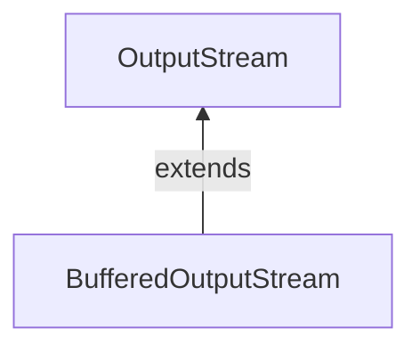

#Java #BufferedOutStream
### Класс BufferedOutStream ###

2023-11-29 16:46

Класс BufferedOutputStream пакета java.io используется с другими выходными потоками для более эффективной записи данных (в байтах). Он расширяет абстрактный класс [OutputStream](OutputStream).

#### Работа BufferedOutputStream ####

BufferedOutputStream поддерживает внутренний буфер объемом 8192 байта. Во время операции записи байты записываются во внутренний буфер, а не на диск. Как только буфер заполняется или поток закрывается, весь буфер записывается на диск. Следовательно, количество обращений к диску уменьшается. Вот почему запись байтов выполняется быстрее с использованием BufferedOutputStream.

Чтобы создать BufferedOutputStream, мы должны сначала импортировать пакет java.io.BufferedOutputStream.
```java
// Creates a FileOutputStream
FileOutputStream file = new FileOutputStream(String path);

// Creates a BufferedOutputStream
BufferedOutputStream buffer = new BufferOutputStream(file);
```
В приведенном выше примере мы создали BufferdOutputStream с именем buffer и [FileOutputStream](FileOutputStream) с именем file. Здесь размер внутреннего буфера по умолчанию равен 8192 байтам. Однако мы также можем указать размер внутреннего буфера.

Буфер поможет быстрее записывать байты в файлы.

#### Методы класса BufferedOutputStream ####

Класс BufferedOutputStream предоставляет различные реализации методов класса [OutputStream](OutputStream).
##### Метод write() #####
- write() - записывает один байт во внутренний буфер выходного потока 
-  write(массив байт[]) - записывает байты из указанного массива в выходной поток
-  write(байт[] arr, int start, int length) - записывает количество байт, равное length, в выходной поток поток из массива, начинающийся с позиции start
```java
import java.io.FileOutputStream;
import java.io.BufferedOutputStream;

public class Main {
    public static void main(String[] args) {
        String data = "This is a line of text inside the file";
        try {
            // Creates a FileOutputStream
            FileOutputStream file = new FileOutputStream("output.txt");
            // Creates a BufferedOutputStream
            BufferedOutputStream output = new BufferedOutputStream(file);
            byte[] array = data.getBytes();
            // Writes data to the output stream
            output.write(array);
            output.close();
        }
        catch (Exception e) {
            e.getStackTrace();
        }
    }
}
```
в приведенном выше примере мы создали буферизованный выходной поток с именем output вместе с [FileOutputStream](FileOutputStream). Выходной поток связан с файлом output.txt.
```java
FileOutputStream file = new FileOutputStream("output.txt");
BufferedOutputStream output = new BufferedOutputStream(file);
```
Чтобы записать данные в файл, мы использовали метод write(). Здесь, когда мы запускаем программу, файл output.txt заполняется следующим содержимым:
<p style="background-color: navy; color: yellow">This is a line of text inside the file.</p>
>Примечание: Метод getBytes(), используемый в программе, преобразует строку в массив байтов.
#### Метод flush() ####

Чтобы очистить внутренний буфер, мы можем использовать метод flush(). Этот метод заставляет выходной поток записывать все данные, присутствующие в буфере, в целевой файл. Например:
```java
import java.io.FileOutputStream;
import java.io.BufferedOutputStream;

public class Main {
    public static void main(String[] args) {
        String data = "This is a demo of the flush method";
        try {
            // Creates a FileOutputStream
            FileOutputStream file = new FileOutputStream(" flush.txt");
            // Creates a BufferedOutputStream
            BufferedOutputStream buffer = new BufferedOutputStream(file);
            // Writes data to the output stream
            buffer.write(data.getBytes());
            // Flushes data to the destination
            buffer.flush();
            System.out.println("Data is flushed to the file.");
            buffer.close();
        }
        catch(Exception e) {
            e.getStackTrace();
        }
    }
}
```
Когда мы запускаем программу, файл flush.txt заполняется текстом, представленным строковыми данными.
#### Метод close() ####

Чтобы закрыть буферизованный выходной поток, мы можем использовать метод close(). Как только метод вызван, мы не можем использовать выходной поток для записи данных.