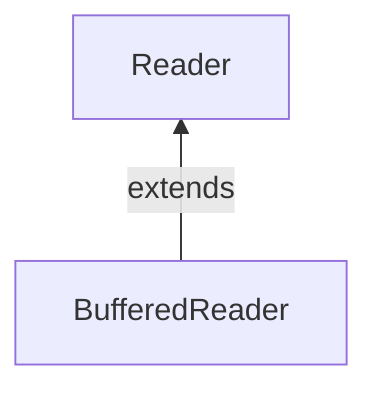

#Java #BufferedReader 

2023-09-07 10:25

Класс BufferedReader java.io пакета может быть использован с другими reader для более эффективного считывания данных (в символах). Он расширяет абстрактный класс [Reader](Reader).

Считывает текст из потока ввода символов, буферизуя символы таким образом, чтобы обеспечить эффективное чтение символов, массивов и строк. Размер буфера может быть указан или может использоваться размер по умолчанию. Значение по умолчанию достаточно велико для большинства целей. В общем случае каждый запрос на чтение, выполняемый средством чтения, вызывает выполнение соответствующего запроса на чтение базового символьного или байтового потока. Поэтому рекомендуется обернуть  BufferedReader вокруг любого устройства чтения, операции read() которого могут быть дорогостоящими, например [FileReader](FileReader) и [InputStreamReader](InputStreamReader). Программы, использующие [DataInputStream](DataInputStream) для текстового ввода, могут быть локализованы путем замены каждого [DataInputStream](DataInputStream) соответствующим **BufferedReader**.

### **Конструкторы класса BufferedReader**

|Конструктор|Действие|
|---|---|
|BufferedReader (Reader in)|Создает буферизующий поток ввода символов, который использует входной буфер размера по умолчанию|
|BufferedReader (Reader in, int sz)|Создает буферизующий поток ввода символов, который использует входной буфер указанного размера.|

### **Методы класса BufferedReader**

|Имя метода|Действие|
|---|---|
|[close()](https://translated.turbopages.org/proxy_u/en-ru.ru.f627e4fc-64f83b21-4c7afbb3-74722d776562/https/www.geeksforgeeks.org/bufferedreader-close-method-in-java-with-examples/#:~:text=The%20close()%20method%20of,associated%20with%20the%20stream%20operations.&text=Parameters%3A%20This%20method%20does%20not,does%20not%20return%20any%20value.)|Закрывает поток и освобождает все связанные с ним системные ресурсы.Как только поток будет закрыт, дальнейшие вызовы read(), ready(), mark(), reset() или skip() вызовут исключение IOException. Закрытие ранее закрытого потока не имеет никакого эффекта.|
|[mark()](https://translated.turbopages.org/proxy_u/en-ru.ru.f627e4fc-64f83b21-4c7afbb3-74722d776562/https/www.geeksforgeeks.org/bufferedreader-mark-method-in-java-with-examples/)|Отмечает текущую позицию в потоке. Последующие вызовы reset() будут пытаться переместить поток в эту точку.|
|[markSupported()](https://translated.turbopages.org/proxy_u/en-ru.ru.f627e4fc-64f83b21-4c7afbb3-74722d776562/https/www.geeksforgeeks.org/bufferedreader-marksupported-method-in-java-with-examples/)|Сообщает, поддерживает ли этот поток операцию mark(), которую он выполняет.|
|read()|Считывает один символ.|
|read(char[] array)|считывает символы из ридера и сохраняет в указанном массиве|
|read(char[] cbuf, int off, int len)|Считывает символы в часть массива. Этот метод реализует общий контракт соответствующего метода чтения класса Reader. В качестве дополнительного удобства он пытается прочитать как можно больше символов, многократно вызывая метод read базового потока.|
|[readLine()](https://translated.turbopages.org/proxy_u/en-ru.ru.f627e4fc-64f83b21-4c7afbb3-74722d776562/https/www.geeksforgeeks.org/bufferedreader-readline-method-in-java-with-examples/)|Считывает строку текста. Считается, что строка завершается любым из перевода строки (‘\n’), возврата каретки (‘\r’) или возврата каретки, за которым сразу следует перевод строки.|
|[ready ()](https://translated.turbopages.org/proxy_u/en-ru.ru.f627e4fc-64f83b21-4c7afbb3-74722d776562/https/www.geeksforgeeks.org/bufferedreader-ready-method-in-java-with-examples/)|Сообщает, готов ли этот поток к чтению.|
|[reset()](https://translated.turbopages.org/proxy_u/en-ru.ru.f627e4fc-64f83b21-4c7afbb3-74722d776562/https/www.geeksforgeeks.org/bufferedreader-reset-method-in-java-with-examples/)|Сбрасывает поток до самой последней отметки.|
|[skip(long)](https://translated.turbopages.org/proxy_u/en-ru.ru.f627e4fc-64f83b21-4c7afbb3-74722d776562/https/www.geeksforgeeks.org/bufferedreader-skiplong-method-in-java-with-examples/)|Пропускает символы.|

**Реализация:** Содержимое внутри файла выглядит следующим образом:
<p style="background-color: navy; color: yellow">This is first line<br>
this is second line</p>
**Пример**

```java
import java.io.BufferedReader;
import java.io.FileReader;
import java.io.IOException;
  

class GFG {
    public static void main(String[] args)
        throws IOException
    {
        FileReader fr = new FileReader("file.txt");
        BufferedReader br = new BufferedReader(fr); 
        char c[] = new char[20];
        // Illustrating markSupported() method
        if (br.markSupported()) {
            System.out.println("mark() method is supported");
            // Illustrating mark method
            br.mark(100);
        }
        // Skipping 8 characters
        br.skip(8);  
        // Illustrating ready() method
        if (br.ready()) {
            // Illustrating readLine() method
            System.out.println(br.readLine());
            // Illustrating read(char c[],int off,int len)
            br.read(c);
            for (int i = 0; i < 20; i++) {
                System.out.print(c[i]);
            }
            System.out.println();
            // Illustrating reset() method
            br.reset();
            for (int i = 0; i < 8; i++) {
                // Illustrating read() method
                System.out.print((char)br.read());
            }
        }
    }
}
```
**Вывод:**
<p style="background-color: navy; color: yellow">mark() method is supported<br>
first line<br>
this is second line<br>
This is</p>

Чтобы отбросить и пропустить указанное количество символов, мы можем использовать метод skip(). Например,
```java
import java.io.FileReader;
import java.io.BufferedReader;

public class Main {
  public static void main(String args[]) {
    // Creates an array of characters
    char[] array = new char[100];
    
    try {
      // Suppose, the input.txt file contains the following text
      // This is a line of text inside the file.
      FileReader file = new FileReader("input.txt");
      // Creates a BufferedReader
      BufferedReader input = new BufferedReader(file);
      // Skips the 5 characters
      input.skip(5);
      // Reads the characters
      input.read(array);
      System.out.println("Data after skipping 5 characters:");
      System.out.println(array);
      // closes the reader
      input.close();
    }
    catch (Exception e) {
      e.getStackTrace();
    }
  }
}
```
Вывод
<p style="background-color: navy; color:yellow">Data after skipping 5 characters:<br>
is a line of text inside the file.</p>
В приведенном выше примере мы использовали этот skip() метод для пропуска 5 символов из средства чтения файлов. Следовательно, символы `'T'`, `'h'`, `'i'`, `'s'`и `' '`пропускаются из исходного файла.