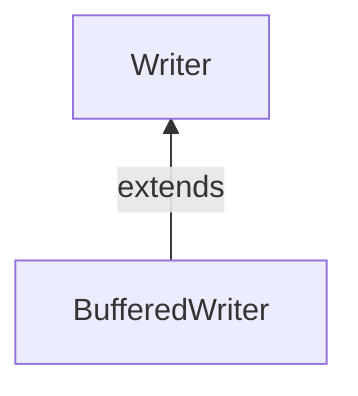

#Java #BufferedWriter

### Класс BufferedWriter ###

2023-12-08 10:45

Класс BufferedWriter пакета  java.io может быть использован с другими writer , чтобы более эффективно записывать данные (в символах). Он расширяет абстрактный класс [Writer](Writer).

BufferedWriter поддерживает внутренний **буфер 8192 символов** .

Во время операции записи символы записываются во внутренний буфер, а не на диск. После заполнения буфера или закрытия записывающего устройства все символы в буфере записываются на диск.

Следовательно, количество обращений к диску сокращается. Вот почему написание символов выполняется быстрее BufferedWriter.

Чтобы создать файл BufferedWriter, мы должны  сначала импортировать пакет java.io.BufferedWriter
```java
	// Creates a FileWriter
	FileWriter file = new FileWriter(String name); 
	// Creates a BufferedWriter 
	BufferedWriter buffer = new BufferedWriter(file);` 
```
В приведенном выше примере мы создали BufferedWriter именованный буфер с указанным FileWriter файлом.

Здесь внутренний буфер `BufferedWriter`имеет размер по умолчанию 8192 символа. Однако мы также можем указать размер внутреннего буфера.
```java
	// Creates a BufferedWriter with specified size internal buffer 
	BufferedWriter buffer = new BufferedWriter(file, int size);
```
Буфер поможет более эффективно записывать символы в файлы..
#### Методы BufferedWriter ####

Класс BufferedWriter обеспечивает реализации для различных методов , присутствующих в [Writer](Writer).
##### write () Метод #####

- `write()` - записывает один символ во внутренний буфер writer
- `write(char() array)` - записывает символы из указанного массива в writer
- `write(String data)` - записывает указанную строку в writer

Пример: BufferedWriter для записи данных в файл
```java
import java.io.FileWriter;
import java.io.BufferedWriter;

public class Main {
  public static void main(String args[]) {
    String data = "This is the data in the output file";
    try {
      // Creates a FileWriter
      FileWriter file = new FileWriter("output.txt");
      // Creates a BufferedWriter
      BufferedWriter output = new BufferedWriter(file);
      // Writes the string to the file
      output.write(data);
      // Closes the writer
      output.close();
    }
    catch (Exception e) {
      e.getStackTrace();
    }
  }
}
```
В приведенном выше примере мы создали буферный writer с именем output вместе с [FileWriter](FileWriter). Буферизованный писатель связан с файлом **output.txt** .
```java
	FileWriter file = new FileWriter("output.txt"); 
	BufferedWriter output = new BufferedWriter(file);
```
Для записи данных в файл мы использовали write() метод.

Здесь, когда мы запускаем программу, файл **output.txt** заполняется следующим содержимым:
<p style="color: yellow">This is a line of text inside the file.</p>
##### Метод flush () #####

Чтобы очистить внутренний буфер, мы можем использовать `flush()`метод. Этот метод заставляет модуль записи записывать все данные, имеющиеся в буфере, в целевой файл.

Например, предположим, что у нас есть пустой файл с именем **output.txt** .
```java
import java.io.FileWriter;
import java.io.BufferedWriter;

public class Main {
  public static void main(String[] args) {
    String data = "This is a demo of the flush method";
    try {
      // Creates a FileWriter
      FileWriter file = new FileWriter(" flush.txt");
      // Creates a BufferedWriter
      BufferedWriter output = new BufferedWriter(file);
      // Writes data to the file
      output.write(data);
      // Flushes data to the destination
      output.flush();
      System.out.println("Data is flushed to the file.");
      output.close();
    }
```
Вывод
<p style="background-color: navy; color: yellow">Data is flushed to the file.</p>
##### Метод close ()  #####

Чтобы закрыть буферизованный writer, мы можем использовать close() метод. После вызова close() метода мы не можем использовать средство записи для записи данных.

##### Другие методы BufferedWriter #####

|Метод|Описание|
|---|---|
|`newLine()`|вставляет новую строку в writer|
|`append()`|вставляет указанный символ в текущий writer|

