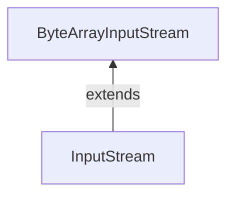

#Java #ByteArrayInputStream
### Класс ByteArrayInputStream ###

2023-12-04 16:26

Класс ByteArrayInputStream пакета java.io может использоваться для чтения массива входных данных (в байтах). Он расширяет абстрактный класс [InputStream](InputStream).

>**Примечание:** В ByteArrayInputStream входной поток создается с использованием массива байтов. Он включает внутренний массив для хранения данных этого конкретного массива байтов.

```java
// Creates a ByteArrayInputStream that reads entire array
ByteArrayInputStream input = new ByteArrayInputStream(byte[] arr);
```
Здесь мы создали входной поток, который считывает все данные из массива arr. Однако мы также можем создать входной поток, который считывает только некоторые данные из массива.
```java
// Creates a ByteArrayInputStream that reads a portion of array
ByteArrayInputStream input = new ByteArrayInputStream(byte[] arr, int start, int length)
```
Здесь входной поток считывает количество байт, равное length, из массива, начиная с позиции start.
#### Методы ByteArrayInputStream ####

##### Метод read() #####

- read() - считывает один байт из массива, присутствующего во входном потоке 
- read(массив байт[]) - считывает байты из входного потока и сохраняет в указанном массиве 
- read(массив байт[], int start, int length) - считывает количество байт, равное length из входного потока поток и сохраняет в указанном массиве, начиная с позиции start
```java
import java.io.ByteArrayInputStream;

public class Main {
  public static void main(String[] args) {

    // Creates an array of byte
    byte[] array = {1, 2, 3, 4};

    try {
      ByteArrayInputStream input = new ByteArrayInputStream(array);
      System.out.print("The bytes read from the input stream: ");
      for(int i= 0; i < array.length; i++) {
        // Reads the bytes
        int data = input.read();
        System.out.print(data + ", ");
      }
      input.close();
    }
    catch(Exception e) {
      e.getStackTrace();
    }
  }
}
```
Вывод
<p style="background-color: navy; color: yellow">The bytes read from the input stream: 1, 2, 3, 4,</p>
В приведенном выше примере мы создали входной поток массива байтов с именем input.
```java
ByteArrayInputStream input = new ByteArrayInputStream(array);
```
Здесь входной поток включает в себя все данные из указанного массива. Чтобы прочитать данные из входного потока, мы использовали метод read().
##### Метод available() #####

Чтобы получить количество доступных байт во входном потоке, мы можем использовать метод available(). Например,
```java
import java.io.ByteArrayInputStream;

public class Main {

  public static void main(String args[]) {

    // Creates an array of bytes
    byte[] array = { 1, 2, 3, 4 };

    try {
      ByteArrayInputStream input = new ByteArrayInputStream(array);

      // Returns the available number of bytes
      System.out.println("Available bytes at the beginning: " + input.available());

      // Reads 2 bytes from the input stream
      input.read();
      input.read();

      // Returns the available number of bytes
      System.out.println("Available bytes at the end: " + input.available());

      input.close();
    }

    catch (Exception e) {
      e.getStackTrace();
    }
  }
}
```
Вывод
<p style="background-color: navy; color: yellow">Available bytes at the beginning: 4<br>
Available bytes at the end: 2</p>
В приведенном выше примере, 
- Мы использовали метод available() для проверки количества доступных байтов во входном потоке. 
- Затем мы использовали метод read() 2 раза, чтобы прочитать 2 байта из входного потока. 
- Теперь, после считывания 2 байтов, мы проверили доступные байты. На этот раз количество доступных байт уменьшилось на 2.
##### Метод skip() #####

Чтобы отбросить и пропустить указанное количество байт, мы можем использовать метод skip(). Например,
```java
import java.io.ByteArrayInputStream;

public class Main {

  public static void main(String args[]) {
    // Create an array of bytes
    byte[] array = { 1, 2, 3, 4 };
    try {
      ByteArrayInputStream input = new ByteArrayInputStream(array);
      // Using the skip() method
      input.skip(2);
      System.out.print("Input stream after skipping 2 bytes: ");
      int data = input.read();
      while (data != -1) {
        System.out.print(data + ", ");
        data = input.read();
      }
      // close() method
      input.close();
    }
    catch (Exception e) {
      e.getStackTrace();
    }
  }
}
```
Вывод
<p style="background-color: navy; color: yellow">Input stream after skipping 2 bytes: 3, 4,</p>
В приведенном выше примере мы использовали метод skip(), чтобы пропустить 2 байта данных из входного потока. Следовательно, 1 и 2 не считываются из входного потока.
##### Метод close() #####

Чтобы закрыть входной поток, мы можем использовать метод close(). Однако метод close() не имеет никакого эффекта в классе ByteArrayInputStream. Мы можем использовать методы этого класса даже после вызова метода close().
##### Другие методы класса ByteArrayInputStream #####

|Methods|Descriptions|
|---|---|
|`finalize()`|гарантирует вызов метода close()|
|`mark()`|отмечает позицию во входном потоке, до которой были считаны данные|
|`reset()`|возвращает элемент управления в точку во входном потоке, где была установлена метка|
|`markSupported()`|проверяет, поддерживает ли входной поток функции `mark()` и `reset()`|
