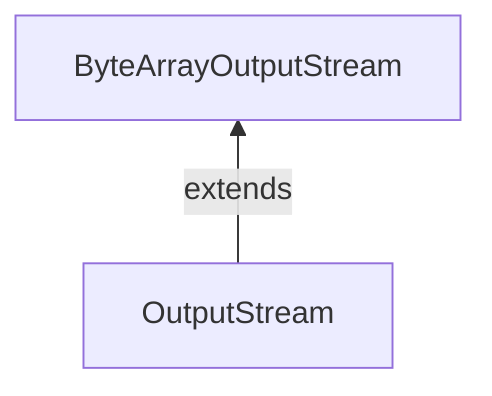

#Java #ByteArrayOutputStream
### Класс ByteArrayOutputStream ###

2023-12-04 16:26

Класс ByteArrayOutputStream пакета java.io может использоваться для записи массива выходных данных (в байтах). Он расширяет абстрактный класс [OutputStream](OutputStream).

>**Примечание:** В ByteArrayOutputStream поддерживается внутренний массив байтов для хранения данных.

```java
// Creates a ByteArrayOutputStream with default size
ByteArrayOutputStream out = new ByteArrayOutputStream();
```
Здесь мы создали выходной поток, который будет записывать данные в массив байтов размером по умолчанию 32 байта. Однако мы можем изменить размер массива по умолчанию.
```java
// Creating a ByteArrayOutputStream with specified size
ByteArrayOutputStream out = new ByteArrayOutputStream(int size);
```
Здесь size определяет длину массива.
#### Методы ByteArrayOutputStream ####

##### Метод write() #####

- wrie(int byte) - записывает указанный байт в выходной поток 
- write(byte[] array) - записывает байты из указанного массива в выходной поток 
- write(byte[] arr, int start, int length) - записывает количество байт, равное length, в выходной поток из массив, начинающийся с позиции start 
- writeTo(ByteArrayOutputStream out1) - записывает все данные текущего выходного потока в указанный выходной поток
```java
import java.io.ByteArrayOutputStream;

class Main {
  public static void main(String[] args) {
    String data = "This is a line of text inside the string.";
    try {
      // Creates an output stream
      ByteArrayOutputStream out = new ByteArrayOutputStream();
      byte[] array = data.getBytes();
      // Writes data to the output stream
      out.write(array);
      // Retrieves data from the output stream in string format
      String streamData = out.toString();
      System.out.println("Output stream: " + streamData);
      out.close();
    }
    catch(Exception e) {
      e.getStackTrace();
    }
  }
}
```
Вывод
<p style="background-color: navy; color: yellow">Output stream: This is a line of text inside the string.</p>
в приведенном выше примере мы создали выходной поток массива байтов с именем output.
```java
ByteArrayOutputStream output = new ByteArrayOutputStream();
```
Чтобы записать данные в выходной поток, мы использовали метод write().

>Примечание: Метод getBytes(), используемый в программе, преобразует строку в массив байтов.

##### Доступ к данным из ByteArrayOutputStream #####

- toByteArray() - возвращает массив, присутствующий внутри выходного потока 
- toString() - возвращает все данные выходного потока в виде строки

```java
import java.io.ByteArrayOutputStream;

class Main {
  public static void main(String[] args) {
    String data = "This is data.";

    try {
      // Creates an output stream
      ByteArrayOutputStream out = new ByteArrayOutputStream();
      // Writes data to the output stream
      out.write(data.getBytes());
      // Returns an array of bytes
      byte[] byteData = out.toByteArray();
      System.out.print("Data using toByteArray(): ");
      for(int i=0; i<byteData.length; i++) {
        System.out.print((char)byteData[i]);
      }
      // Returns a string
      String stringData = out.toString();
      System.out.println("\nData using toString(): " + stringData);
      out.close();
    }
    catch(Exception e) {
      e.getStackTrace();
    }
  }
}
```
Вывод
<p style="background-color: navy; color: yellow">Data using toByteArray(): This is data.<br>
Data using toString(): This is data.</p>
В приведенном выше примере мы создали массив байтов для хранения данных, возвращаемых методом toByteArray(). 

Затем мы использовали цикл for для доступа к каждому байту из массива. Здесь каждый байт преобразуется в соответствующий символ с помощью приведения типов.
##### Метод close() #####

Чтобы закрыть выходной поток, мы можем использовать метод close(). Однако метод close() не имеет никакого эффекта в классе ByteArrayOutputStream. 

Мы можем использовать методы этого класса даже после вызова метода close().
##### Другие методы класса ByteArrayOutputStream #####

|Методы| Описания|
|---|---|
|size()|возвращает размер массива в выходном потоке|
|flush()|очищает выходной поток|

