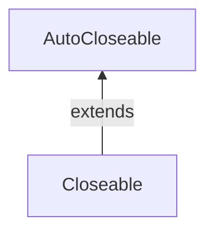

#Java #Closeable
### Closeable интерфейс в Java

2024-01-22 12:45

Closeable - это источник или назначение данных, которые необходимо закрыть. Метод close() вызывается, когда нам нужно освободить ресурсы, которые удерживаются объектами, такими как открытые файлы. Это один из важных интерфейсов для потоковых классов. Closeable интерфейс был представлен в JDK 5 и определен в java.io. Начиная с JDK 7+, мы должны использовать AutoCloseable интерфейс. Closeable интерфейс - это более старый интерфейс, который был введен для сохранения обратной совместимости.


Интерфейс Closeable расширяет интерфейс AutoCloseable, поэтому любой класс, реализующий Closeable, также реализует AutoCloseable.
```java
public interface Closeable extends AutoCloseable 
{
    public void close() throws IOException;
}
```

Реализация Closeable интерфейса
```java
import java.io.Closeable;
import java.io.IOException;

public class MyCustomCloseableClass implements Closeable {

    @Override
    public void close() throws IOException {
        // close resource
        System.out.println("Closing");
    }
}
```
Метод close() вызывается для освобождения ресурсов, удерживаемых объектом. Если поток закрыт, то вызов метода close не имеет никаких последствий.

Ограничения интерфейса Closeable Closeable генерирует только исключение [IOException](Exceptions), и его нельзя изменить, не нарушив устаревший код. Поэтому был введен AutoCloseable, поскольку он может генерировать исключение.

#### Методы Closeable интерфейса

close() - закрывает этот поток и освобождает все системные ресурсы, связанные с ним.

#### Подинтерфейсы Closeable:

- AsynchronousByteChannel
- AsynchronousChannel
- ByteChannel
- Channel
- ImageInputStream
- ImageOutputStream
- MulticastChannel

#### Implementing Classes: 

- AbstractSelectableChannel
- AbstractSelector
- BufferedReader
- BufferedWriter
- BufferedInputStream
- BufferedOutputStream
- CheckedInputStream
- CheckedOutputStream

Closeable и AutoCloseable:
- Closeable был введен с JDK 5, тогда как AutoCloseable был введен с JDK 7+. 
- Closeable расширяет AutoCloseable, а Closeable в основном предназначен для потоков ввода-вывода.
- Closeable расширяет исключение [IOException](Exceptions), тогда как AutoCloseable расширяет [Exception](Exceptions).
- Интерфейс Closeable является идемпотентным (вызов метода close() более одного раза не имеет никаких побочных эффектов), тогда как AutoCloseable не предоставляет этой функции. 
- AutoCloseable был специально введен для работы с инструкциями try-with-resources. Поскольку Closeable реализует AutoCloseable, следовательно, любой класс, реализующий Closeable, также реализует интерфейс AutoCloseable и может использовать try-with resources для закрытия файлов.

#### Использование блока try-with с Closeable

Поскольку Closeable наследует свойства интерфейса AutoCloseable, следовательно, класс, реализующий Closeable, также может использовать блок [try-with-resources](try-with-resources). Внутри блока try-with-resources можно использовать несколько ресурсов, и все они будут автоматически закрыты. В этом случае ресурсы будут закрыты в порядке, обратном тому, в котором они были созданы внутри квадратных скобок.
```java
// Java program to illustrate 
// Automatic Resource Management 
// in Java with multiple resource 
  
import java.io.*; 
class Resource { 
    public static void main(String s[]) { 
        // note the order of opening the resources 
        try (Demo d = new Demo(); Demo1 d1 = new Demo1()) { 
            int x = 10 / 0; 
            d.show(); 
            d1.show1(); 
        } 
        catch (ArithmeticException e) { 
            System.out.println(e); 
        } 
    } 
} 
  
// custom resource 1 
class Demo implements Closeable { 
    void show() { System.out.println("inside show"); } 
    public void close() 
    { 
        System.out.println("close from demo"); 
    } 
} 
  
// custom resource 2 
class Demo1 implements Closeable { 
    void show1() { System.out.println("inside show1"); } 
    public void close() 
    { 
        System.out.println("close from demo1"); 
    } 
}
```
Вывод:
<p style="background-color: navy; color: yellow">
close from demo1<br>
close from demo<br>
java.lang.ArithmeticException: / by zero</p>
