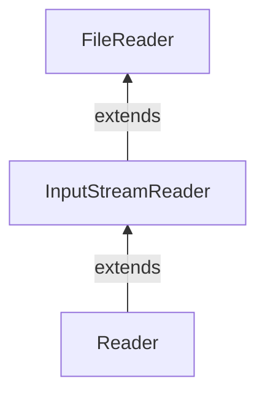

#Java #FileReader
### Класс FileReader ###

2023-12-06 15:53

Класс FileReader из пакета java.io может использоваться для чтения данных (в символах) из файлов. Он расширяет класс [InputSreamReader](InputStreamReader). FileReader расширяет классы [InputStreamReader](InputStreamReader) и [Reader](Reader).


Чтобы создать программу чтения файлов, мы должны сначала импортировать пакет java.io.FileReader.
```java
FileReader input = new FileReader(String name);
```
Здесь мы создали программу чтения файлов, которая будет связана с файлом, указанным по имени.
```java
FileReader input = new FileReader(File fileObj);
```
Здесь мы создали средство чтения файлов, которое будет связано с файлом, указанным объектом файла. В приведенном выше примере данные в файле хранятся с использованием некоторой кодировки символов по умолчанию. Однако, начиная с Java 11, мы также можем указать тип кодировки символов (UTF-8 или UTF-16) в файле.
```java
FileReader input = new FileReader(String file, Charset cs);
```
Здесь мы использовали класс Charset для указания кодировки символов средства чтения файлов.
#### Методы FileReader ####

Класс FileReader предоставляет реализации для различных методов, присутствующих в классе Reader.

##### Метод read() #####

- read() - считывает один символ из reader
- read(char[] array) - считывает символы из reader и сохраняет в указанном массиве 
- read(char[] array, int start, int length) - считывает количество символов, равное length, из reader и сохраняет в указанном массиве, начинающийся с позиции start

Например, предположим, что у нас есть файл с именем input.txt со следующим содержимым.
<p style="color: yellow">This is a line of text inside the file.</p>
Давайте попробуем прочитать файл с помощью FileReader.
```java
import java.io.FileReader;

class Main {
  public static void main(String[] args) {
    // Creates an array of character
    char[] array = new char[100];
    try {
      // Creates a reader using the FileReader
      FileReader input = new FileReader("input.txt");
      // Reads characters
      input.read(array);
      System.out.println("Data in the file: ");
      System.out.println(array);
      // Closes the reader
      input.close();
    }
    catch(Exception e) {
      e.getStackTrace();
    }
  }
}
```
Вывод
<p style="background-color: navy; color: yellow">Data in the file:<br>
This is a line of text inside the file.</p>
В приведенном выше примере мы создали средство чтения файлов с именем input. Средство чтения файлов связано с файлом input.txt.
```java
FileInputStream input = new FileInputStream("input.txt");
```
Чтобы прочитать данные из файла, мы использовали метод read(). 

>Примечание: Файл input.txt должен присутствовать в текущем рабочем каталоге.

##### Метод getEncoding() #####

Метод GetEncoding() можно использовать для получения типа кодировки, который используется для хранения данных в файле. Например,
```java
import java.io.FileReader;
import java.nio.charset.Charset;

class Main {
  public static void main(String[] args) {
    try {
      // Creates a FileReader with default encoding
      FileReader input1 = new FileReader("input.txt");
      // Creates a FileReader specifying the encoding
      FileReader input2 = new FileReader("input.txt", Charset.forName("UTF8"));
      // Returns the character encoding of the file reader
      System.out.println("Character encoding of input1: " + input1.getEncoding());
      System.out.println("Character encoding of input2: " + input2.getEncoding());
      // Closes the reader
      input1.close();
      input2.close();
    }
    catch(Exception e) {
      e.getStackTrace();
    }
  }
}
```
Вывод
<p style="background-color: navy; color: yellow">The character encoding of input1: Cp1252<br>
The character encoding of input2: UTF8</p>
В приведенном выше примере мы создали 2 reader чтения файлов с именами input1 и input2. 
- input1 не указывает кодировку символов. Следовательно, метод GetEncoding() возвращает кодировку символов по умолчанию. 
- input2 указывает кодировку символов UTF8. Следовательно, метод GetEncoding() возвращает указанную кодировку символов.

##### Метод close() #####

Чтобы закрыть reader, мы можем использовать метод close(). После вызова метода close() мы не можем использовать reader для чтения данных.