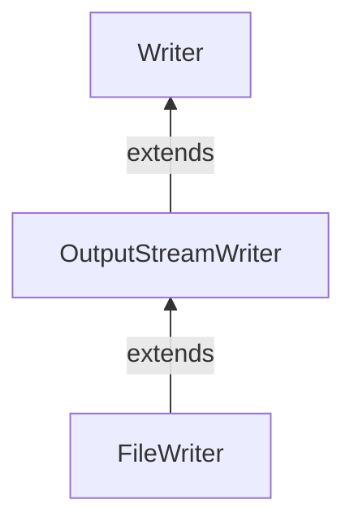

#Java #FileWriter
### Класс FileWriter ###

2023-12-07 16:50

Класс FileWriter  пакета  java.io может использоваться для записи данных (в символах) в файл.
Это расширяет [OutputStreamWriter](OutputStreamWriter) класс.

Чтобы создать writer, мы должны сначала импортировать пакет Java.io.FileWriter.
```java
 FileWriter output = new FileWriter(String name);
```
Здесь мы создали средство записи файлов, которое будет связано с файлом, указанным по имени.
```java
 FileWriter input = new FileWriter(File fileObj);
```
Здесь мы создали средство записи файла, которое будет связано с файлом, указанным объектом файла.

В приведенном выше примере данные хранятся с использованием кодировки символов по умолчанию. Однако, начиная с Java 11, мы также можем указать тип кодировки символов ( **UTF8** или **UTF16** ).
```java
 FileWriter input = new FileWriter(String file, Charset cs);
```
Здесь мы использовали `Charset`класс, чтобы указать кодировку символов средства записи файла.
#### Методы FileWriter ####

Класс FileWriter обеспечивает реализации для различных методов представления в [Writer](Writer)классе.
##### Метод write () #####

- `write()` - пишет один символ в writer
- `write(char() array)` - записывает символы из указанного массива в writer
- `write(String data)` - записывает указанную строку в writer

 Пример: FileWriter для записи данных в файл
 ```java
import java.io.FileWriter;

public class Main {
  public static void main(String args[]) {
    String data = "This is the data in the output file";
    try {
      // Creates a FileWriter
      FileWriter output = new FileWriter("output.txt");
      // Writes the string to the file
      output.write(data);
      // Closes the writer
      output.close();
    }
    catch (Exception e) {
      e.getStackTrace();
    }
  }
}
```
В приведенном выше примере мы создали writer с именем output. writer связан с файлом **output.txt** .
```java
 FileWriter output = new FileWriter("output.txt");
```
Для записи данных в файл мы использовали write()метод.

Когда мы запускаем программу, файл **output.txt** заполняется следующим содержимым.
<p style="color: yellow">This is a line of text inside the file.</p>
##### Метод getEncoding () #####

Метод getEncoding() может быть использован , чтобы получить тип кодирования, используемый для записи данных. Например,
```java
import java.io.FileWriter;
import java.nio.charset.Charset;

class Main {
  public static void main(String[] args) {
    String file = "output.txt";
    try {
      // Creates a FileReader with default encoding
      FileWriter output1 = new FileWriter(file);
      // Creates a FileReader specifying the encoding
      FileWriter output2 = new FileWriter(file, Charset.forName("UTF8"));
      // Returns the character encoding of the reader
      System.out.println("Character encoding of output1: " + output1.getEncoding());
      System.out.println("Character encoding of output2: " + output2.getEncoding());
      // Closes the reader
      output1.close();
      output2.close();
    }
    catch(Exception e) {
      e.getStackTrace();
    }
  }
}
```
**Вывод**
<p style="background-color:navy; color: yellow">Кодировка символов вывода1: Cp1252<br> Кодировка символов вывода2: UTF8 </p>
В приведенном выше примере мы создали 2 модуля writer с именами output1 и output2.
- output1 не указывает кодировку символов. Следовательно, `getEncoding()`метод возвращает кодировку символов по умолчанию.
- output2 указывает кодировку символов **UTF8** . Следовательно, `getEncoding()`метод возвращает указанную кодировку символов.

>**Примечание** . Мы использовали этот Charset.forName() метод, чтобы указать тип кодировки символов. 

##### Метод close () #####

Чтобы закрыть writer, мы можем использовать close() метод. После вызова close() метода мы не можем использовать средство записи для записи данных.

##### Другие методы FileWriter #####

|Метод|Описание|
|---|---|
|`flush()`|заставляет записать все данные, имеющиеся в writer, в соответствующее место назначения|
|`append()`|вставляет указанный символ в текущий writer|
