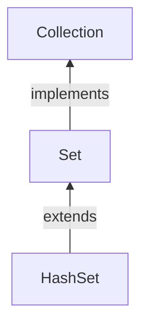

#Java #Collection #HashSet

## Класс Java HashSet

2024-04-09 10:03

Класс `HashSet` реализует интерфейс `Set`, основан на хэш-таблице, а также поддерживается с помощью экземпляра `HashMap`. В `HashSet` элементы не упорядочены, нет никаких гарантий, что элементы будут в том же порядке спустя какое-то время. Операции добавления, удаления и поиска будут выполняться за константное время при условии, что хэш-функция правильно распределяет элементы по «корзинам».


Чтобы создать хэш-набор, мы должны сначала импортировать `java.util.HashSet` пакет. 
Несколько важных пунктов о `HashSet`:

- Т.к. класс реализует интерфейс [Set](Set), он может хранить только уникальные значения;
- Может хранить NULL – значения;
- Порядок добавления элементов вычисляется с помощью хэш-кода;
- `HashSet` также реализует интерфейсы [Serializable](Serializable) и [Cloneable](Cloneable).

```java
// HashSet with 8 capacity and 0.75 load factor
HashSet<Integer> numbers = new HashSet<>(8, 0.75);
```
Здесь мы создали хэш-набор с именем `numbers`.

Обратите внимание, часть новая `HashSet<>(8, 0.75)`. Здесь первым параметром является **емкость**, а вторым параметром является **loadFactor**.
- **Емкость** - емкость этого хэш-набора равна 8. Это означает, что он может хранить 8 элементов.
- **loadFactor** - коэффициент загрузки этого хэш-набора равен 0.75. Это означает, что всякий раз, когда наш хэш-набор заполняется на 75%, элементы перемещаются в новую хэш-таблицу вдвое большего размера, чем исходная хэш-таблица.

Для поддержания постоянного времени выполнения операций время, затрачиваемое на действия с `HashSet`, должно быть прямо пропорционально количеству элементов в `HashSet` + «емкость» встроенного экземпляра [_HashMap_](HashMap) (количество «корзин»). Поэтому для поддержания производительности очень важно не устанавливать слишком высокую начальную ёмкость (или слишком низкий коэффициент загрузки).

**Конструкторы HashSet:**
1. **HashSet h = new HashSet();** — конструктор по умолчанию. Начальная емкость по умолчанию – 16, коэффициент загрузки – 0,75.
2. **HashSet h = new HashSet(int initialCapacity)** – конструктор с заданной начальной емкостью. Коэффициент загрузки – 0,75.
3. **HashSet h = new HashSet(int initialCapacity, float loadFactor);** — конструктор с заданными начальной емкостью и коэффициентом загрузки.
4. **HashSet h = new HashSet(Collection C)** – конструктор, добавляющий элементы из другой коллекции.

В Java `HashSet` обычно используется, если нам приходится обращаться к элементам случайным образом. Это потому, что доступ к элементам в хэш-таблице осуществляется с использованием хэш-кодов.

Хэш-код элемента - это уникальный идентификатор, который помогает идентифицировать элемент в хэш-таблице.

`HashSet` не может содержать повторяющихся элементов. Следовательно, каждый элемент хэш-набора имеет уникальный хэш-код.

>==Важно==: `HashSet` не является структурой данных с встроенной синхронизацией, поэтому если с ним работают одновременно несколько потоков, и как минимум один из них пытается внести изменения, необходимо обеспечить синхронизированный доступ извне. Часто это делается за счет другого синхронизируемого объекта, инкапсулирующего `HashSet`. Если такого объекта нет, то лучше всего подойдет метод `Collections.synchronizedSet()`. На данный момент это лучшее средство для предотвращения несинхронизированных операций с `HashSet`.

```java
Set s = Collections.synchronizedSet(new HashSet(...));
```

### Методы HashSet

Методы HashSet:
- boolean add(E e): добавляет элемент в HashSet, если таковой отсутствует, если же такой элемент уже присутствует, метод возвращает false.
- void clear(): удаляет все элементы из множества.
- boolean contains(Object o): Возвращает true, если данный элемент присутствует в множестве.
- boolean remove(Object o): удаляет данный элемент из множества, если таковой присутствует.
- Iterator iterator(): возвращает [итератор](Iterator) для элементов множества.
- boolean isEmpty(): возвращает true, если в множестве нет элементов.
- Object clone(): выполняет поверхностное клонирование HashSet.

#### Вставка элементов в HashSet

- `add()` - вставляет указанный элемент в набор
- `addAll()` - вставляет все элементы указанной коллекции в set

Например,
```java
import java.util.HashSet;

class Main {
    public static void main(String[] args) {
        HashSet<Integer> evenNumber = new HashSet<>();

        // Using add() method
        evenNumber.add(2);
        evenNumber.add(4);
        evenNumber.add(6);
        System.out.println("HashSet: " + evenNumber);

        HashSet<Integer> numbers = new HashSet<>();
        
        // Using addAll() method
        numbers.addAll(evenNumber);
        numbers.add(5);
        System.out.println("New HashSet: " + numbers);
    }
}
```
**Вывод**
<p style="background-color: navy; color: yellow">
HashSet: [2, 4, 6]<br>
New HashSet: [2, 4, 5, 6]</p>

#### Доступ к элементам HashSet

Для доступа к элементам хэш-набора мы можем использовать `iterator()` метод. Чтобы использовать этот метод, мы должны импортировать `java.util.Iterator` пакет. Например,
```java
import java.util.HashSet;
import java.util.Iterator;

class Main {
    public static void main(String[] args) {
        HashSet<Integer> numbers = new HashSet<>();
        numbers.add(2);
        numbers.add(5);
        numbers.add(6);
        System.out.println("HashSet: " + numbers);

        // Calling iterator() method
        Iterator<Integer> iterate = numbers.iterator();
        System.out.print("HashSet using Iterator: ");
        // Accessing elements
        while(iterate.hasNext()) {
            System.out.print(iterate.next());
            System.out.print(", ");
        }
    }
}
```
**Вывод**
<p style="background-color: navy; color: yellow">
HashSet: [2, 5, 6]<br>
HashSet using Iterator: 2, 5, 6,</p>

#### Удалить элементы

- `remove()` - удаляет указанный элемент из набора
- `removeAll()` - удаляет все элементы из набора

Например,
```java
import java.util.HashSet;

class Main {
    public static void main(String[] args) {
        HashSet<Integer> numbers = new HashSet<>();
        numbers.add(2);
        numbers.add(5);
        numbers.add(6);
        System.out.println("HashSet: " + numbers);

        // Using remove() method
        boolean value1 = numbers.remove(5);
        System.out.println("Is 5 removed? " + value1);

        boolean value2 = numbers.removeAll(numbers);
        System.out.println("Are all elements removed? " + value2);
    }
}
```
**Вывод**
<p style="background-color: navy; color: yellow">
HashSet: [2, 5, 6]<br>
Is 5 removed? true<br>
Are all elements removed? true</p>

#### Операции с набором

Различные методы класса `HashSet` также могут использоваться для выполнения различных операций с [Set](Set).

#### Объединение множеств

Чтобы выполнить объединение между двумя наборами, мы можем использовать метод `addAll()`. Например,
```java
import java.util.HashSet;

class Main {
    public static void main(String[] args) {
        HashSet<Integer> evenNumbers = new HashSet<>();
        evenNumbers.add(2);
        evenNumbers.add(4);
        System.out.println("HashSet1: " + evenNumbers);

        HashSet<Integer> numbers = new HashSet<>();
        numbers.add(1);
        numbers.add(3);
        System.out.println("HashSet2: " + numbers);

        // Union of two set
        numbers.addAll(evenNumbers);
        System.out.println("Union is: " + numbers);
    }
}

```
**Вывод**
<p style="background-color: navy; color: yellow">
HashSet1: [2, 4]<br>
HashSet2: [1, 3]<br>
Union is: [1, 2, 3, 4]</p>

#### Пересечение множеств

Чтобы выполнить пересечение между двумя наборами, мы можем использовать метод `retainAll()`. Например
```java
import java.util.HashSet;

class Main {
    public static void main(String[] args) {
        HashSet<Integer> primeNumbers = new HashSet<>();
        primeNumbers.add(2);
        primeNumbers.add(3);
        System.out.println("HashSet1: " + primeNumbers);

        HashSet<Integer> evenNumbers = new HashSet<>();
        evenNumbers.add(2);
        evenNumbers.add(4);
        System.out.println("HashSet2: " + evenNumbers);

        // Intersection of two sets
        evenNumbers.retainAll(primeNumbers);
        System.out.println("Intersection is: " + evenNumbers);
    }
}
```
**Вывод**
<p style="background-color: navy; color: yellow">
HashSet1: [2, 3]<br>
HashSet2: [2, 4]<br>
Intersection is: [2]</p>

#### Разница в наборах

Чтобы вычислить разницу между двумя наборами, мы можем использовать метод `removeAll()`. Например,
```java
import java.util.HashSet;

class Main {
    public static void main(String[] args) {
        HashSet<Integer> primeNumbers = new HashSet<>();
        primeNumbers.add(2);
        primeNumbers.add(3);
        primeNumbers.add(5);
        System.out.println("HashSet1: " + primeNumbers);

        HashSet<Integer> oddNumbers = new HashSet<>();
        oddNumbers.add(1);
        oddNumbers.add(3);
        oddNumbers.add(5);
        System.out.println("HashSet2: " + oddNumbers);

        // Difference between HashSet1 and HashSet2
        primeNumbers.removeAll(oddNumbers);
        System.out.println("Difference : " + primeNumbers);
    }
}
```
**Вывод**
<p style="background-color: navy; color: yellow">
HashSet1: [2, 3, 5]<br>
HashSet2: [1, 3, 5]<br>
Difference: [2]</p>

#### Подмножество

Чтобы проверить, является ли набор подмножеством другого набора или нет, мы можем использовать `containsAll()` метод. Например,
```java
import java.util.HashSet;

class Main {
    public static void main(String[] args) {
        HashSet<Integer> numbers = new HashSet<>();
        numbers.add(1);
        numbers.add(2);
        numbers.add(3);
        numbers.add(4);
        System.out.println("HashSet1: " + numbers);

        HashSet<Integer> primeNumbers = new HashSet<>();
        primeNumbers.add(2);
        primeNumbers.add(3);
        System.out.println("HashSet2: " + primeNumbers);

        // Check if primeNumbers is a subset of numbers
        boolean result = numbers.containsAll(primeNumbers);
        System.out.println("Is HashSet2 is subset of HashSet1? " + result);
    }
}
```
**Вывод**
<p style="background-color: navy; color: yellow">
HashSet1: [1, 2, 3, 4]<br>
HashSet2: [2, 3]<br>
Is HashSet2 is a subset of HashSet1? true</p>

#### Другие методы работы с HashSet

| Метод        | Описание                                                                          |
| ------------ | --------------------------------------------------------------------------------- |
| `clone()`    | Создает копию `HashSet`                                                           |
| `contains()` | Выполняет поиск в `HashSet` указанного элемента и возвращает логический результат |
| `isEmpty()`  | Проверяет, является ли `HashSet` пустым                                           |
| `size()`     | Возвращает размер `HashSet`                                                       |
| `clear()`    | Удаляет все элементы из `HashSet`                                                 |

Код ниже демонстрирует некоторые методы HashSet:
```java
import java.util.*;

class Test
{
    public static void main(String[]args)
    {
        HashSet<String> h = new HashSet<String>();
        // Добавляем элементы в HashSet с помощью метода add()
        h.add("India");
        h.add("Australia");
        h.add("South Africa");
        h.add("India");// пытаемся добавить еще один такой же элемент
        // Выводим элементы HashSet в консоль
        System.out.println(h);
        System.out.println("List contains India or not:" +
                           h.contains("India"));
        // Удаляем элементы из множества с помощью метода remove()
        h.remove("Australia");
        System.out.println("List after removing Australia:"+h);
        // Проходимся по элементам HashSet с помощью итератора:
        System.out.println("Iterating over list:");
        Iterator<String> i = h.iterator();
        while (i.hasNext())
            System.out.println(i.next());
    }
}
```
Вывод:
<p style="background-color: navy; color: yellow">
[South Africa, Australia, India]<br>
List contains India or not:true<br>
List after removing Australia:[South Africa, India]<br>
Iterating over list:<br>
South Africa<br>
India</p>

Все классы, реализующие интерфейс Set, внутренне поддерживаются реализациями Map. HashSet хранит элементы с помощью HashMap. Хоть и для добавления элемента в HashMap он должен быть представлен в виде пары «ключ-значение», в  HashSet добавляется только значение.

На самом деле значение, которые мы передаем в HashSet, является ключом к объекту HashMap, а в качестве значения в HashMap используется константа. Таким образом, в каждой паре «ключ-значение» все ключи будут иметь одинаковые значения.

Реализация HashSet в java doc:
```java
private transient HashMap map;

// Конструктор - 1
// Все конструкторы неявно создают объект HashMap.
public HashSet()
{
    // Создаем неявно объект HashMap
    map = new HashMap();
}

// Конструктор- 2
public HashSet(int initialCapacity)
{
    // Создаем неявно объект HashMap
    map = new HashMap(initialCapacity);
}

// Объект класса Object, каждый раз выступающий в роли значения в HashMap
private static final Object PRESENT = new Object();
```
Если взглянуть на метод add() у HashSet:
```java
public boolean add(E e)
{
   return map.put(e, PRESENT) == null;
}
```
Можно заметить, что метод add() у HashSet вызывает метод put() у внутреннего объекта HashMap, передавая ему в качестве ключа добавляемый элемент, а в качестве значения – константу PRESENT.

Сходным образом работает и метод remove(). В нем вызывается метод remove() внутреннего объекта HashMap:
```java
public boolean remove(Object o)
{
  return map.remove(o) == PRESENT;
}
```
HashSet основан на хэш-таблице, и операции добавления, удаления или поиска в среднем будут выполняться за константное (О(1)) время.

Чтобы узнать больше о методах HashSet, посетите [Java HashSet (официальная документация Java)](https://docs.oracle.com/javase/7/docs/api/java/util/HashSet.html).

