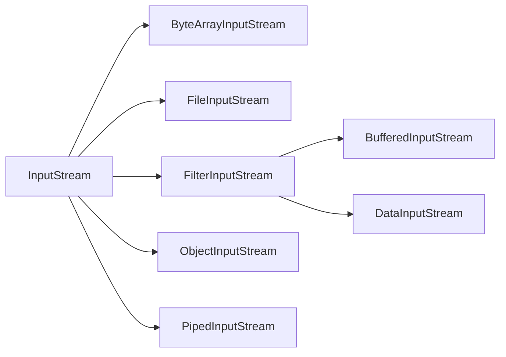

#java #InputStream 
### Потоки ввода, InputStream ###

2023-11-28 15:36

Существуют две параллельные иерархии классов ввода : **InputStream** и [Reader](https://java-online.ru/java-reader.xhtml). Класс Reader введен в последних версиях Java. В данной статье рассматривается вопрос использования потока байтового ввода _InputStream_, иерархия которого представлена на следующем рисунке.
![[InputStream.png]]

Поток **Stream**- это абстрактное понятие источника или приёмника данных, которые способны обрабатывать информацию. Есть два типа потоков: байтовые и символьные. В некоторых ситуациях символьные потоки более эффективны, чем байтовые. Классы, производные от базовых **InputStream** или _Reader_, имеют методы **read()** для чтения отдельных байтов или массива байтов.
#### Входной поток InputStream ####

Базовый класс **InputStream** - это абстрактный класс, определяющий входной поток данных, и является родителем для классов, получающих данные из различных источников : массив байтов, строки (String), файлы, каналы pipe, у которых одна из сторон является входом, а вторая сторона играет роль выхода, и т.д. Методы класса InputStream при возникновении ошибки вызывают исключение **IOException**.

Методы класса **InputStream** :

|Метод|Описание|
|---|---|
|int read()|возвращает очередной доступный символ во входном потоке в виде целого|
|int read(byte b[])|чтение b.length байтов из входного потока в массив b. Возвращает количество прочитанных из потока байтов|
|int read(byte b[], int off, int len)|чтение len байтов в массиве b, начиная со смещения off. Возвращает количество реально прочитанных байтов|
|long skip(long n)|пропуск во входном потоке n байтов. Возвращает количество пропущенных байтов|
|int available()|получение количество доступных для чтения байтов|
|void close()|закрытие источник ввода. Последующие попытки чтения из этого потока вызывают IOException|
|void mark(int readlimit)|установка метки в текущей позиции входного потока, которую можно будет использовать до тех пор, пока из потока не будет прочитано readlimit байтов|
|void reset()|перевод указателя потока на установленную ранее метку|
|boolean markSupported()|проверка поддержки потоком операции mark/reset|

Класс **InputStream** часто выступает в качестве параметров конструкторов или методов различных классов. Согласно правилам наследования это означает, что в качестве параметра может быть передан объект любого класса-наследника. Это позволяет комбинировать классы для достижения нужных нам целей.
