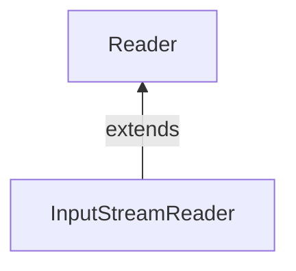

#Java #InputStreamReader

### Класс InputStreamReader ###

2023-12-06 14:51

Класс InputStreamReader из пакета java.io может использоваться для преобразования данных в байтах в данные в символах. Он расширяет абстрактный класс Reader.

Класс InputStreamReader работает с другими входными потоками. Он также известен как мост между потоками байтов и потоками символов. Это связано с тем, что InputStreamReader считывает байты из входного потока как символы.

Например, для хранения некоторых символов в памяти требовалось 2 байта. Для чтения таких данных мы можем использовать программу чтения входного потока, которая считывает 2 байта вместе и преобразует в соответствующий символ.

In order to create an InputStreamReader, we must import the java.io.InputStreamReader package
```java
// Creates an InputStream
FileInputStream file = new FileInputStream(String path);

// Creates an InputStreamReader
InputStreamReader input = new InputStreamReader(file);
```
В приведенном выше примере мы создали InputStreamReader с именем input вместе с FileInputStream с именем file.

Здесь данные в файле хранятся с использованием некоторой кодировки символов по умолчанию. Однако мы также можем указать тип кодировки символов (UTF8 или UTF16) в файле.
```java
// Creates an InputStreamReader specifying the character encoding
InputStreamReader input = new InputStreamReader(file, Charset cs);
```
Здесь мы использовали класс Charset для указания кодировки символов в файле.
#### Методы InputStreamReader ####

Класс InputStreamReader предоставляет реализации для различных методов, присутствующих в классе Reader. 

##### Метод read() #####

- read() - считывает один символ из reader
- read(char[] array) - считывает символы из считывателя и сохраняет в указанном массиве 
- read(массив char[], int start, int length) - считывает количество символов, равное length, из reader и сохраняет в указанном массиве, с позиции start

Например, предположим, что у нас есть файл с именем input.txt со следующим содержимым:
<p style="color: yellow">This is a line of text inside the file.</p>
Давайте попробуем прочитать этот файл с помощью InputStreamReader.
```java
import java.io.InputStreamReader;
import java.io.FileInputStream;

class Main {
  public static void main(String[] args) {
    // Creates an array of character
    char[] array = new char[100];
    try {
      // Creates a FileInputStream
      FileInputStream file = new FileInputStream("input.txt");
      // Creates an InputStreamReader
      InputStreamReader input = new InputStreamReader(file);
      // Reads characters from the file
      input.read(array);
      System.out.println("Data in the stream:");
      System.out.println(array);
      // Closes the reader
      input.close();
    }
    catch(Exception e) {
      e.getStackTrace();
    }
  }
}
```
Вывод
<p style="background-color: navy; color: yellow">Data in the stream:<br>
This is a line of text inside the file.</p>
В приведенном выше примере мы создали средство чтения входного потока, используя поток ввода файла. Средство чтения входного потока связано с файлом input.txt.
```java
FileInputStream file = new FileInputStream("input.txt");
InputStreamReader input = new InputStreamReader(file);
```
Чтобы прочитать символы из файла, мы использовали метод read().

##### Метод getEncoding() #####

Метод GetEncoding() может быть использован для получения типа кодировки, который используется для хранения данных во входном потоке. Например,
```java
import java.io.InputStreamReader;
import java.nio.charset.Charset;
import java.io.FileInputStream;

class Main {
  public static void main(String[] args) {
    try {
      // Creates a FileInputStream
      FileInputStream file = new FileInputStream("input.txt");
      // Creates an InputStreamReader with default encoding
      InputStreamReader input1 = new InputStreamReader(file);
      // Creates an InputStreamReader specifying the encoding
      InputStreamReader input2 = new InputStreamReader(file, Charset.forName("UTF8"));
      // Returns the character encoding of the input stream
      System.out.println("Character encoding of input1: " + input1.getEncoding());
      System.out.println("Character encoding of input2: " + input2.getEncoding());
      // Closes the reader
      input1.close();
      input2.close();
    }
    catch(Exception e) {
      e.getStackTrace();
    }
  }
}
```
Вывод
<p style="background-color: navy; color: yellow">The character encoding of input1: Cp1252<br>
The character encoding of input2: UTF8</p>
В приведенном выше примере мы создали 2 readert входного потока с именами input1 и input2
- input1 не указывает кодировку символов. Следовательно, метод GetEncoding() возвращает каноническое имя кодировки символов по умолчанию. 
- input2 указывает кодировку символов, UTF8. Следовательно, метод GetEncoding() возвращает указанную кодировку символов.

>Примечание: Мы использовали метод Charset.forName(), чтобы указать тип кодировки символов.

##### Метод close() #####

Чтобы закрыть reader входного потока, мы можем использовать метод close(). После вызова метода close() мы не можем использовать reader для чтения данных.

##### Другие методы класса InputStreamReader #####

|Метод|Описание|
|---|---|
|ready()|проверяет, готов ли поток к считыванию|
|mark()|отметить позицию в потоке, до которой были считаны данные|
|reset()|возвращает элемент управления в точку в потоке, где была установлена отметка|
