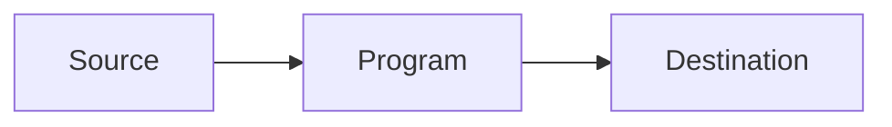
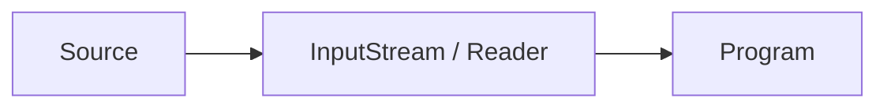
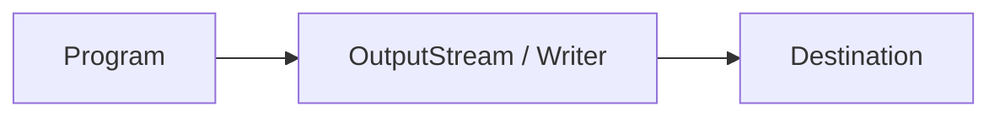

#Java 
### Input and Output - Source and Destination ###

2023-12-05 15:39

Пакет ввода-вывода Java в основном занимается считыванием необработанных данных из источника и записью необработанных данных в пункт назначения. Наиболее типичными источниками и пунктами назначения данных являются следующие:
- Files
- Pipes
- Network Connections
- In-memory Buffers (e.g. arrays)
- System.in, System.out, System.error

Приведенная ниже диаграмма иллюстрирует принцип работы программы, считывающей данные из источника и записывающей их в какой-либо пункт назначения:

Потоки ввода-вывода являются основной концепцией Java IO. Поток - это концептуально бесконечный поток данных. Вы можете либо считывать из потока, либо записывать в поток. Поток подключен к источнику данных или к месту назначения данных. Потоки в Java IO могут быть либо байтовыми (чтение и запись байтов), либо символьными (чтение и запись символов).

Программе, которой необходимо считывать данные из некоторого источника, нужен входной поток или средство чтения. Программе, которой необходимо записывать данные в какой-либо пункт назначения, нужен выходной поток или средство записи. Это также проиллюстрировано на диаграмме ниже:

Входной поток или устройство чтения связано с источником данных. Выходной поток или устройство записи связано с пунктом назначения данных.

Java IO содержит множество подклассов классов [InputStream](InputStream), [OutputStream](OutputStream), [Reader](Reader) и [Writer](Writer). Причина в том, что все эти подклассы предназначены для различных целей. Вот почему существует так много разных классов. Рассмотренные цели кратко изложены ниже:
- Доступ к файлам 
- Доступ к сети 
- Доступ к буферу внутренней памяти 
- Межпоточное взаимодействие (каналы) 
- Буферизация 
- Фильтрация 
- Разбор 
- Чтение и запись текста (Readers / Writers) 
- Чтение и запись примитивных данных (long, int и т.д.) 
- Чтение и запись объектов

Об этих целях полезно знать при ознакомлении с классами ввода-вывода Java. Они несколько облегчают понимание того, на что нацелены классы.
#### Обзорная таблица классов ввода-вывода Java ####

|   |   |   |   |   |
|---|---|---|---|---|
||Byte Based|   |Character Based|   |
||Input|Output|Input|Output|
|Basic|[InputStream](InputStream)|[OutputStream](OutputStream)|[Reader](Reader)   [InputStreamReader](InputStreamReader)|[Writer](Writer)   [OutputStreamWriter](OutputStreamWriter)|
|Arrays|[ByteArrayInputStream](ByteArrayInputStream)|[ByteArrayOutputStream](ByteArrayOutputStream)|[CharArrayReader](https://www.jenkov.com/tutorials/java-io/chararrayreader.html)|[CharArrayWriter](https://www.jenkov.com/tutorials/java-io/chararraywriter.html)|
|Files|[FileInputStream](FileInputStream)   [RandomAccessFile](https://www.jenkov.com/tutorials/java-io/randomaccessfile.html)|[FileOutputStream](FileOutputStream)   [RandomAccessFile](https://www.jenkov.com/tutorials/java-io/randomaccessfile.html)|[FileReader](FileReader)|[FileWriter](FileWriter)|
|Pipes|[PipedInputStream](https://www.jenkov.com/tutorials/java-io/pipedinputstream.html)|[PipedOutputStream](https://www.jenkov.com/tutorials/java-io/pipedoutputstream.html)|[PipedReader](https://www.jenkov.com/tutorials/java-io/pipedreader.html)|[PipedWriter](https://www.jenkov.com/tutorials/java-io/pipedwriter.html)|
|Buffering|[BufferedInputStream](BufferedInputStream)|[BufferedOutputStream](BufferedOutputStream)|[BufferedReader](BufferedReader)|[BufferedWriter](BufferedWriter)|
|Filtering|[FilterInputStream](https://www.jenkov.com/tutorials/java-io/filterinputstream.html)|[FilterOutputStream](https://www.jenkov.com/tutorials/java-io/filteroutputstream.html)|[FilterReader](https://www.jenkov.com/tutorials/java-io/filterreader.html)|[FilterWriter](https://www.jenkov.com/tutorials/java-io/filterwriter.html)|
|Parsing|[PushbackInputStream](https://www.jenkov.com/tutorials/java-io/pushbackinputstream.html)   [StreamTokenizer](https://www.jenkov.com/tutorials/java-io/streamtokenizer.html)||[PushbackReader](https://www.jenkov.com/tutorials/java-io/pushbackreader.html)   [LineNumberReader](https://www.jenkov.com/tutorials/java-io/linenumberreader.html)||
|Strings|||[StringReader](StringReader)|[StringWriter](StringWriter)|
|Data|[DataInputStream](DataInputStream)|[DataOutputStream](DataOutputStream)|||
|Data - Formatted||[PrintStream](PrintStream)||[PrintWriter](https://www.jenkov.com/tutorials/java-io/printwriter.html)|
|Objects|[ObjectInputStream](ObjectInputStream)|[ObjectOutputStream](ObjectOutputStream)|||
|Utilities|[SequenceInputStream](https://www.jenkov.com/tutorials/java-io/sequenceinputstream.html)||||
![[stream.png]]