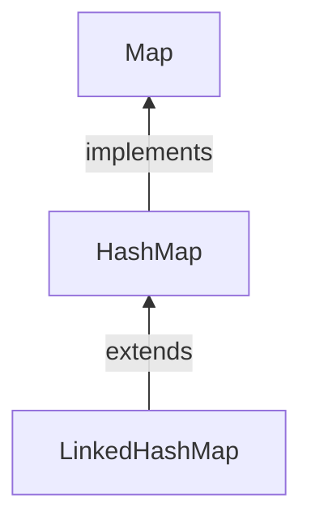

#Java #Map #LinkedHashMap

## LinkedHashMap в Java

2024-04-10 12:28

Класс _LinkedHashMap_ фреймворка Collections framework представляет собой хэш-таблицу и [_LinkedList_](Class-LinkedList) реализацию интерфейса [Map](Map). Он хранит свои записи в хэш-таблице и использует двусвязный список внутри для поддержания порядка вставки. Этот [_LinkedList_](Class-LinkedList) определяет порядок вставки, в котором ключи были вставлены в карту. [_HashMap_](HashMap) обеспечивает быструю вставку, поиск и удаление, но в LinkedHashMap реализация [_LinkedList_](Class-LinkedList) также поддерживает порядок вставки.

### Особенности LinkedHashMap

1. Он содержит значения, основанные на ключе.
2. Он содержит уникальные элементы.
3. Он может иметь один нулевой ключ и несколько нулевых значений.
4. Он не синхронизирован.
5. Он поддерживает порядок вставки, что делает итерацию более дорогостоящей.

### Факторы производительности

Производительность LinkedHashMap зависит в основном от двух факторов, которые описаны ниже.

#### Емкость

Емкость означает количество записей, которые он может хранить. Емкость по умолчанию равна 16, если параметр не указан. Коэффициент загрузки Коэффициент загрузки означает, что всякий раз, когда хэш-карта заполняется с точностью до определенного процента, указанного в качестве параметра, создается новая хэш-карта двойного размера, и все записи перемещаются в эту новую. Коэффициент загрузки хэш-карты по умолчанию равен 0.75. Он также известен как коэффициент заполнения.

### Объявление LinkedHashMap

Чтобы создать _LinkedHashMap_, сначала нам нужно импортировать пакет, который является java.util.LinkedHashMap.
```java
LinkedHashMap<Key, Value> lhm = new LinkedHashMap<>(12, 0.5f);
```
Здесь, 
Ключ - это тип ключей на карте. 
Значение - это тип отображаемых значений на карте. 
12 - это емкость, которая означает, что в ней будет храниться 12 записей на карте. 
0.5f - это коэффициент загрузки, который означает, что при заполнении 50% он создаст новую карту и переместит все значения в эту новую.

### Общие методы LinkedHashMap

Вот список некоторых распространенных методов _LinkedHashMap_.

| Методы                                   | Описание                                                                                              |
| ---------------------------------------- | ----------------------------------------------------------------------------------------------------- |
| clear()                                  | Удаляет все сопоставления на карте.                                                                   |
| containsValue (Object value)             | Возвращает true, если карта сопоставляет ключ с указанным значением.                                  |
| entrySet()                               | Возвращает заданный вид отображений на карте.                                                         |
| get(Object key)                          | Возвращает значение для указанного ключа или null, если ключ не указан.                               |
| keySet()                                 | Возвращает заданный вид ключей на карте.                                                              |
| values()                                 | Возвращает представление коллекции значений на карте.                                                 |
| getOrDefault(Object key, V defaultValue) | Возвращает значение, с которым связан указанный ключ, или значение по умолчанию, если ключ не связан. |
| isEmpty()                                | проверяет, пуста ли карта, и возвращает логическое значение                                           |

#### Пример LinkedHasMap

```java
import java.util.LinkedHashMap;

class Main {
    public static void main(String[] args) {
        // Creating a LinkedHashMap of odd numbers
        LinkedHashMap<String, Integer> oddNumbers = new LinkedHashMap<>();
        // Using the put() method
        oddNumbers.put("One", 1);
        oddNumbers.put("Three", 3);
        System.out.println("LinkedHashMap1: " + oddNumbers);

        // Creating another LinkedHashMap
        LinkedHashMap<String, Integer> numbers = new LinkedHashMap<>();
        numbers.put("Two", 2);
        // Using putAll() method
        numbers.putAll(oddNumbers);
        System.out.println("LinkedHashMap2: " + numbers);

        // Using entrySet() method
        System.out.println("Key/Value mappings: " + numbers.entrySet());

        // Using keySet() method
        System.out.println("Keys: " + numbers.keySet());

        // Using values() method
        System.out.println("Values: " + numbers.values());

        // Using get() method
        int value1 = numbers.get("Three");
        System.out.println("Returned Number: " + value1);

        // Using getOrDefault() method
        int value2 = numbers.getOrDefault("Five", 5);
        System.out.println("Returned Number: " + value2);

        // Using remove() method
        int value = numbers.remove("Two");
        System.out.println("Removed value: " + value);

        // Using entrySet() method
        System.out.println("Key/Value mappings: " + numbers.entrySet());
    }
}
```
Вывод
<p style="background-color: navy; color: yellow">
LinkedHashMap1: {Один = 1, Три = 3} <br>
LinkedHashMap2: {Два = 2, Один = 1, Три = 3}<br> Сопоставления ключа / значения: [Два = 2, Один = 1, Три = 3]<br> 
Ключи: [Два, Один, три] Значения: [2, 1, 3]<br> 
Возвращаемое число: 3<br>
Возвращаемое число: 5<br>
Удаленное значение: 2<br>
Сопоставления ключа / значения: [Один = 1, Три = 3]</p>

#### Вставка элементов в LinkedHashMap

- `put()` - вставляет указанное сопоставление ключа / значения в карту
- `putAll()` - вставляет все записи с указанной карты в эту карту
- `putIfAbsent()` - вставляет указанное сопоставление ключа / значения на карту, если указанный ключ отсутствует на карте

Например,
```java
import java.util.LinkedHashMap;

class Main {
    public static void main(String[] args) {
        // Creating LinkedHashMap of even numbers
        LinkedHashMap<String, Integer> evenNumbers = new LinkedHashMap<>();

        // Using put()
        evenNumbers.put("Two", 2);
        evenNumbers.put("Four", 4);
        System.out.println("Original LinkedHashMap: " + evenNumbers);

        // Using putIfAbsent()
        evenNumbers.putIfAbsent("Six", 6);
        System.out.println("Updated LinkedHashMap(): " + evenNumbers);

        //Creating LinkedHashMap of numbers
        LinkedHashMap<String, Integer> numbers = new LinkedHashMap<>();
        numbers.put("One", 1);

        // Using putAll()
        numbers.putAll(evenNumbers);
        System.out.println("New LinkedHashMap: " + numbers);
    }
}
```
**Вывод**
<p style="background-color: navy; color: yellow">
Original LinkedHashMap: {Two=2, Four=4}<br>
Updated LinkedHashMap: {Two=2, Four=4, Six=6}<br>
New LinkedHashMap: {One=1, Two=2, Four=4, Six=6}</p>

#### Доступ к элементам LinkedHashMap

**1. Использование entrySet(), keySet() и values()**
- `entrySet()` - возвращает набор всех сопоставлений ключей и значений карты
- `keySet()` - возвращает набор всех ключей карты
- `values()` - возвращает набор всех значений карты

Например,
```java
import java.util.LinkedHashMap;

class Main {
    public static void main(String[] args) {
        LinkedHashMap<String, Integer> numbers = new LinkedHashMap<>();

        numbers.put("One", 1);
        numbers.put("Two", 2);
        numbers.put("Three", 3);
        System.out.println("LinkedHashMap: " + numbers);

        // Using entrySet()
        System.out.println("Key/Value mappings: " + numbers.entrySet());

        // Using keySet()
        System.out.println("Keys: " + numbers.keySet());

        // Using values()
        System.out.println("Values: " + numbers.values());
    }
}
```
**Вывод**
<p style="background-color: navy; color: yellow">
LinkedHashMap: {One=1, Two=2, Three=3}<br>
Key/Value mappings: [One=1, Two=2, Three=3]<br>
Keys: [One, Two, Three]<br>
Values: [1, 2, 3]</p>

**2. Использование get() и getOrDefault()**
- `get()` - Возвращает значение, связанное с указанным ключом. Если ключ не найден, он возвращает `null`.
- `getOrDefault()` - Возвращает значение, связанное с указанным ключом. Если ключ не найден, возвращается указанное значение по умолчанию.

Например,
```java
import java.util.LinkedHashMap;

class Main {
    public static void main(String[] args) {

        LinkedHashMap<String, Integer> numbers = new LinkedHashMap<>();
        numbers.put("One", 1);
        numbers.put("Two", 2);
        numbers.put("Three", 3);
        System.out.println("LinkedHashMap: " + numbers);

        // Using get()
        int value1 = numbers.get("Three");
        System.out.println("Returned Number: " + value1);

        // Using getOrDefault()
        int value2 = numbers.getOrDefault("Five", 5);
        System.out.println("Returned Number: " + value2);
    }
}
```
**Вывод**
<p style="background-color: navy; color: yellow">
LinkedHashMap: {One=1, Two=2, Three=3}<br>
Returned Number: 3<br>
Returned Number: 5</p>

#### Удаление элементов LinkedHashMap

- `remove(key)` - возвращает и удаляет запись, связанную с указанным key, с карты
- `remove(key, value)` - удаляет запись с карты, только если указанное key сопоставлено с указанным value и возвращает логическое значение

Например,
```java
import java.util.LinkedHashMap;

class Main {
    public static void main(String[] args) {

        LinkedHashMap<String, Integer> numbers = new LinkedHashMap<>();
        numbers.put("One", 1);
        numbers.put("Two", 2);
        numbers.put("Three", 3);
        System.out.println("LinkedHashMap: " + numbers);

        // remove method with single parameter
        int value = numbers.remove("Two");
        System.out.println("Removed value: " + value);

        // remove method with two parameters
        boolean result = numbers.remove("Three", 3);
        System.out.println("Is the entry Three removed? " + result);

        System.out.println("Updated LinkedHashMap: " + numbers);
    }
}
```
**Вывод**
<p style="background-color: navy; color: yellow">
LinkedHashMap: {One=1, Two=2, Three=3}<br>
Removed value: 2<br>
Is the entry {Three=3} removed? True<br>
Updated LinkedHashMap: {One=1}</p>

### LinkedHashMap Vs. HashMap

Как в _LinkedHashMap_, так и в [_HashMap_](HashMap) реализует [_Map_](Map) интерфейс. Однако между ними существуют некоторые различия.
- _LinkedHashMap_ поддерживает двусвязный список внутри. Благодаря этому он поддерживает порядок вставки своих элементов.
- Для _LinkedHashMap_ класса требуется больше памяти, чем для [_HashMap_](HashMap). Это потому, что _LinkedHashMap_ поддерживает связанные списки внутри.
- Производительность _LinkedHashMap_ медленнее, чем [_HashMap_](HashMap).
