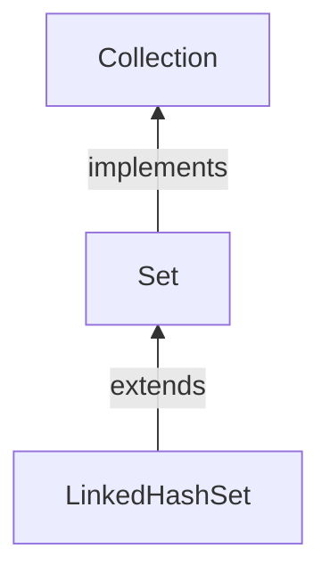

#Java #Collection #LinkedHashSet 

## Java LinkedHashSet

2024-04-09 11:50

Класс _LinkedHashSet_ реализует интерфейс [_Set_](Set). _LinkedHashSet_ создает коллекцию, которая хранит элементы в хэш-таблице, но сохраняет порядок вставки элементов в отличие от своего аналога [_HashSet_](HashSet).

Класс _LinkedHashSet_ Java расширяет [_HashSet_](HashSet) без добавления каких-либо новых методов. _LinkedHashSet_ позволяет быстро проверять наличие записи, точно так же, как _HashSet_, но содержит внутри упорядоченный список. Это означает, что он сохраняет порядок вставки элементов. Другими словами, _LinkedHashSet_ поддерживает связанный список элементов set в том порядке, в котором они были вставлены. Это позволяет выполнять упорядоченную итерацию вставки в set. Но это приводит к тому, что класс _LinkedHashSet_ выполняет операции дольше, чем класс [_HashSet_](HashSet).

Мы должны сначала импортировать `java.util.LinkedHashSet` пакет.  Как только мы импортируем пакет, вот как мы можем создавать связанные хэш-наборы в Java.
Для создания _LinkedHashSet_ доступно несколько конструкторов. Давайте рассмотрим каждый из них.:

### Создаем LinkedHashSet

Для создания _LinkedHashSet_ доступно несколько конструкторов. Давайте рассмотрим каждый из них.:
#### 1. Конструктор без аргументов по умолчанию

```java
Set<String> linkedHashSet = new LinkedHashSet<>();
assertTrue(linkedHashSet.isEmpty());
```

#### 2. Создание с начальными возможностями

Начальная емкость представляет собой начальную длину _LinkedHashSet_. **Предоставление начальной емкости предотвращает любое ненужное изменение размера _набора_ по мере его роста**. Начальная емкость по умолчанию равна 16:

```java
LinkedHashSet<String> linkedHashSet = new LinkedHashSet<>(20);
```

#### 3. Создание из коллекции

Мы также можем использовать содержимое _коллекции_ для заполнения объекта _LinkedHashSet_ в момент создания:

```java
import java.util.LinkedHashSet;
import java.util.ArrayList;

class Main {
    public static void main(String[] args) {
        // Creating an arrayList of even numbers
        ArrayList<Integer> evenNumbers = new ArrayList<>();
        evenNumbers.add(2);
        evenNumbers.add(4);
        System.out.println("ArrayList: " + evenNumbers);

        // Creating a LinkedHashSet from an ArrayList
        LinkedHashSet<Integer> numbers = new LinkedHashSet<>(evenNumbers);
        System.out.println("LinkedHashSet: " + numbers);
    }
}
```
**Вывод**
<p style="background-color: navy; color: yellow">
ArrayList: [2, 4]<br>
LinkedHashSet: [2, 4]</p>

#### 4. Создание с учетом начальной емкости и коэффициента загрузки

Когда размер _LinkedHashSet_ увеличивается и превышает значение начальной емкости, новая емкость является умножением коэффициента загрузки на предыдущую емкость. В приведенном ниже фрагменте начальная емкость установлена равной 20, а коэффициент загрузки равен 3.
```java
LinkedHashSet<String> linkedHashSet = new LinkedHashSet<>(20, 3);
```
Коэффициент загрузки по умолчанию равен 0.75.

### Методы LinkedHashSet

Класс _LinkedHashSet_ предоставляет методы, которые позволяют нам выполнять различные операции над связанным набором хэшей.

#### Вставка элементов в LinkedHashSet

- `add()` - вставляет указанный элемент в связанный хэш-набор
- `addAll()` - вставляет все элементы указанной коллекции в связанный хэш-набор

Например,
```java
import java.util.LinkedHashSet;

class Main {
    public static void main(String[] args) {
        LinkedHashSet<Integer> evenNumber = new LinkedHashSet<>();

        // Using add() method
        evenNumber.add(2);
        evenNumber.add(4);
        evenNumber.add(6);
        System.out.println("LinkedHashSet: " + evenNumber);

        LinkedHashSet<Integer> numbers = new LinkedHashSet<>();
        
        // Using addAll() method
        numbers.addAll(evenNumber);
        numbers.add(5);
        System.out.println("New LinkedHashSet: " + numbers);
    }
}
```
**Вывод**
<p style="background-color: navy; color: yellow">
LinkedHashSet: [2, 4, 6]<br>
New LinkedHashSet: [2, 4, 6, 5]</p>

#### Доступ к элементам LinkedHashSet

Для доступа к элементам связанного хэш-набора мы можем использовать метод [iterator()](Iterator). Чтобы использовать этот метод, мы должны импортировать `java.util.Iterator` пакет. Например,
```java
import java.util.LinkedHashSet;
import java.util.Iterator;

class Main {
    public static void main(String[] args) {
        LinkedHashSet<Integer> numbers = new LinkedHashSet<>();
        numbers.add(2);
        numbers.add(5);
        numbers.add(6);
        System.out.println("LinkedHashSet: " + numbers);

        // Calling the iterator() method
        Iterator<Integer> iterate = numbers.iterator();

        System.out.print("LinkedHashSet using Iterator: ");

        // Accessing elements
        while(iterate.hasNext()) {
            System.out.print(iterate.next());
            System.out.print(", ");
        }
    }
}
```
**Вывод**
<p style="background-color: navy; color: yellow">
LinkedHashSet: [2, 5, 6]<br>
LinkedHashSet using Iterator: 2, 5, 6,</p>

**Примечание**:
- `hasNext()` возвращает `true`, есть ли следующий элемент в связанном хэш-наборе
- `next()` возвращает следующий элемент в связанном хэш-наборе

#### Удалить элементы из HashSet

- `remove()` - удаляет указанный элемент из связанного хэш-набора
- `removeAll()` - удаляет все элементы из связанного хэш-набора

Например,
```java
import java.util.LinkedHashSet;

class Main {
    public static void main(String[] args) {
        LinkedHashSet<Integer> numbers = new LinkedHashSet<>();
        numbers.add(2);
        numbers.add(5);
        numbers.add(6);
        System.out.println("LinkedHashSet: " + numbers);

        // Using the remove() method
        boolean value1 = numbers.remove(5);
        System.out.println("Is 5 removed? " + value1);

        boolean value2 = numbers.removeAll(numbers);
        System.out.println("Are all elements removed? " + value2);
    }
}
```
**Вывод**
<p style="background-color: navy; color: yellow">
LinkedHashSet: [2, 5, 6]<br>
Is 5 removed? true<br>
Are all elements removed? true</p>

#### Операции с набором

Различные методы класса _LinkedHashSet_ также могут использоваться для выполнения различных операций с set.

#### Объединение множеств

Для выполнения объединения между двумя наборами мы можем использовать метод `addAll()`. Например,
```java
import java.util.LinkedHashSet;

class Main {
    public static void main(String[] args) {
        LinkedHashSet<Integer> evenNumbers = new LinkedHashSet<>();
        evenNumbers.add(2);
        evenNumbers.add(4);
        System.out.println("LinkedHashSet1: " + evenNumbers);

        LinkedHashSet<Integer> numbers = new LinkedHashSet<>();
        numbers.add(1);
        numbers.add(3);
        System.out.println("LinkedHashSet2: " + numbers);

        // Union of two set
        numbers.addAll(evenNumbers);
        System.out.println("Union is: " + numbers);
    }
}
```
**Вывод**
<p style="background-color: navy; color: yellow">
LinkedHashSet1: [2, 4]<br>
LinkedHashSet2: [1, 3]<br>
Union is: [1, 3, 2, 4]</p>

#### Пересечение множеств

Чтобы выполнить пересечение между двумя наборами, мы можем использовать метод `retainAll()`. Например
```java
import java.util.LinkedHashSet;

class Main {
    public static void main(String[] args) {
        LinkedHashSet<Integer> primeNumbers = new LinkedHashSet<>();
        primeNumbers.add(2);
        primeNumbers.add(3);
        System.out.println("LinkedHashSet1: " + primeNumbers);

        LinkedHashSet<Integer> evenNumbers = new LinkedHashSet<>();
        evenNumbers.add(2);
        evenNumbers.add(4);
        System.out.println("LinkedHashSet2: " + evenNumbers);

        // Intersection of two sets
        evenNumbers.retainAll(primeNumbers);
        System.out.println("Intersection is: " + evenNumbers);
    }
}
```
**Вывод**
<p style="background-color: navy; color: yellow">
LinkedHashSet1: [2, 3]<br>
LinkedHashSet2: [2, 4]<br>
Intersection is: [2]</p>

#### Разница в наборах

Чтобы вычислить разницу между двумя наборами, мы можем использовать метод `removeAll()`. Например,
```java
import java.util.LinkedHashSet;

class Main {
    public static void main(String[] args) {
        LinkedHashSet<Integer> primeNumbers = new LinkedHashSet<>();
        primeNumbers.add(2);
        primeNumbers.add(3);
        primeNumbers.add(5);
        System.out.println("LinkedHashSet1: " + primeNumbers);

        LinkedHashSet<Integer> oddNumbers = new LinkedHashSet<>();
        oddNumbers.add(1);
        oddNumbers.add(3);
        oddNumbers.add(5);
        System.out.println("LinkedHashSet2: " + oddNumbers);

        // Difference between LinkedHashSet1 and LinkedHashSet2
        primeNumbers.removeAll(oddNumbers);
        System.out.println("Difference : " + primeNumbers);
    }
}
```
**Вывод**
<p style="background-color: navy; color: yellow">
LinkedHashSet1: [2, 3, 5]<br>
LinkedHashSet2: [1, 3, 5]<br>
Difference: [2]</p>

#### Подмножество

Чтобы проверить, является ли набор подмножеством другого набора или нет, мы можем использовать `containsAll()` метод. Например,
```java
import java.util.LinkedHashSet;

class Main {
    public static void main(String[] args) {
        LinkedHashSet<Integer> numbers = new LinkedHashSet<>();
        numbers.add(1);
        numbers.add(2);
        numbers.add(3);
        numbers.add(4);
        System.out.println("LinkedHashSet1: " + numbers);

        LinkedHashSet<Integer> primeNumbers = new LinkedHashSet<>();
        primeNumbers.add(2);
        primeNumbers.add(3);
        System.out.println("LinkedHashSet2: " + primeNumbers);

        // Check if primeNumbers is a subset of numbers
        boolean result = numbers.containsAll(primeNumbers);
        System.out.println("Is LinkedHashSet2 is subset of LinkedHashSet1? " + result);
    }
}
```
**Вывод**
<p style="background-color: navy; color: yellow">
LinkedHashSet1: [1, 2, 3, 4]<br>
LinkedHashSet2: [2, 3]<br>
Is LinkedHashSet2 is a subset of LinkedHashSet1? true</p>

#### Другие методы LinkedHashSet

| Метод        | Описание                                                                                |
| ------------ | --------------------------------------------------------------------------------------- |
| `clone()`    | Создает копию _LinkedHashSet_                                                           |
| `contains()` | Выполняет поиск в _LinkedHashSet_ указанного элемента и возвращает логический результат |
| `isEmpty()`  | Проверяет, является ли _LinkedHashSet_ пустым                                           |
| `size()`     | Возвращает размер _LinkedHashSet_                                                       |
| `clear()`    | Удаляет все элементы из _LinkedHashSet_                                                 |

Чтобы узнать больше о `LinkedHashSet` методах, посетите [Java LinkedHashSet (официальная документация Java)](https://docs.oracle.com/javase/7/docs/api/java/util/LinkedHashSet.html).

### Сравнение LinkedHashSet и [HashSet](HashSet)

Оба _LinkedHashSet_ и [_HashSet_](HashSet) реализуют [_Set_](Set) интерфейс. Однако между ними существуют некоторые различия.
- _LinkedHashSet_ поддерживает связанный список внутри. Благодаря этому он поддерживает порядок вставки своих элементов.
- Для _LinkedHashSet_ класса требуется больше памяти, чем для [_HashSet_](HashSet). Это потому, что _LinkedHashSet_ поддерживает связанные списки внутри.
- Производительность _LinkedHashSet_ медленнее, чем [_HashSet_](HashSet). Это из-за связанных списков, присутствующих в _LinkedHashSet_.

### Сравнение LinkedHashSet и TreeSet

Вот основные различия между _LinkedHashSet_ и _TreeSet_:

- _TreeSet_ Класс реализует _SortedSet_ интерфейс. Вот почему элементы в наборе дерева сортируются. Однако _LinkedHashSet_ класс поддерживает только порядок вставки своих элементов.
- _TreeSet_ обычно работает медленнее, чем _LinkedHashSet_. Это потому, что всякий раз, когда элемент добавляется в _TreeSet_, он должен выполнять операцию сортировки.
- _LinkedHashSet_ позволяет вставлять нулевые значения. Однако мы не можем вставить нулевое значение в _TreeSet_.


