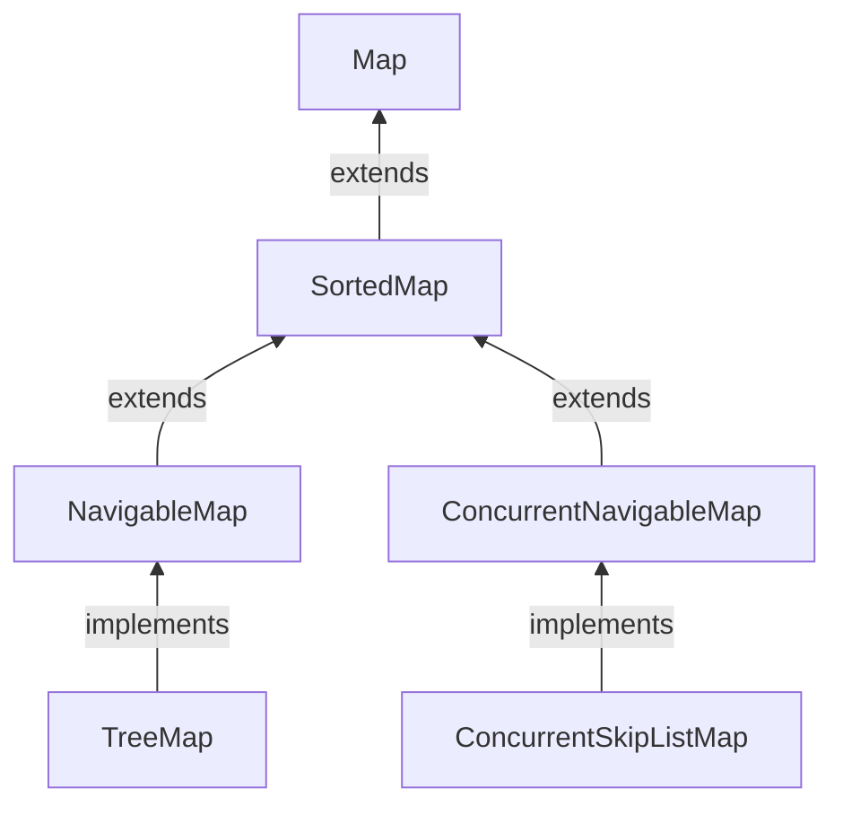

#Java #Map #NavigableMap

## Интерфейс Java NavigableMap

2024-04-11 14:39

Интерфейс _NavigableMap_ является частью [Java Collection Framework](https://www.geeksforgeeks.org/collections-in-java-2/). Он принадлежит к пакету **java.util** и является расширением [_SortedMap_](SortedMap), которое предоставляет удобные методы навигации, такие как _lowerKey, floorKey, ceilingKey_ и _higherKey_. 
Примером класса, реализующего _NavigableMap_, является [_TreeMap_](TreeMap).



**Объявление:**
```java
public interface NavigableMap<K,V> extends SortedMap<K,V>
```
Здесь **K** - тип ключевого объекта, а **V** - тип объекта значения.

В Java мы должны импортировать `java.util.NavigableMap` пакет для использования _NavigableMap_. Как только мы импортируем пакет, вот как мы можем создать навигационную карту.
```java
// NavigableMap implementation by TreeMap class
NavigableMap<Key, Value> numbers = new TreeMap<>();
```
В приведенном выше коде мы создали навигационную карту с именем numbers класса [_TreeMap_](TreeMap).

Здесь,
- Key - уникальный идентификатор, используемый для связывания каждого элемента (значения) на карте
- Value - элементы, связанные ключами на карте

### Методы NavigableMap

_NavigableMap_ рассматривается как тип [_SortedMap_](SortedMap). Это потому, что _NavigableMap_ расширяет [_SortedMap_](SortedMap) интерфейс. Следовательно, все _SortedMap_ методы также доступны в _NavigableMap_. 

Однако некоторые методы [_SortedMap_](SortedMap) (`headMap()`, `tailMap()` и `subMap()` ) в _NavigableMap_ определены по-другому.

Давайте посмотрим, как эти методы определены в _NavigableMap_.

#### headMap (key, booleanValue)

Метод `headMap()` возвращает все записи навигационной карты, связанные со всеми этими ключами, предшествующими указанному key (который передается в качестве аргумента).

booleanValue является необязательным параметром. Его значение по умолчанию равно `false`.

Если `true` передается как booleanValue, метод возвращает все записи, связанные со всеми этими ключами до указанного key, включая запись, связанную с указанным key.

#### tailMap (key, booleanValue)

Метод `tailMap()` возвращает все записи навигационной карты, связанные со всеми этими ключами после указанного key (который передается в качестве аргумента), включая запись, связанную с указанным key.

booleanValue является необязательным параметром. Его значение по умолчанию равно `true`.

Если `false` передается как booleanValue, метод возвращает все записи, связанные с этими ключами после указанного key, не включая запись, связанную с указанным key.

#### subMap (k1, bv1, k2, bv2)

`subMap()` Метод возвращает все записи, связанные с ключами между k1 и k2, включая запись, связанную с k1.

bv1 и bv2 являются необязательными параметрами. Значение по умолчанию bv1 равно true, а значение по умолчанию bv2 равно `false`.

Если `false` передается как bv1, метод возвращает все записи, связанные с ключами между k1 и k2, не включая запись, связанную с k1.

Если `true` передается как bv2, метод возвращает все записи, связанные с ключами между k1 и k2, включая запись, связанную с k1.

#### Другие методы

_NavigableMap_ предоставляет различные методы, которые можно использовать для определения местоположения элементов карт.
- **descendingMap()** - изменяет порядок записей на карте в обратном порядке
- **descendingKeyMap()** - изменяет порядок ключей на карте на обратный.
- **ceilingEntry()** - возвращает запись с наименьшим ключом среди всех записей, ключи которых больше или равны указанному ключу
- **ceilingKey()** - возвращает младший ключ среди тех ключей, которые больше или равны указанному ключу
- **floorEntry()** - возвращает запись с наивысшим ключом среди всех записей, ключи которых меньше или равны указанному ключу
- **floorKey()** - возвращает самый высокий ключ среди тех ключей, которые меньше или равны указанному ключу
- **higherEntry()** - возвращает запись с наименьшим ключом среди всех записей, ключи которых больше указанного ключа
- **higherKey()** - возвращает наименьший ключ среди тех ключей, которые больше указанного ключа
- **lowerEntry()** - возвращает запись с наибольшим ключом среди всех записей, ключи которых меньше указанного ключа
- **lowerKey()** - возвращает самый высокий ключ среди тех ключей, которые меньше указанного ключа
- **firstEntry()** - возвращает первую запись (запись с наименьшим ключом) карты
- **lastEntry()** - возвращает последнюю запись (запись с наивысшим ключом) карты
- **pollFirstEntry()** - возвращает и удаляет первую запись карты
- **pollLastEntry()** - возвращает и удаляет последнюю запись карты

### Реализация NavigableMap в классе TreeMap

```java
import java.util.NavigableMap;
import java.util.TreeMap;

class Main {
    public static void main(String[] args) {
        // Creating NavigableMap using TreeMap
        NavigableMap<String, Integer> numbers = new TreeMap<>();

        // Insert elements to map
        numbers.put("Two", 2);
        numbers.put("One", 1);
        numbers.put("Three", 3);
        System.out.println("NavigableMap: " + numbers);

        // Access the first entry of the map
        System.out.println("First Entry: " + numbers.firstEntry());

        // Access the last entry of the map
        System.out.println("Last Entry: " + numbers.lastEntry());

        // Remove the first entry from the map
        System.out.println("Removed First Entry: " + numbers.pollFirstEntry());

        // Remove the last entry from the map
        System.out.println("Removed Last Entry: " + numbers.pollLastEntry());
    }
}
```
**Вывод**
<p style="background-color: navy; color: yellow">
NavigableMap: {One=1, Three=3, Two=2}<br>
First Entry: One=1<br>
Last Entry: Two=2<br>
Removed First Entry: One=1<br>
Removed Last Entry: Two=2</p>

