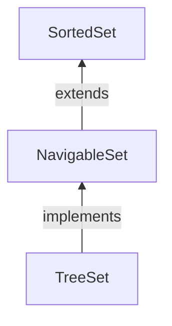

#Java #Collection #NavigableSet

## Интерфейс Java NavigableSet

2024-04-09 16:03

Интерфейс _NavigableSet_ [Java Collections framework](https://www.programiz.com/java-programming/collections) предоставляет функции для навигации между элементами набора. Он рассматривается как тип [SortedSet](SortedSet).

Чтобы использовать функциональные возможности _NavigableSet_ интерфейса, нам нужно использовать [_TreeSet_](TreeSet) класс, который реализует _NavigableSet_.

Мы должны импортировать `java.util.NavigableSet` пакет для использования _NavigableSet_. Как только мы импортируем пакет, вот как мы можем создавать _NavigableSet_.
```java
// SortedSet implementation by TreeSet class
NavigableSet<String> numbers = new TreeSet<>();
```
Здесь мы создали _NavigableSet_ с именем numbers класса [_TreeSet_](TreeSet).

### Методы NavigableSet

_NavigableSet_ рассматривается как тип [_SortedSet_](SortedSet). Это потому, что _NavigableSet_ расширяет [_SortedSet_](SortedSet) интерфейс.

Следовательно, все [_SortedSet_](SortedSet) методы также доступны в _NavigableSet_. 

Однако некоторые методы [_SortedSet_](SortedSet) (`headSet()`, `tailSet()` и `subSet()`) в _NavigableSet_ определены по-разному.

#### headSet (element, booleanValue)

Метод `headSet()` возвращает все элементы _NavigableSet_ до указанного element (который передается в качестве аргумента).

Параметр booleanValue необязателен. Его значение по умолчанию - `false`.

Если `true` передается как booleanValue, метод возвращает все элементы перед указанным элементом, включая указанный элемент.

#### tailSet(element, booleanValue)

Метод `tailSet()` возвращает все элементы _NavigableSet_ после указанного element (который передается в качестве аргумента), включая указанный элемент.

Параметр booleanValue необязателен. Его значение по умолчанию - `true`.

Если `false` передается как booleanValue, метод возвращает все элементы после указанного элемента, не включая указанный элемент.

#### Подмножество (e1, bv1, e2, bv2)

Метод _subSet()_ возвращает все элементы между e1 и e2 включая e1.

bv1 И bv2 являются необязательными параметрами. Значение по умолчанию bv1 равно `true`, а значение по умолчанию bv2 равно `false`.

Если `false` передается как bv1, метод возвращает все элементы между e1 и e2 без включения `e1`.

Если `true` передается как bv2, метод возвращает все элементы между e1 и e2, включая e1.

#### Методы навигации

_NavigableSet_ предоставляет различные методы, которые можно использовать для навигации по его элементам.
- **descendingSet()** - изменяет порядок элементов в наборе на противоположный
- **descendingIterator()** - возвращает итератор, который можно использовать для перебора набора в обратном порядке
- **ceiling()** - возвращает наименьший элемент среди тех элементов, которые больше или равны указанному элементу
- **floor()** - возвращает наибольший элемент среди тех элементов, которые меньше или равны указанному элементу
- **higher()** - возвращает наименьший элемент среди тех элементов, которые больше указанного элемента
- **lower()** - возвращает наибольший элемент среди тех элементов, которые меньше указанного элемента
- **pollFirst()** - возвращает и удаляет первый элемент из набора
- **pollLast()** - возвращает и удаляет последний элемент из набора

Чтобы узнать больше о `NavigableSet`, посетите [Java NavigableSet (официальная документация Java)](https://docs.oracle.com/javase/7/docs/api/java/util/NavigableSet.html).

### Реализация NavigableSet в классе [TreeSet](TreeSet)

```java
import java.util.NavigableSet;
import java.util.TreeSet;

class Main {
    public static void main(String[] args) {
        // Creating NavigableSet using the TreeSet
        NavigableSet<Integer> numbers = new TreeSet<>();

        // Insert elements to the set
        numbers.add(1);
        numbers.add(2);
        numbers.add(3);
        System.out.println("NavigableSet: " + numbers);

        // Access the first element
        int firstElement = numbers.first();
        System.out.println("First Number: " + firstElement);

        // Access the last element
        int lastElement = numbers.last();
        System.out.println("Last Element: " + lastElement);

        // Remove the first element
        int number1 = numbers.pollFirst();
        System.out.println("Removed First Element: " + number1);

        // Remove the last element
        int number2 = numbers.pollLast();
        System.out.println("Removed Last Element: " + number2);
    }
}
```
**Вывод**
<p style="background-color: navy; color: yellow">
NavigableSet: [1, 2, 3]<br>
First Element: 1<br>
Last Element: 3<br>
Removed First Element: 1<br>
Removed Last Element: 3</p>
