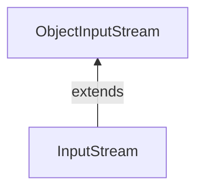

#Java #ObjectInputStream #ObjectOutputStream 

### Класс ObjectInputStream ###

2023-12-04 12:22

Класс ObjectInputStream пакета java.io может использоваться для чтения объектов, которые ранее были записаны [ObjectOutputStream](ObjectOutputStream). Он расширяет абстрактный класс [InputStream](InputStream).

ObjectInputStream в основном используется для чтения данных, записанных [ObjectOutputStream](ObjectOutputStream). 

По сути, [ObjectOutputStream](ObjectOutputStream) преобразует объекты Java в соответствующие потоки. Это известно как сериализация. Эти преобразованные потоки могут быть сохранены в файлах или переданы по сетям. 

Теперь, если нам нужно прочитать эти объекты, мы будем использовать ObjectInputStream, который преобразует потоки обратно в соответствующие объекты. Это известно как десериализация.
```java
// Creates a file input stream linked with the specified file
FileInputStream fileStream = new FileInputStream(String file);
// Creates an object input stream using the file input stream
ObjectInputStream objStream = new ObjectInputStream(fileStream);
```
В приведенном выше примере мы создали поток ввода объекта с именем objStream, который связан с потоком ввода файла с именем FileStream. 

Теперь objStream можно использовать для чтения объектов из файла.
#### Методы класса ObjectInputStream ####

Класс ObjectInputStream предоставляет реализации различных методов, присутствующих в классе [InputStream](InputStream).
##### Метод read() #####

- read() - считывает байт данных из входного потока 
- readBoolean() - считывает данные в логической форме 
- readChar() - считывает данные в символьной форме 
- readInt() - считывает данные в целочисленной форме 
- readObject() - считывает объект из входного потока

**Пример 1: Java ObjectInputStream**
Давайте посмотрим, как мы можем использовать класс ObjectInputStream для чтения объектов, записанных классом [ObjectOutputStream](ObjectOutputStream).
```java
import java.io.FileInputStream;
import java.io.FileOutputStream;
import java.io.ObjectInputStream;
import java.io.ObjectOutputStream;

class Main {
    public static void main(String[] args) {
        int data1 = 5;
        String data2 = "This is programiz";
        try {
            FileOutputStream file = new FileOutputStream("file.txt");
            // Creates an ObjectOutputStream
            ObjectOutputStream output = new ObjectOutputStream(file);
            // writes objects to output stream
            output.writeInt(data1);
            output.writeObject(data2);
            // Reads data using the ObjectInputStream
            FileInputStream fileStream = new FileInputStream("file.txt");
            ObjectInputStream objStream = new ObjectInputStream(fileStream);
            System.out.println("Integer data :" + objStream.readInt());
            System.out.println("String data: " + objStream.readObject());
            output.close();
            objStream.close();
        }
        catch (Exception e) {
            e.getStackTrace();
        }
    }
}
```
Вывод
<p style="background-color: navy; color: yellow">Integer data: 5<br>
String data: This is programiz</p>
В приведенном выше примере мы использовали методы readInt() и readObject() для чтения целочисленных данных и объектных данных из файлов. 

Здесь мы использовали [ObjectOutputStream](ObjectOutputStream) для записи данных в файл. Затем мы считываем данные из файла, используя ObjectInputStream.

**Пример 2: Java ObjectInputStream**
Давайте возьмем другойц пример
```java
import java.io.FileInputStream;
import java.io.FileOutputStream;
import java.io.ObjectInputStream;
import java.io.ObjectOutputStream;
import java.io.Serializable;

class Dog implements Serializable {
    String name;
    String breed;

    public Dog(String name, String breed) {
        this.name = name;
        this.breed = breed;
    }
}

class Main {
    public static void main(String[] args) {
        // Creates an object of Dog class
        Dog dog1 = new Dog("Tyson", "Labrador");

        try {
            FileOutputStream fileOut = new FileOutputStream("file.txt");
            // Creates an ObjectOutputStream
            ObjectOutputStream objOut = new ObjectOutputStream(fileOut);
            // Writes objects to the output stream
            objOut.writeObject(dog1);
            // Reads the object
            FileInputStream fileIn = new FileInputStream("file.txt");
            ObjectInputStream objIn = new ObjectInputStream(fileIn);
            // Reads the objects
            Dog newDog = (Dog) objIn.readObject();
            System.out.println("Dog Name: " + newDog.name);
            System.out.println("Dog Breed: " + newDog.breed);
            objOut.close();
            objIn.close();
        }
        catch (Exception e) {
            e.getStackTrace();
        }
    }
}
```
Вывод
<p style="background-color: navy; color: yellow">Dog Name: Tyson<br>
Dog Breed: Labrador</p>
В приведенном выше примере мы создали 
- [ObjectOutputStream](ObjectOutputStream) с именем objOut, используя [FileOutputStream](FileOutputStream) с именем fileOut
- ObjectInputStream с именем objIn, используя [FileInputStream](FileInputStream) с именем fileIn 
- Объект dog1 класса Dog. 
 
Здесь мы затем использовали поток вывода объекта для записи объекта в файл. И поток ввода объекта для чтения объекта из файла.

>**Примечание:** Класс Dog реализует сериализуемый интерфейс. Это связано с тем, что ObjectOutputStream записывает в выходной поток только те объекты, которые могут быть сериализованы.

#### Другие методы класса ObjectInputStream ####

|Методы|Описания|
|---|---|
|available()|возвращает доступное количество байт во входном потоке|
|mark()|отмечает позицию во входном потоке, до которой были считаны данные|
|reset()|возвращает элемент управления в точку во входном потоке, где была установлена метка|
|skipBytes()|пропускает и отбрасывает указанные байты из входного потока|
|close()|закрывает поток ввода объекта|
