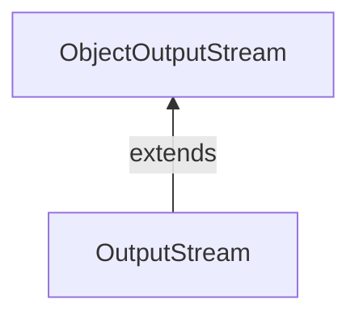

#Java #ObjectOutputStream #ObjectInputStream

### [Класс ObjectOutputStream](https://javarush.com/groups/posts/2022-serializacija-i-deserializacija-v-java) ###

2023-12-04 11:26

Класс ObjectOutputStream пакета java.io может использоваться для записи объектов, которые могут быть прочитаны [ObjectInputStream](ObjectInputStream). Он расширяет абстрактный класс [OutputStream](OutputStream).

По сути, ObjectOutputStream кодирует объекты Java, используя имя класса и значения объектов. И, следовательно, генерирует соответствующие потоки. Этот процесс известен как [сериализация](Serializable). Эти преобразованные потоки могут храниться в файлах и передаваться по сетям.

>Примечание: Класс ObjectOutputStream записывает только те объекты, которые реализуют сериализуемый интерфейс. Это связано с тем, что объекты необходимо сериализовать при записи в поток.

```java
// Creates a FileOutputStream where objects from ObjectOutputStream are written
FileOutputStream fileStream = new FileOutputStream(String file);
// Creates the ObjectOutputStream
ObjectOutputStream objStream = new ObjectOutputStream(fileStream);
```
В приведенном выше примере мы создали поток вывода объекта с именем objStream, который связан с потоком вывода файла с именем FileStream.
#### Методы классf ObjectOutputStream ####

Класс ObjectOutputStream предоставляет реализации для различных методов, присутствующих в классе [OutputStream](OutputStream).

##### Метод write() #####

- write() - записывает байт данных в выходной поток 
- writeBoolean() - записывает данные в логической форме 
- writeChar() - записывает данные в символьной форме 
- writeInt() - записывает данные в целочисленной форме 
- writeObject() - записывает объект в выходной поток

**Пример 1: Java ObjectOutputStream**
Давайте посмотрим, как мы можем использовать ObjectOutputStream для хранения объектов в файле и [ObjectInputStream](ObjectInputStream) для чтения этих объектов из файлов
```java
import java.io.FileInputStream;
import java.io.FileOutputStream;
import java.io.ObjectInputStream;
import java.io.ObjectOutputStream;

class Main {
    public static void main(String[] args) {
        int data1 = 5;
        String data2 = "This is programiz";
        try {
            FileOutputStream file = new FileOutputStream("file.txt");
            // Creates an ObjectOutputStream
            ObjectOutputStream output = new ObjectOutputStream(file);
            // writes objects to output stream
            output.writeInt(data1);
            output.writeObject(data2);
            // Reads data using the ObjectInputStream
            FileInputStream fileStream = new FileInputStream("file.txt");
            ObjectInputStream objStream = new ObjectInputStream(fileStream);
            System.out.println("Integer data :" + objStream.readInt());
            System.out.println("String data: " + objStream.readObject());
            output.close();
            objStream.close();
        }
        catch (Exception e) {
            e.getStackTrace();
        }
    }
}
```
Вывод
<p style="background-color: navy; color: yellow">Integer data: 5<br>
String data: This is programiz</p>
В приведенном выше примере мы использовали методы readInt() и readObject() для чтения целочисленных данных и объектных данных из файлов. 

Здесь мы использовали ObjectOutputStream для записи данных в файл. Затем мы считываем данные из файла, используя [ObjectInputStream](ObjectInputStream).

**Пример 2: Java ObjectOutputStream**
Давайте возьмем другойц пример
```java
import java.io.FileInputStream;
import java.io.FileOutputStream;
import java.io.ObjectInputStream;
import java.io.ObjectOutputStream;
import java.io.Serializable;

class Dog implements Serializable {
    String name;
    String breed;

    public Dog(String name, String breed) {
        this.name = name;
        this.breed = breed;
    }
}

class Main {
    public static void main(String[] args) {
        // Creates an object of Dog class
        Dog dog1 = new Dog("Tyson", "Labrador");

        try {
            FileOutputStream fileOut = new FileOutputStream("file.txt");
            // Creates an ObjectOutputStream
            ObjectOutputStream objOut = new ObjectOutputStream(fileOut);
            // Writes objects to the output stream
            objOut.writeObject(dog1);
            // Reads the object
            FileInputStream fileIn = new FileInputStream("file.txt");
            ObjectInputStream objIn = new ObjectInputStream(fileIn);
            // Reads the objects
            Dog newDog = (Dog) objIn.readObject();
            System.out.println("Dog Name: " + newDog.name);
            System.out.println("Dog Breed: " + newDog.breed);
            objOut.close();
            objIn.close();
        }
        catch (Exception e) {
            e.getStackTrace();
        }
    }
}
```
Вывод
<p style="background-color: navy; color: yellow">Dog Name: Tyson<br>
Dog Breed: Labrador</p>
В приведенном выше примере мы создали 
- ObjectOutputStream с именем objOut, используя [FileOutputStream](FileOutputStream) с именем fileOut
- ObjectInputStream с именем objIn, используя [FileInputStream](FileInputStream) с именем fileIn 
- Объект dog1 класса Dog. 
 
Здесь мы затем использовали поток вывода объекта для записи объекта в файл. И поток ввода объекта для чтения объекта из файла.

>**Примечание:** Класс Dog реализует сериализуемый интерфейс. Это связано с тем, что ObjectOutputStream записывает в выходной поток только те объекты, которые могут быть сериализованы.

#### Другие методы класса ObjectOutputStream ####

|Методы| Описания|
|---|---|
|flush()|очищает все данные из выходного потока|
|drain()|помещает все буферизованные данные в выходной поток|
|close()|закрывает выходной поток|

