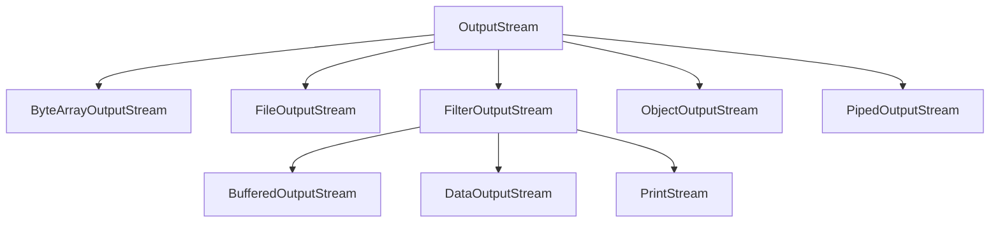

#Java #OutputSrteam
### Потоки вывода, OutputStream ###

2023-11-28 15:42

Стандартная библиотека Java имеет весьма развитые средства вывода данных. Все возможности вывода данных сосредоточены в пакете java.io.

Существуют две параллельные иерархии классов вывода : **OutputStream** и [Writer](https://java-online.ru/java-reader.xhtml). Класс Writer введен в последних версиях Java.

В данной статье рассматривается вопрос использования потоков для вывода данных в файл. Иерархии выходных **OutputStream** потоков представлена на следующем рисунке.
![[OutputStream.png]]

Поток **Stream**- это абстрактное значение источника или приёмника данных, которые способны обрабатывать информацию. Есть два типа потоков: байтовые и символьные. В некоторых ситуациях символьные потоки более эффективны, чем байтовые. Классы, производные от классов **OutputStream** или _Writer_, имеют методы с именами _write()_ для записи одиночных байтов или массива байтов (отвечают за вывод данных).
#### Выходной поток OutputStream ###

Класс **OutputStream** - это абстрактный класс, определяющий байтовый поток вывода. Наследники данного класса определяют куда направлять данные: в массив байтов, в файл или канал. Из массива байт можно создать текстовую строку String.

Методы класса **OutputStream** :

|Метод|Описание|
|---|---|
|void write(int b)|записывает один байт в выходной поток. Аргумент этого метода имеет тип int, что позволяет вызывать write, передавая ему выражение, при этом не нужно выполнять приведение его типа к byte|
|void write(byte b[])| записывает в выходной поток весь указанный массив байтов.|
|void write(byte b[], int off, int len)| записывает в поток len байтов массива, начиная с элемента `b[off]`.|
|void flush() |очищает любые выходные буферы, завершая операцию вывода.|
|void close()| закрывает выходной поток. Последующие попытки записи в этот поток будут возбуждать [IOException](https://java-online.ru/java-interview-03.xhtml).|

