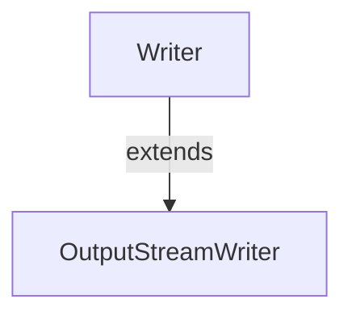

#Java #OutputSrteamWriter
### Класс OutputSrteamWriter ###

2023-12-07 15:01

Класс OutputStreamWriter пакета java.io может использоваться для преобразовыния данных в символьном виде в данные в байтовой форме. 
Он расширяет абстрактный класс [Writer](Writer).

OutputStreamWriter работает с другими выходными потоками. Он также известен как мост между потоками байтов и потоками символов. Это потому, что OutputStreamWriter конвертирует свои символы в байты.

Чтобы создать OutputStreamWriter, мы должны импортировать пакет java.io.OutputStreamWriter.
```java
// Creates an OutputStream
FileOutputStream file = new FileOutputStream(String path); 
// Creates an OutputStreamWriter
OutputStreamWriter output = new OutputStreamWriter(file); 
```
Здесь мы используем кодировку символов по умолчанию для записи символов в выходной поток. Однако мы можем указать тип кодировки символов ( **UTF8** или **UTF16** ), который будет использоваться для записи данных.
```java
// Creates an OutputStream Writer specifying the character encoding 
OutputStreamWriter output = new OutputStreamWriter(file, Charset cs); 
```
Здесь мы использовали `Charset`класс, чтобы указать тип кодировки символов.
#### Методы OutputStreamWriter ####

OutputStreamWriter обеспечивает реализации для различных методов представления в Writer классе.
##### Метод write() #####

- `write()` - пишет в writer один символ
- `write(char() array)` - записывает символы из указанного массива в writer
- `write(String data)` - записывает указанную строку в writer

Пример: OutputStreamWriter для записи данных в файл
```java
import java.io.FileOutputStream;
import java.io.OutputStreamWriter;

public class Main {
  public static void main(String args[]) {
    String data = "This is a line of text inside the file.";
    try {
      // Creates a FileOutputStream
      FileOutputStream file = new FileOutputStream("output.txt");
      // Creates an OutputStreamWriter
      OutputStreamWriter output = new OutputStreamWriter(file);
      // Writes string to the file
      output.write(data);
      // Closes the writer
      output.close();
    }
    catch (Exception e) {
      e.getStackTrace();
    }
  }
}
```
В приведенном выше примере мы создали средство чтения потока вывода, используя поток вывода файла. Средство чтения выходного потока связано с файлом **output.txt** .
```java
FileOutputStream file = new FileOutputStream("output.txt");
OutputStreamWriter output = new OutputStreamWriter(file);
```
Для записи данных в файл мы использовали write() метод.
Здесь, когда мы запускаем программу, файл **output.txt** заполняется следующим содержимым.
<p style="color: yellow">This is a line of text inside the file.</p>
##### Метод getEncoding () #####

Метод getEncoding() может быть использован , чтобы получить тип кодирования, используемый для записи данных в выходной поток. Например,
```java
import java.io.OutputStreamWriter;
import java.nio.charset.Charset;
import java.io.FileOutputStream;

class Main {
  public static void main(String[] args) {
    try {
      // Creates an output stream
      FileOutputStream file = new FileOutputStream("output.txt");
      // Creates an output stream reader with default encoding
      OutputStreamWriter output1 = new OutputStreamWriter(file);
      // Creates an output stream reader specifying the encoding
      OutputStreamWriter output2 = new OutputStreamWriter(file,harset.forName("UTF8"));
      // Returns the character encoding of the output stream
      System.out.println("Character encoding of output1: " + output1.getEncoding());
      System.out.println("Character encoding of output2: " + output2.getEncoding());
      // Closes the reader
      output1.close();
      output2.close();
    }
    catch(Exception e) {
      e.getStackTrace();
    }
  }
}
```
**Вывод**
<p style="background-color: navy; color: yellow">Кодировка символов вывода1: Cp1252<br> Кодировка символов вывода2: UTF8</p>
В приведенном выше примере мы создали 2 модуля записи выходного потока с именами output1 и output2.

- output1 не указывает кодировку символов. Следовательно, `getEncoding()`метод возвращает кодировку символов по умолчанию.
- output2 указывает кодировку символов **UTF8** . Следовательно, `getEncoding()`метод возвращает указанную кодировку символов.

>**Примечание** . Мы использовали этот `Charset.forName()`метод, чтобы указать тип кодировки символов. Чтобы узнать больше, посетите Java Charset (официальная документация по Java).

##### Метод close() #####

Чтобы закрыть средство записи выходного потока, мы можем использовать  метод close(). После вызова close() метода мы не можем использовать средство записи для записи данных.
#### Другие методы OutputStreamWriter

|Метод|Описание|
|---|---|
|`flush()`|заставляет записать все данные, имеющиеся в writer, в соответствующее место назначения|
|`append()`|вставляет указанный символ в текущий writer|

