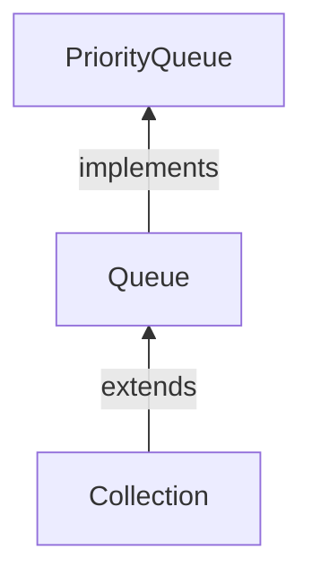

#Java #PriorityQueue
## Java PriorityQueue

2024-04-08 11:30

Реализует интерфейс очереди [Queue](Queue). В отличие от обычных очередей, элементы приоритетной очереди извлекаются в отсортированном порядке.


Предположим, мы хотим извлекать элементы в порядке возрастания. В этом случае главой приоритетной очереди будет наименьший элемент. Как только этот элемент будет извлечен, следующий наименьший элемент будет главой очереди.

Важно отметить, что элементы приоритетной очереди могут не сортироваться. Однако элементы всегда извлекаются в отсортированном порядке.

Чтобы создать приоритетную очередь, мы должны импортировать `java.util.PriorityQueue` пакет.
```java
PriorityQueue<Integer> numbers = new PriorityQueue<>();
```
Здесь мы создали приоритетную очередь без каких-либо аргументов. В этом случае начало приоритетной очереди является наименьшим элементом очереди. И элементы удаляются из очереди в порядке возрастания.

Однако мы можем настроить порядок элементов с помощью [Comparator](Comparator) интерфейса.

### Методы PriorityQueue

`PriorityQueue` Класс обеспечивает реализацию всех методов, присутствующих в [Queue](Queue) интерфейсе.

#### Вставка элементов в PriorityQueue

- `add()` - Вставляет указанный элемент в очередь. Если очередь заполнена, выдается исключение.
- `offer()` - Вставляет указанный элемент в очередь. Если очередь заполнена, он возвращает `false`.

Например,
```java
import java.util.PriorityQueue;

class Main {
    public static void main(String[] args) {
        // Creating a priority queue
        PriorityQueue<Integer> numbers = new PriorityQueue<>();
        // Using the add() method
        numbers.add(4);
        numbers.add(2);
        System.out.println("PriorityQueue: " + numbers);
        // Using the offer() method
        numbers.offer(1);
        System.out.println("Updated PriorityQueue: " + numbers);
    }
}
```
**Вывод**
<p style="background-color: navy; color: yellow">
PriorityQueue: [2, 4]<br>
Updated PriorityQueue: [1, 4, 2]</p>

Здесь мы создали приоритетную очередь с именем numbers. Мы вставили 4 и 2 в очередь.
Хотя 4 вставляется перед 2, начало очереди равно 2. Это потому, что начало приоритетной очереди является наименьшим элементом очереди.
Затем мы вставили 1 в очередь. Теперь очередь изменена, чтобы сохранить наименьший элемент 1 в начале очереди.

#### Доступ к элементам PriorityQueue

Для доступа к элементам из приоритетной очереди мы можем использовать метод peek(). Этот метод возвращает начало очереди. Например,
```java
import java.util.PriorityQueue;

class Main {
    public static void main(String[] args) {
        // Creating a priority queue
        PriorityQueue<Integer> numbers = new PriorityQueue<>();
        numbers.add(4);
        numbers.add(2);
        numbers.add(1);
        System.out.println("PriorityQueue: " + numbers);
        // Using the peek() method
        int number = numbers.peek();
        System.out.println("Accessed Element: " + number);
    }
}
```
**Вывод**
<p style="background-color: navy; color: yellow">
PriorityQueue: [1, 4, 2]<br>
Accessed Element: 1</p>

#### Удалить элементы PriorityQueue

- `remove()` - удаляет указанный элемент из очереди
- `poll()` - возвращает и удаляет начало очереди

Например,
```java
import java.util.PriorityQueue;

class Main {
    public static void main(String[] args) {
        // Creating a priority queue
        PriorityQueue<Integer> numbers = new PriorityQueue<>();
        numbers.add(4);
        numbers.add(2);
        numbers.add(1);
        System.out.println("PriorityQueue: " + numbers);
        // Using the remove() method
        boolean result = numbers.remove(2);
        System.out.println("Is the element 2 removed? " + result);
        // Using the poll() method
        int number = numbers.poll();
        System.out.println("Removed Element Using poll(): " + number);
    }
}
```
**Вывод**
<p style="background-color: navy; color: yellow">
PriorityQueue: [1, 4, 2]<br>
Is the element 2 removed? true<br>
Removed Element Using poll(): 1</p>

#### Выполнение итерации по PriorityQueue

Для перебора элементов приоритетной очереди мы можем использовать метод [iterator()](Iterator). Чтобы использовать этот метод, мы должны импортировать `java.util.Iterator` пакет. Например,
```java
import java.util.PriorityQueue;
import java.util.Iterator;

class Main {
    public static void main(String[] args) {

        // Creating a priority queue
        PriorityQueue<Integer> numbers = new PriorityQueue<>();
        numbers.add(4);
        numbers.add(2);
        numbers.add(1);
        System.out.print("PriorityQueue using iterator(): ");

        //Using the iterator() method
        Iterator<Integer> iterate = numbers.iterator();
        while(iterate.hasNext()) {
            System.out.print(iterate.next());
            System.out.print(", ");
        }
    }
}
```
**Вывод**
<p style="background-color: navy; color: yellow">
PriorityQueue using iterator(): 1, 4, 2,</p>

#### Другие методы PriorityQueue

| Методы              | Описания                                                                                                                               |
| ------------------- | -------------------------------------------------------------------------------------------------------------------------------------- |
| `contains(element)` | Выполняет поиск в очереди приоритетов указанного элемента. Если элемент найден, он возвращает `true`, если нет, то возвращает `false`. |
| `size()`            | Возвращает длину приоритетной очереди.                                                                                                 |
| `toArray()`         | Преобразует очередь приоритетов в массив и возвращает ее.                                                                              |

#### Компаратор PriorityQueue

Во всех приведенных выше примерах элементы приоритетной очереди извлекаются в естественном порядке (по возрастанию). Однако мы можем настроить этот порядок.

Для этого нам нужно создать наш собственный класс-компаратор, который реализует [Comparator](Comparator) интерфейс. Например,
```java
import java.util.PriorityQueue;
import java.util.Comparator;

class Main {
    public static void main(String[] args) {
        // Creating a priority queue
        PriorityQueue<Integer> numbers = new PriorityQueue<>(new CustomComparator());
        numbers.add(4);
        numbers.add(2);
        numbers.add(1);
        numbers.add(3);
        System.out.print("PriorityQueue: " + numbers);
    }
}

class CustomComparator implements Comparator<Integer> {
    @Override
    public int compare(Integer number1, Integer number2) {
        int value =  number1.compareTo(number2);
        // elements are sorted in reverse order
        if (value > 0) {
            return -1;
        }
        else if (value < 0) {
            return 1;
        }
        else {
            return 0;
        }
    }
}
```
**Вывод**
<p style="background-color: navy; color: yellow">
PriorityQueue: [4, 3, 1, 2]</p>

В приведенном выше примере мы создали приоритетную очередь, передающую CustomComparator класс в качестве аргумента.

CustomComparator Класс реализует [Comparator](Comparator) интерфейс.

Затем мы переопределяем метод `compare()`. Теперь метод приводит к тому, что в начале элемента указывается наибольшее число.

Чтобы узнать больше о компараторе, посетите [Java Comparator](https://docs.oracle.com/javase/8/docs/api/java/util/Comparator.html).


