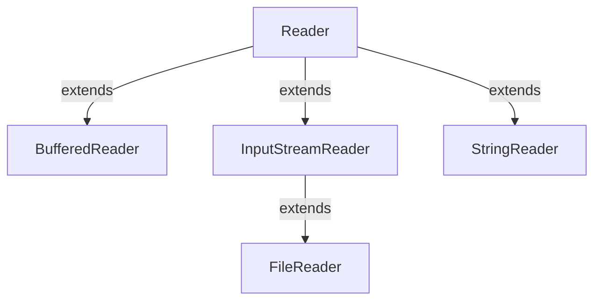

#Java #Reader 
### Класс Reader ###

2023-12-06 11:17

Класс Reader из java.io пакета является абстрактным суперклассом, представляющим поток символов.  Количество

Поскольку Reader является абстрактным классом, сам по себе он бесполезен. Однако его подклассы можно использовать для чтения данных.
#### Подклассы Reader ####

Чтобы использовать функциональность Reader, мы можем использовать его подклассы. Некоторыми из них являются:
- [BufferedReader](BufferedReader)
- [InputStreamReader](InputStreamReader)
- [FileReader](FileReader)
- [StringReader](StringReader)


Чтобы создать программу чтения, мы должны сначала импортировать пакет java.io.Reader.
```java
// Creates a Reader
Reader input = new FileReader();
```
используя класс [FileReader](FileReader). Это потому, что Reader является абстрактным классом. Следовательно, мы не можем создать объект Reader.
#### Методы Reader ####

Класс Reader предоставляет различные методы, которые реализуются его подклассами. Вот некоторые из часто используемых методов:
- ready() - проверяет, готов ли считыватель к чтению 
- read(char[] array) - считывает символы из потока и сохраняет в указанном массиве 
- read(массив char[], int start, int length) - считывает количество символов, равное length, из потока и сохраняет в указанном массиве, начиная с позиции start
- mark() - отмечает позицию в потоке, до которой были считаны данные
- reset() - возвращает элемент управления в точку в потоке, где установлена метка
- skip() - удаляет указанное количество символов из потока

Вот как мы можем реализовать Reader, используя класс [FileReader](FileReader). 

Предположим, у нас есть файл с именем input.txt со следующим содержимым:
<p style="color: yellow">This is a line of text inside the file.</p>
Давайте попробуем прочитать этот файл с помощью [FileReader](FileReader) (подкласс Reader).
```java
import java.io.FileReader;

class Main {
    public static void main(String[] args) {
        // Creates an array of character
        char[] array = new char[100];
        try {
            // Creates a reader using the FileReader
            Reader input = new FileReader("input.txt");
            // Checks if reader is ready 
            System.out.println("Is there data in the stream?  " + input.ready());
            // Reads characters
            input.read(array);
            System.out.println("Data in the stream:");
            System.out.println(array);
            // Closes the reader
            input.close();
        }
        catch(Exception e) {
            e.getStackTrace();
        }
    }
}
```
Вывод
<p style="background-color: navy; color: yellow">Is there data in the stream?  true<br>
Data in the stream:<br>
This is a line of text inside the file.</p>
В приведенном выше примере мы создали reader, используя класс FileReader. Средство чтения связано с файлом input.txt.
```java
Reader input = new FileReader("input.txt");
```
Чтобы прочитать данные из файла input.txt, мы реализовали эти методы.
```java
input.read();       // to read data from the reader
input.close();      // to close the reader
```


