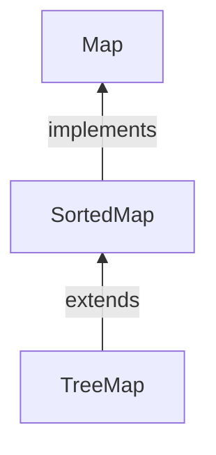

#Java #Map #SortedMap

## Интерфейс Java SortedMap

2024-04-11 12:41

_SortedMap_ - это интерфейс в среде collection Framework. Этот интерфейс расширяет интерфейс [_Map_](Map) и обеспечивает полное упорядочение ее элементов (элементы могут перемещаться в отсортированном порядке ключей). Класс, реализующий этот интерфейс, называется [_TreeMap_](TreeMap).

Основное различие между _SortedMap_ и обычной [_Map_](Map) заключается в том, что элементы в SortedMap хранятся в отсортированном порядке, тогда как в карте элементы хранятся в произвольном порядке. Порядок сортировки определяется естественным порядком ключей, который должен реализовывать интерфейс [_java.lang.Comparable_](Comparable), или компаратором, передаваемым конструктору _SortedMap_.

Поскольку _SortedMap_ это интерфейс, мы не можем создавать объекты на его основе. Чтобы использовать функциональные возможности _SortedMap_ интерфейса, нам нужно использовать класс, [_TreeMap_](TreeMap) который его реализует.



Чтобы использовать _SortedMap_, мы должны сначала импортировать `java.util.SortedMap` пакет. Как только мы импортируем пакет, вот как мы можем создать отсортированную карту.
```java
// SortedMap implementation by TreeMap class
SortedMap<Key, Value> numbers = new TreeMap<>();
```
Мы создали отсортированную карту с именем, numbers используя [_TreeMap_](TreeMap) класс.
Здесь,
- Key - уникальный идентификатор, используемый для связывания каждого элемента (значения) на карте
- Value - элементы, связанные ключами на карте

Здесь мы не использовали никаких аргументов для создания отсортированной карты. Следовательно, карта будет отсортирована естественным образом (в порядке возрастания).

### Методы SortedMap

Интерфейс _SortedMap_ включает в себя все методы [_Map_](Map) интерфейса. Это потому, что `Map` это суперинтерфейс _SortedMap_.

Помимо всех этих методов, вот методы, специфичные для _SortedMap_ интерфейса.
- **comparator()** - возвращает компаратор, который можно использовать для упорядочивания ключей на карте
- **FirstKey()** - возвращает первый ключ отсортированной карты
- **lastKey()** - возвращает последний ключ отсортированной карты
- **headMap(ключ)** - возвращает все элементы карты, ключи которых меньше указанного key
- **tailMap (ключ)** - возвращает все элементы карты, ключи которых больше или равны указанному key
- **Вложенная карта (key1, key2)** - возвращает все элементы карты, ключи которых находятся между key1 и key2 включая key1

## Реализация SortedMap в классе TreeMap

**Пример 1.**
```java
import java.util.SortedMap;
import java.util.TreeMap;

class Main {
    public static void main(String[] args) {
        // Creating SortedMap using TreeMap
        SortedMap<String, Integer> numbers = new TreeMap<>();

        // Insert elements to map
        numbers.put("Two", 2);
        numbers.put("One", 1);
        System.out.println("SortedMap: " + numbers);

        // Access the first key of the map
        System.out.println("First Key: " + numbers.firstKey());

        // Access the last key of the map
        System.out.println("Last Key: " + numbers.lastKey());

        // Remove elements from the map
        int value = numbers.remove("One");
        System.out.println("Removed Value: " + value);
    }
}
```
**Вывод**
<p style="background-color: navy; color: yellow">
SortedMap: {One=1, Two=2}<br>
First Key: One<br>
Last Key: Two<br>
Removed Value: 1</p>
**Пример 2.**
```java
// Java code to demonstrate SortedMap Interface 
import java.util.Iterator; 
import java.util.Map; 
import java.util.Set; 
import java.util.SortedMap; 
import java.util.TreeMap; 
  
public class SortedMapExample { 
    public static void main(String[] args) { 
        SortedMap<Integer, String> sm 
            = new TreeMap<Integer, String>(); 
        sm.put(new Integer(2), "practice"); 
        sm.put(new Integer(3), "quiz"); 
        sm.put(new Integer(5), "code"); 
        sm.put(new Integer(4), "contribute"); 
        sm.put(new Integer(1), "geeksforgeeks"); 
        Set s = sm.entrySet(); 
  
        // Using iterator in SortedMap 
        Iterator i = s.iterator(); 
  
        // Traversing map. Note that the traversal 
        // produced sorted (by keys) output . 
        while (i.hasNext()) { 
            Map.Entry m = (Map.Entry)i.next(); 
  
            int key = (Integer)m.getKey(); 
            String value = (String)m.getValue(); 
  
            System.out.println("Key : " + key + "  value : " + value); 
        } 
    } 
}
```
**Выход**
<p style="background-color: navy; color: yellow">
Key : 1  value : geeksforgeeks<br>
Key : 2  value : practice<br>
Key : 3  value : quiz<br>
Key : 4  value : contribute<br>
Key : 5  value : code</p>

### Преимущества SortedMap:

1. Сортированный порядок: интерфейс _SortedMap_ обеспечивает отсортированный порядок своих элементов на основе естественного порядка его ключей или пользовательского компаратора, переданного конструктору. Это делает его полезным в ситуациях, когда вам нужно получить элементы в определенном порядке.
2. Предсказуемый порядок итерации. Поскольку элементы в _SortedMap_ хранятся в отсортированном порядке, вы можете предсказать порядок, в котором они будут возвращены во время итерации, что упрощает написание алгоритмов, обрабатывающих элементы в определенном порядке.
3. Производительность поиска. Интерфейс _SortedMap_ обеспечивает эффективную реализацию интерфейса [_Map_](Map), позволяя извлекать элементы за логарифмическое время, что делает его полезным в алгоритмах поиска, где необходимо быстро извлекать элементы.

### Недостатки SortedMap:

1. Медленная вставка элементов. Вставка элементов в _SortedMap_ может быть медленнее, чем вставка элементов в обычную [_Map_](Map), поскольку _SortedMap_ необходимо поддерживать отсортированный порядок своих элементов.
2. Ограничение по ключам: ключи в _SortedMap_ должны реализовывать интерфейс [_java.lang.Comparable_](Comparable) или должен быть предоставлен собственный компаратор. Это может быть ограничением, если вам нужно использовать пользовательские ключи, которые не реализуют этот интерфейс.

Чтобы узнать больше, посетите [Java SortedMap (официальная документация Java)](https://docs.oracle.com/javase/7/docs/api/java/util/SortedMap.html).