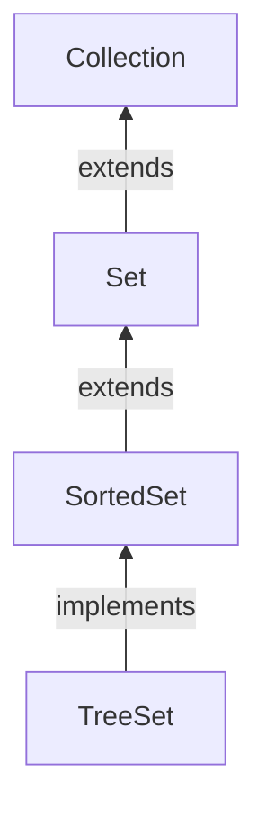

#Java #Collection #SortedSet

## Интерфейс Java SortedSet

2024-04-09 14:14

Интерфейс _SortedSet_ Java collections framework используется для хранения элементов в определенном порядке в наборе.

Он расширяет интерфейс [Set](Set).

Чтобы использовать функциональные возможности _SortedSet_ интерфейса, нам нужно использовать [_TreeSet_](TreeSet) класс, который его реализует. Чтобы использовать функциональные возможности _SortedSet_ интерфейса, нам нужно использовать [_TreeSet_](TreeSet) класс, который его реализует.

Чтобы использовать _SortedSet_, мы должны сначала импортировать `java.util.SortedSet` пакет.
```java
// SortedSet implementation by TreeSet class
SortedSet<String> animals = new TreeSet<>();
```
Мы создали сортированный набор с именем, animals используя [_TreeSet_](TreeSet) класс. Здесь мы не использовали аргументы для создания отсортированного набора. Следовательно, набор будет отсортирован естественным образом.

## Методы SortedSet

 Интерфейс _SortedSet_ включает в себя все методы интерфейса [Set](Set). Это потому, что [_Set_](Set) это суперинтерфейс _SortedSet_.

Помимо методов, включенных в [_Set_](Set) интерфейс, _SortedSet_ интерфейс также включает в себя эти методы:
- **comparator()** - возвращает [компаратор](Comparator), который можно использовать для упорядочивания элементов в наборе
- **first()** - возвращает первый элемент набора
- **last()** - возвращает последний элемент набора
- headSet (element)** - возвращает все элементы набора перед указанным элементом
- **tailSet(element)** - возвращает все элементы набора после указанного элемента, включая указанный элемент
- **subSet(element1, element2)** - возвращает все элементы между element1 и element2, включая element1

### Реализация SortedSet в классе [TreeSet](TreeSet)

```java
import java.util.SortedSet;
import java.util.TreeSet;

class Main {

    public static void main(String[] args) {
        // Creating SortedSet using the TreeSet
        SortedSet<Integer> numbers = new TreeSet<>();

        // Insert elements to the set
        numbers.add(1);
        numbers.add(2);
        numbers.add(3);
        numbers.add(4);
        System.out.println("SortedSet: " + numbers);

        // Access the element
        int firstNumber = numbers.first();
        System.out.println("First Number: " + firstNumber);

        int lastNumber = numbers.last();
        System.out.println("Last Number: " + lastNumber);

        // Remove elements
        boolean result = numbers.remove(2);
        System.out.println("Is the number 2 removed? " + result);
    }
}
```
**Вывод**
<p style="background-color: navy; color: yellow">
SortedSet: [1, 2, 3, 4]<br>
First Number: 1<br>
Last Number: 4<br>
Is the number 2 removed? true</p>

Чтобы узнать больше о [_TreeSet_](TreeSet), посетите [Java TreeSet](https://www.programiz.com/java-programming/treeset "Класс Java TreeSet").
