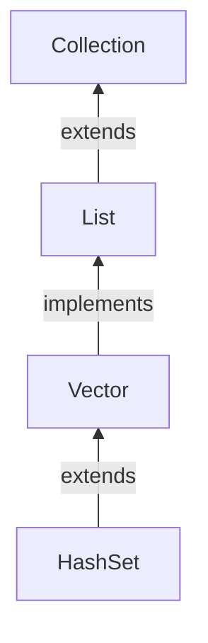

#Java #List #Stack

## Java Stack

2024-04-17 09:53

В Java класс _Stack_ - это класс из Collection Framework, который реализует интерфейс [_List_](List) и расширяет класс [_Vector_](Vector). Он также реализует интерфейсы [[Collections#Интерфейс Java Collection|Collection]], [_Iterable_](Iterable), [_Cloneable_](Cloneable), [_Serializable_](Serializable). Как вы, наверное, уже догадались, этот класс представляет стек объектов LIFO. 

Здесь приведен вызов конструктора класса Stack, то есть создание объекта этого класса.
```java
Stack<E> stack = new Stack<E>();
```
Где E - тип объекта.

### Методы Java Stack

Этот класс имеет только один конструктор по умолчанию и все методы класса [_Vector_](Vector). Кроме того, у _Stack_ есть свои собственные 5 методов:
- boolean empty() - метод проверяет, пуст ли стек или нет. Возвращает _true_, если стек пуст, и _false_, если нет.
- Object peek() - метод возвращает элемент, который находится в верхней части стека.
- Object pop() - метод возвращает элемент, который находится в верхней части стека, и удаляет его.
- Object push(Object element) - этот метод добавляет указанный элемент в верхнюю часть стека.  
- int search(Object element) - метод выполняет поиск в стеке указанного элемента. Если требуемый элемент найден, возвращается его “расстояние” от вершины (серийный номер). Если элемент не найден, возвращается значение -1.

### Пример кода стека

 Мы поместим три "шарика”, оранжевый, фиолетовый и зеленый, в стек. Давайте проверим, нет ли в стеке пустоты. Затем мы будем извлекать шары из стека до тех пор, пока стек не опустеет.
```java
import java.util.Stack;

public class myStackTest2 {
    public static void main(String[] args) {
	    Stack myStack= new Stack<>();

        System.out.println("Is my stack empty? " + myStack.empty());
		// pushing elements into stack
        myStack.push("Orange Ball");
        myStack.push("Violet Ball");
        myStack.push("Green Ball");

		//prints elements of the stack
        System.out.println("Elements in Stack: " + myStack);
        System.out.println("Is my stack empty? " + myStack.empty());
        while (!myStack.isEmpty()) {
	        myStack.pop();
            System.out.println("Elements in Stack: " + myStack);
            System.out.println("Is my stack empty? " + myStack.empty());
        }
    }
}
```
Вот выходные данные этой программы:
<p style="background-color: navy; color: yellow">
Is my stack empty? true<br>
Elements in Stack: [Orange Ball, Violet Ball, Green Ball]<br>
Is my stack empty? false<br>
Elements in Stack: [Orange Ball, Violet Ball]<br>
Is my stack empty? false<br>
Elements in Stack: [Orange Ball]<br>
Is my stack empty? false<br>
Elements in Stack: []<br>
Is my stack empty? true</p>

Поскольку _Stack_ наследуется от класса [_Vector_](Vector) и реализует интерфейс [_List_](List), _Stack_, в дополнение к классическим операциям push и pop для этой структуры данных для добавления и извлечения элементов, также имеет стандартные для структуры списка операции add() и remove(). В нашем примере добавление элементов может быть реализовано таким же образом с использованием метода add(). Однако вы можете извлечь с помощью remove() только с указанным элементом, что не имеет смысла для структуры данных стека.
```java
import java.util.Stack;

public class myStackTest2 {
    public static void main(String[] args) {
	    Stack myStack= new Stack<>();

        System.out.println("Is my stack empty? " + myStack.empty());
		// pushing elements into stack
        myStack.add("Orange Ball");
        myStack.add("Violet Ball");
        myStack.add("Green Ball");

		//prints elements of the stack
        System.out.println("Elements in Stack: " + myStack);
        System.out.println("Is my stack empty? " + myStack.empty());
        while (!myStack.isEmpty()) {
	        myStack.pop();
            System.out.println("Elements in Stack: " + myStack);
            System.out.println("Is my stack empty? " + myStack.empty());
        }
    }
}
```
Результат работы программы, конечно же, будет точно таким же.
### Используйте [ArrayDeque](ArrayDeque) вместо Stack

Фактически, _Stack_ Java, как и его родительский вектор, является устаревшим классом.
Класс _Stack_ обеспечивает прямую реализацию структуры данных стека. Рекомендуется его не использовать. Вместо этого используйте [_ArrayDeque_](ArrayDeque) класс (реализует [_Deque_](Deque) интерфейс) для реализации структуры данных стека в Java.