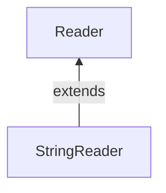

#java #StringReadert 

### Класс StringReader ###

2023-12-08 12:00

Класс StringReader – это простейшая реализация абстрактного класса [Reader](Reader). И практически аналог [FileReader](FileReader). Но, в отличие от него, он работают не с данными в файле на диске, а со строкой ([String](String)) находящейся в памяти Java-машины. **StringReader** – это, фактически, переходник между классом [String](String) и [Reader](Reader).

Чтобы создать файл StringReader, мы должны java.io.StringReader сначала импортировать пакет.
```java
// Creates a StringReader 
StringReader input = new StringReader(String data); 
```
Здесь мы создали объект, `StringReader`который считывает символы из указанной строки с именем data.
#### Методы StringReader ####

Класс StringReader обеспечивает реализации для различных методов представления в классе Reader.

### read () Метод

- `read()` - считывает один символ из считывателя строк
- `read(char() array)` - считывает символы из ридера и сохраняет в указанном массиве
- `read(char() array, int start, int length)` - считывает из ридера количество символов, равное длине, и сохраняет в указанном массиве, начиная с позиции start

```java
import java.io.StringReader;

public class Main {
  public static void main(String[] args) {
    String data = "This is the text read from StringReader.";

    // Create a character array
    char[] array = new char[100];
    try {
      // Create a StringReader
      StringReader input = new StringReader(data);
      //Use the read method
      input.read(array);
      System.out.println("Data read from the string:");
      System.out.println(array);
      input.close();
    }
    catch(Exception e) {
      e.getStackTrace();
    }
  }
}
```
Вывод
<p style="background-color: navy; color: yellow">Data read from the string:<br>
This is the text read from StringReader.</p>
В приведенном выше примере мы создали средство чтения строк с именем input. Считыватель строк связан со строковыми данными.
```java
String data = "This is a text in the string."; 
StringReader input = new StringReader(data);
```
Для чтения данных из строки мы использовали `read()`метод. Здесь метод считывает массив символов из reader и сохраняет в указанном массиве.

##### Метод skip ()  #####

Чтобы отбросить и пропустить указанное количество символов, мы можем использовать метод skip(). Например
```java
import java.io.StringReader;

public class Main {
  public static void main(String[] args) {
    String data = "This is the text read from StringReader";
    System.out.println("Original data: " + data);
    // Create a character array
    char[] array = new char[100];

    try {
      // Create a StringReader
      StringReader input = new StringReader(data);
      // Use the skip() method
      input.skip(5);
      //Use the read method
      input.read(array);
      System.out.println("Data after skipping 5 characters:");
      System.out.println(array);
      input.close();
    }
    catch(Exception e) {
      e.getStackTrace();
    }
  }
}
```
**Вывод**
<p style="background-color: navy; color: yellow">Original data: This is the text read from StringReader<br>
Data after skipping 5 characters:<br>
is the text read from StringReader</p>
##### Метод close () #####

Чтобы закрыть средство чтения строк, мы можем использовать close() метод. После вызова close() метода мы не можем использовать средство чтения для чтения данных из строки.

##### Другие методы StringReader #####

|Метод|Описание|
|---|---|
|`ready()`|проверяет, готов ли считыватель строк к чтению|
|`mark()`|отмечает позицию в считывателе, до которой были прочитаны данные|
|`reset()`|возвращает элемент управления в то место в ридере, где была поставлена ​​отметка|