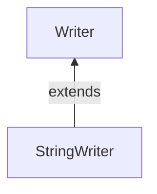

#Java #StringWrite

### Класс StringWrite ###

2023-12-08 14:52

Класс StringWriter – это простейшая реализация абстрактного класса [Writer](Writer). И практически аналог [FileWriter](FileWriter). Но, в отличие от него, он работают не с данными в файле на диске, а со строкой ([String](String)) находящейся в памяти Java-машины. **StringWriter** – это, фактически, переходник между классом [String](String) и [Writer](Writer).

>**Примечание** . В Java строковый буфер считается изменяемой строкой. То есть мы можем изменить строковый буфер. Чтобы преобразовать из строкового буфера в строковый, мы можем использовать `toString()`метод.

Чтобы создать файл StringWriter, мы должны java.io.StringWriter сначала импортировать пакет.
```java
// Creates a StringReader 
StringWriter output = new StringWriter(); 
```
Здесь мы создали средство записи строк с емкостью строкового буфера по умолчанию. Однако мы также можем указать емкость строкового буфера.
```java
// Creates a StringWriter with specified string buffer capacity 
StringWriter output = new StringWriter(int size);
```
Здесь размер определяет емкость строкового буфера.
#### Методы StringWriter ####

Класс StringWriter обеспечивает реализации для различных методов представления в классе [Writer](Writer).

#### Метод write() ####

- `write()` - записывает один символ в writer
- `write(char() array)` - записывает символы из указанного массива в writer
- `write(String data)` - записывает указанную строку в writer

```java
import java.io.StringWriter;

public class Main {
  public static void main(String[] args) {
    String data = "This is the text in the string.";
    try {
      // Create a StringWriter with default string buffer capacity
      StringWriter output = new StringWriter();
      // Writes data to the string buffer
      output.write(data);
      // Prints the string writer
      System.out.println("Data in the StringWriter: " + output);
      output.close();
    }
    catch(Exception e) {
      e.getStackTrace();
    }
  }
}
```
**Вывод**
<p style="background-color: navy; color: yellow">Data in the StringWriter: This is the text in the string.</p> 

В приведенном выше примере мы создали writer с именем output.
```java
StringWriter output = new StringWriter();
```
Затем мы используем этот write() метод для записи строковых данных в строковый буфер.

>**Примечание** . Мы использовали этот toString() метод для получения выходных данных из строкового буфера в строковой форме.

** Доступ к данным из StringBuffer**
- `getBuffer()` - возвращает данные, имеющиеся в строковом буфере
- `toString()` - возвращает данные, имеющиеся в строковом буфере, в виде строки

Например,
```java
import java.io.StringWriter;

public class Main {
  public static void main(String[] args) {
    String data = "This is the original data";
    try {
      // Create a StringWriter with default string buffer capacity
      StringWriter output = new StringWriter();
      // Writes data to the string buffer
      output.write(data);
      // Returns the string buffer
      StringBuffer stringBuffer = output.getBuffer();
      System.out.println("StringBuffer: " + stringBuffer);
      // Returns the string buffer in string form
      String string = output.toString();
      System.out.println("String: " + string);
      output.close();
    }
    catch(Exception e) {
      e.getStackTrace();
    }
  }
}
```
Вывод
<p style="background-color:navy; color: yellow">StringBuffer: This is the original data<br>
String: This is the original data</p>
Здесь мы использовали `getBuffer()`метод для получения данных, присутствующих в строковом буфере. А также метод `toString()`возвращает данные, присутствующие в строковом буфере, в виде строки.

##### Метод close () #####

Чтобы закрыть средство записи строк, мы можем использовать `close()`метод.
Однако этот `close()`метод не действует в `StringWriter`классе. Мы можем использовать методы этого класса даже после вызова `close()`метода.close () Метод

##### Другие методы StringWriter #####

|Метод|Описание|
|---|---|
|`flush()`|заставляет записать все данные, имеющиеся в writer, в строковый буфер|
|`append()`|вставляет указанный символ в текущий writer|

**Пример:** Прочитаем строки, выведем их на экран с разворотом их задом наперед с выводом в объект **writer**. 
Чтение из объекта reader и запись в объект writer:
```java
public static void main (String[] args) throws Exception
{
	//эту строку должен будет прочитать Reader
	String test = "Hi!\n My name is Richard\n I'm a photographer\n";
	//заворачиваем строку в StringReader
	StringReader reader = new StringReader(test);
	//Создаем объект StringWriter
	StringWriter writer = new StringWriter();

	//переписываем строки из Reader во Writer, предварительно развернув их
	executor(reader, writer);
	//получаем текст, который был записан во Writer
	String result = writer.toString();
	//выводем полученный из Writer’а текст на экран
	System.out.println("Результат: "+result);
	
	writer.close();
	reader.close();
}

public static void executor(Reader reader, Writer writer) throws Exception
{
	String line;
	BufferedReader br = new BufferedReader(reader);
	while ((line = br.readLine()) != null) {
		//разворачиваем строку задом наперед
		StringBuilder sb = new StringBuilder(line);
		String newLine = sb.reverse().toString();
		//пишем строку в Writer
		writer.write(newLine);
	}
} 
```
Вывод
<p style="background-color:navy; color: yellow">!iHdrahciR si eman yM rehpargotohp a m'I</p>
Создание Reader из String
```java
String s = "data";
Reader reader = new StringReader(s);
```
Получение String из Writer
```java
Writer writer = new StringWriter();
/*тут пишем кучу данных во writer */
String result = writer.toString();
```