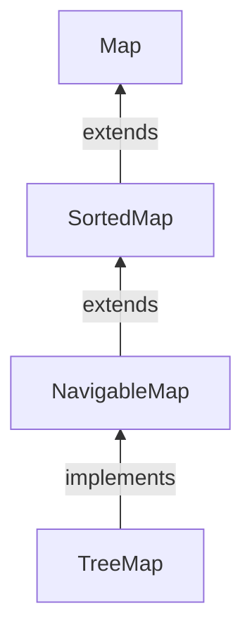

#Java #Map #TreeMap

## Класс TreeMap

2024-04-10 14:58

Класс _TreeMap_ Java collections framework обеспечивает реализацию древовидной структуры данных. Он реализует интерфейс [_NavigableMap_](NavigableMap).


### Особенности TreeMap

Некоторые важные функции _TreeMap_ заключаются в следующем:

1. Этот класс является членом платформы Java Collections.
2. Класс реализует интерфейсы [_Map_](Map), включая [_NavigableMap_](NavigableMap), [_SortedMap_](SortedMap) и расширяет класс _AbstractMap_.
3. _TreeMap_ в Java не допускает нулевых ключей (например, [_Map_](Map)) и, следовательно, возникает [исключение NullPointerException](https://www.geeksforgeeks.org/null-pointer-exception-in-java/). Однако несколько нулевых значений могут быть связаны с разными ключами.
4. Пары элементов, возвращаемые методами этого класса и его представлениями, представляют моментальные снимки отображений на момент их создания. Они не поддерживают метод [Entry.setValue](https://www.geeksforgeeks.org/map-entry-interface-java-example/).

Теперь давайте продвинемся вперед и обсудим синхронизированную древовидную карту. Реализация древовидной карты не синхронизирована. Это означает, что если несколько потоков обращаются к набору дерева одновременно, и хотя бы один из потоков изменяет набор, он должен быть синхронизирован извне. Обычно это достигается с помощью [коллекций.Метод synchronizedSortedMap](https://www.geeksforgeeks.org/collections-synchronizedsortedmap-method-in-java-with-examples/). Это лучше всего делать во время создания, чтобы предотвратить случайный несинхронизированный доступ к набору. Это можно сделать следующим образом:
```java
SortedMap m = Collections.synchronizedSortedMap(new TreeMap(...)); 
```
### Создание TreeMap

Чтобы создать _TreeMap_, мы должны сначала импортировать `java.util.TreeMap` пакет. Как только мы импортируем пакет, вот как мы можем создать _TreeMap_ на Java.
```java
TreeMap<Key, Value> numbers = new TreeMap<>();
```
В приведенном выше коде мы создали _TreeMap_ без каких-либо аргументов. В этом случае элементы в _TreeMap_ отсортированы естественным образом (в порядке возрастания).

Однако мы можем настроить сортировку элементов с помощью [_Comparator_](Comparator) интерфейса. 
Здесь,
- Key - уникальный идентификатор, используемый для связывания каждого элемента (значения) на map
- Value - элементы, связанные ключами в map

### Конструкторы в TreeMap

Чтобы создать _TreeMap_, нам нужно создать объект класса _TreeMap_. Класс _TreeMap_ состоит из различных конструкторов. Ниже приведены конструкторы, доступные в этом классе:
1. TreeMap()
2. TreeMap(Comparator comp)
3. TreeMap(Map M)
4. TreeMap([SortedMap](SortedMap) sm)

Давайте обсудим их по отдельности наряду с реализацией каждого конструктора следующим образом:

**Конструктор 1:** TreeMap()

Этот конструктор используется для создания пустой древовидной карты, которая будет отсортирована с использованием естественного порядка ее ключей.

**Пример**
```java
// Java Program to Demonstrate TreeMap
// using the Default Constructor
// Importing required classes
import java.util.*;
import java.util.concurrent.*;
 
// Main class
// TreeMapImplementation
public class GFG {
    // Method 1
    // To show TreeMap constructor
    static void Example1stConstructor() {
        // Creating an empty TreeMap
        TreeMap<Integer, String> tree_map = new TreeMap<Integer, String>();
 
        // Mapping string values to int keys
        // using put() method
        tree_map.put(10, "Geeks");
        tree_map.put(15, "4");
        tree_map.put(20, "Geeks");
        tree_map.put(25, "Welcomes");
        tree_map.put(30, "You");
 
        // Printing the elements of TreeMap
        System.out.println("TreeMap: " + tree_map);
    }
 
    // Method 2
    // Main driver method
    public static void main(String[] args)
    {
        System.out.println("TreeMap using " + "TreeMap() constructor:\n");
        // Calling constructor
        Example1stConstructor();
    }
}
```
**Вывод**
<p style="background-color: navy; color: yellow">
TreeMap using TreeMap() constructor:<br>
TreeMap: {10=Geeks, 15=4, 20=Geeks, 25=Welcomes, 30=You}</p>

**Конструктор 2:** TreeMap(Comparator comp)

Этот конструктор используется для создания пустого объекта TreeMap, в котором элементам потребуется внешняя спецификация порядка сортировки.

**Пример**
```java
// Java Program to Demonstrate TreeMap
// using Comparator Constructor
// Importing required classes
import java.util.*;
import java.util.concurrent.*;
 
// Class 1
// Helper class representing Student
class Student {
    // Attributes of a student
    int rollno;
    String name, address;
 
    // Constructor
    public Student(int rollno, String name, String address) {
        // This keyword refers to current object itself
        this.rollno = rollno;
        this.name = name;
        this.address = address;
    }
 
    // Method of this class
    // To print student details
    public String toString() {
        return this.rollno + " " + this.name + " "
            + this.address;
    }
}
 
// Class 2
// Helper class - Comparator implementation
class Sortbyroll implements Comparator<Student> {
    // Used for sorting in ascending order of
    // roll number
    public int compare(Student a, Student b) {
        return a.rollno - b.rollno;
    }
}
 
// Class 3
// Main class
public class GFG {
    // Calling constructor inside main()
    static void Example2ndConstructor() {
        // Creating an empty TreeMap
        TreeMap<Student, Integer> tree_map
            = new TreeMap<Student, Integer>(
                new Sortbyroll());
 
        // Mapping string values to int keys
        tree_map.put(new Student(111, "bbbb", "london"), 2);
        tree_map.put(new Student(131, "aaaa", "nyc"), 3);
        tree_map.put(new Student(121, "cccc", "jaipur"), 1);
 
        // Printing the elements of TreeMap
        System.out.println("TreeMap: " + tree_map);
    }
 
    // Main driver method
    public static void main(String[] args) {
        System.out.println("TreeMap using " + "TreeMap(Comparator)"
                           + " constructor:\n");
        Example2ndConstructor();
    }
}
```
**Вывод**
<p style="background-color: navy; color: yellow">
TreeMap using TreeMap(Comparator) constructor:<br>
TreeMap: {111 bbbb london=2, 121 cccc jaipur=1, 131 aaaa nyc=3}</p>

**Конструктор 3:** TreeMap(Map M)

Этот конструктор используется для инициализации TreeMap записями из заданной карты M, которые будут отсортированы с использованием естественного порядка ключей.

**Пример**
```java
// Java Program to Demonstrate TreeMap
// using the Default Constructor
// Importing required classes
import java.util.*;
import java.util.concurrent.*;
 
// Main class
public class TreeMapImplementation {
    // Method 1
    // To illustrate constructor<Map>
    static void Example3rdConstructor() {
        // Creating an empty HashMap
        Map<Integer, String> hash_map = new HashMap<Integer, String>();
 
        // Mapping string values to int keys
        // using put() method
        hash_map.put(10, "Geeks");
        hash_map.put(15, "4");
        hash_map.put(20, "Geeks");
        hash_map.put(25, "Welcomes");
        hash_map.put(30, "You");
 
        // Creating the TreeMap using the Map
        TreeMap<Integer, String> tree_map = new TreeMap<Integer, String>(hash_map);
        // Printing the elements of TreeMap
        System.out.println("TreeMap: " + tree_map);
    }
 
    // Method 2
    // Main driver method
    public static void main(String[] args) {
        System.out.println("TreeMap using " + "TreeMap(Map)" + " constructor:\n");
        Example3rdConstructor();
    }
}
```
**Вывод**
<p style="background-color: navy; color: yellow">
TreeMap using TreeMap(Map) constructor:<br>
TreeMap: {10=Geeks, 15=4, 20=Geeks, 25=Welcomes, 30=You}</p>

**Конструктор 4:** TreeMap(SortedMap sm)

Этот конструктор используется для инициализации TreeMap записями из данной отсортированной карты, которые будут храниться в том же порядке, что и данная отсортированная карта.

**Пример**
```java
// Java Program to Demonstrate TreeMap
// using the SortedMap Constructor
// Importing required classes
import java.util.*;
import java.util.concurrent.*;
 
// Main class
// TreeMapImplementation
public class GFG {
    // Method
    // To show TreeMap(SortedMap) constructor
    static void Example4thConstructor() {
        // Creating a SortedMap
        SortedMap<Integer, String> sorted_map
            = new ConcurrentSkipListMap<Integer, String>();
 
        // Mapping string values to int keys
        // using put() method
        sorted_map.put(10, "Geeks");
        sorted_map.put(15, "4");
        sorted_map.put(20, "Geeks");
        sorted_map.put(25, "Welcomes");
        sorted_map.put(30, "You");
 
        // Creating the TreeMap using the SortedMap
        TreeMap<Integer, String> tree_map
		     = new TreeMap<Integer, String>(sorted_map);
 
        // Printing the elements of TreeMap
        System.out.println("TreeMap: " + tree_map);
    }
 
    // Method 2
    // Main driver method
    public static void main(String[] args) {
        System.out.println("TreeMap using " + "TreeMap(SortedMap)"
		    + " constructor:\n");
        Example4thConstructor();
    }
}
```
**Вывод**
<p style="background-color: navy; color: yellow">
TreeMap using TreeMap(SortedMap) constructor:<br>
TreeMap: {10=Geeks, 15=4, 20=Geeks, 25=Welcomes, 30=You}</p>

#### Вставка элементов в TreeMap

- `put()` - вставляет указанное отображение ключа / значения (запись) на карту
- `putAll()` - вставляет все записи с указанной карты в эту карту
- `putIfAbsent()` - вставляет указанное сопоставление ключа / значения на карту, если указанный ключ отсутствует на карте

Например
```java
import java.util.TreeMap;

class Main {
    public static void main(String[] args) {
        // Creating TreeMap of even numbers
        TreeMap<String, Integer> evenNumbers = new TreeMap<>();

        // Using put()
        evenNumbers.put("Two", 2);
        evenNumbers.put("Four", 4);

        // Using putIfAbsent()
        evenNumbers.putIfAbsent("Six", 6);
        System.out.println("TreeMap of even numbers: " + evenNumbers);

        //Creating TreeMap of numbers
        TreeMap<String, Integer> numbers = new TreeMap<>();
        numbers.put("One", 1);

        // Using putAll()
        numbers.putAll(evenNumbers);
        System.out.println("TreeMap of numbers: " + numbers);
    }
}
```
**Вывод**
<p style="background-color: navy; color: yellow">
TreeMap of even numbers: {Four=4, Six=6, Two=2}<br>
TreeMap of numbers: {Four=4, One=1, Six=6, Two=2}</p>

#### Доступ к элементам TreeMap

**1. Использование entrySet(), keySet() и values()**
- `entrySet()` - возвращает набор всех отображений ключей / значений (запись) treemap
- `keySet()` - возвращает набор всех ключей древовидной карты
- `values()` - возвращает набор всех карт древовидной карты

Например,
```java
import java.util.TreeMap;

class Main {
    public static void main(String[] args) {
        TreeMap<String, Integer> numbers = new TreeMap<>();

        numbers.put("One", 1);
        numbers.put("Two", 2);
        numbers.put("Three", 3);
        System.out.println("TreeMap: " + numbers);

        // Using entrySet()
        System.out.println("Key/Value mappings: " + numbers.entrySet());

        // Using keySet()
        System.out.println("Keys: " + numbers.keySet());

        // Using values()
        System.out.println("Values: " + numbers.values());
    }
}
```
**Вывод**
<p style="background-color: navy; color: yellow">
TreeMap: {One=1, Three=3, Two=2}<br>
Key/Value mappings: [One=1, Three=3, Two=2]<br>
Keys: [One, Three, Two]<br>
Values: [1, 3, 2]</p>

**2. Использование get() и getOrDefault()**
- `get()` - Возвращает значение, связанное с указанным ключом. Возвращает null, если ключ не найден.
- `getOrDefault()` - Возвращает значение, связанное с указанным ключом. Возвращает указанное значение по умолчанию, если ключ не найден.

Например,
```java
import java.util.TreeMap;

class Main {
    public static void main(String[] args) {
        TreeMap<String, Integer> numbers = new TreeMap<>();
        numbers.put("One", 1);
        numbers.put("Two", 2);
        numbers.put("Three", 3);
        System.out.println("TreeMap: " + numbers);

        // Using get()
        int value1 = numbers.get("Three");
        System.out.println("Using get(): " + value1);

        // Using getOrDefault()
        int value2 = numbers.getOrDefault("Five", 5);
        System.out.println("Using getOrDefault(): " + value2);
    }
}
```
**Output**
<p style="background-color: navy; color: yellow">
TreeMap: {One=1, Three=3, Two=2}<br>
Using get(): 3<br>
Using getOrDefault(): 5</p>

Здесь метод  `getOrDefault()` не находит ключа Five. Следовательно, он возвращает указанное значение по умолчанию 5

### Удалить элементы TeeMap

- `remove(key)` - возвращает и удаляет запись, связанную с указанным ключом, из _TreeMap_
- `remove(key, value)` - удаляет запись с карты, только если указанный ключ связан с указанным значением и возвращает логическое значение

Например,
```java
import java.util.TreeMap;

class Main {
    public static void main(String[] args) {
        TreeMap<String, Integer> numbers = new TreeMap<>();
        numbers.put("One", 1);
        numbers.put("Two", 2);
        numbers.put("Three", 3);
        System.out.println("TreeMap: " + numbers);

        // remove method with single parameter
        int value = numbers.remove("Two");
        System.out.println("Removed value: " + value);

        // remove method with two parameters
        boolean result = numbers.remove("Three", 3);
        System.out.println("Is the entry {Three=3} removed? " + result);

        System.out.println("Updated TreeMap: " + numbers);
    }
}
```
**Вывод**
<p style="background-color: navy; color: yellow">
TreeMap: {One=1, Three=3, Two=2}<br>
Removed value = 2<br>
Is the entry {Three=3} removed? True<br>
Updated TreeMap: {One=1}</p>

#### Замена элементов древовидной карты

- `replace(key, value)` - заменяет значение , сопоставленное указанному key , на новое value
- `replace(key, old, new)` - заменяет старое значение новым значением, только если старое значение уже связано с указанным ключом
- `replaceAll(function)` - заменяет каждое значение карты результатом указанного function

Например,
```java
import java.util.TreeMap;

class Main {
    public static void main(String[] args) {

        TreeMap<String, Integer> numbers = new TreeMap<>();
        numbers.put("First", 1);
        numbers.put("Second", 2);
        numbers.put("Third", 3);
        System.out.println("Original TreeMap: " + numbers);

        // Using replace()
        numbers.replace("Second", 22);
        numbers.replace("Third", 3, 33);
        System.out.println("TreeMap using replace: " + numbers);

        // Using replaceAll()
        numbers.replaceAll((key, oldValue) -> oldValue + 2);
        System.out.println("TreeMap using replaceAll: " + numbers);
    }
}
```
**Вывод**
<p style="background-color: navy; color: yellow">
Original TreeMap: {First=1, Second=2, Third=3}<br>
TreeMap using replace(): {First=1, Second=22, Third=33}<br>
TreeMap using replaceAll(): {First=3, Second=24, Third=35}</p>

В приведенной выше программе обратите внимание на инструкцию
```java
numbers.replaceAll((key, oldValue) -> oldValue + 2);
```
Здесь мы передали [лямбда-выражение](Lambda) в качестве аргумента.

Метод `replaceAll()` обращается ко всем элементам карты. Затем он заменяет все элементы новыми значениями (возвращаемыми из [лямбда-выражения](Lambda)).

### Методы навигации

Поскольку _TreeMap_ класс реализует _NavigableMap_, он предоставляет различные методы для навигации по элементам treemap.

#### 1. Первый и последний методы

- `firstKey()` - возвращает первый ключ карты
- `firstEntry()` - возвращает сопоставление ключа / значения первого ключа карты
- `lastKey()` - возвращает последний ключ карты
- `lastEntry()` - возвращает сопоставление ключа / значения последнего ключа карты

Например,
```java
import java.util.TreeMap;

class Main {
    public static void main(String[] args) {
        TreeMap<String, Integer> numbers = new TreeMap<>();
        numbers.put("First", 1);
        numbers.put("Second", 2);
        numbers.put("Third", 3);
        System.out.println("TreeMap: " + numbers);

        // Using the firstKey() method
        String firstKey = numbers.firstKey();
        System.out.println("First Key: " + firstKey);

        // Using the lastKey() method
        String lastKey = numbers.lastKey();
        System.out.println("Last Key: " + lastKey);

        // Using firstEntry() method
        System.out.println("First Entry: " + numbers.firstEntry());


        // Using the lastEntry() method
        System.out.println("Last Entry: " + numbers.lastEntry());
    }
}
```
**Вывод**
<p style="background-color: navy; color: yellow">
TreeMap: {First=1, Second=2, Third=3}<br>
First Key: First<br>
Last Key: Third<br>
First Entry: First=1<br>
Last Entry: Third=3</p>

#### 2. Методы Ceiling, Floor, Higher и Lower

- **higherKey()** - возвращает младший ключ среди тех ключей, которые больше указанного ключа.
- **higherEntry()** - возвращает запись, связанную с ключом, который является наименьшим среди всех ключей, превышающих указанный ключ.
- **lowerKey()** - Возвращает наибольший ключ среди всех тех ключей, которые меньше указанного ключа.
- **lowerEntry()** - возвращает запись, связанную с ключом, который является наибольшим среди всех тех ключей, которые меньше указанного ключа.
- **ceilingKey()** - возвращает младший ключ среди тех ключей, которые больше указанного ключа. Если ключ, переданный в качестве аргумента, присутствует в карте, он возвращает этот ключ.
- **ceilingEntry()** - возвращает запись, связанную с ключом, который является наименьшим среди тех ключей, которые больше указанного ключа. Если в карте присутствует запись, связанная с ключом, переданным аргументом, она возвращает запись, связанную с этим ключом.
- **floorKey()** - возвращает наибольший ключ среди тех ключей, которые меньше указанного ключа. Если ключ, переданный в качестве аргумента, присутствует, он возвращает этот ключ.
- **floorEntry()** - возвращает запись, связанную с ключом, который является наибольшим среди тех ключей, которые меньше указанного ключа. Если ключ, переданный в качестве аргумента, присутствует, он возвращает этот ключ.

Например,
```java
import java.util.TreeMap;

class Main {
    public static void main(String[] args) {

        TreeMap<String, Integer> numbers = new TreeMap<>();
        numbers.put("First", 1);
        numbers.put("Second", 5);
        numbers.put("Third", 4);
        numbers.put("Fourth", 6);
        System.out.println("TreeMap: " + numbers);

        // Using higher()
        System.out.println("Using higherKey(): " + numbers.higherKey("Fourth"));
        System.out.println("Using higherEntry(): " + numbers.higherEntry("Fourth"));

        // Using lower()
        System.out.println("\nUsing lowerKey(): " + numbers.lowerKey("Fourth"));
        System.out.println("Using lowerEntry(): " + numbers.lowerEntry("Fourth"));

        // Using ceiling()
        System.out.println("\nUsing ceilingKey(): " + numbers.ceilingKey("Fourth"));
        System.out.println("Using ceilingEntry(): " + numbers.ceilingEntry("Fourth"));

        // Using floor()
        System.out.println("\nUsing floorKey(): " + numbers.floorKey("Fourth"));
        System.out.println("Using floorEntry(): " + numbers.floorEntry("Fourth"));
    }
}
```
**Вывод**
<p style="background-color: navy; color: yellow">
TreeMap: {First=1, Fourth=6, Second=5, Third=4}<br>
Using higherKey(): Second<br>
Using higherEntry(): Second=5<br>
<br>
Using lowerKey(): First<br>
Using lowerEntry(): First=1<br>
<br>
Using ceilingKey(): Fourth<br>
Using ceilingEntry(): Fourth=6<br>
<br>
Using floorkey(): Fourth<br>
Using floorEntry(): Fourth=6</p>

#### 3. Методы pollFirstEntry() и pollLastEntry()

- `pollFirstEntry()` - возвращает и удаляет запись, связанную с первым ключом карты
- `pollLastEntry()` - возвращает и удаляет запись, связанную с последним ключом карты

Например,
```java
import java.util.TreeMap;

class Main {
    public static void main(String[] args) {
        TreeMap<String, Integer> numbers = new TreeMap<>();
        numbers.put("First", 1);
        numbers.put("Second", 2);
        numbers.put("Third", 3);
        System.out.println("TreeMap: " + numbers);

        //Using the pollFirstEntry() method
        System.out.println("Using pollFirstEntry(): " + numbers.pollFirstEntry());

        // Using the pollLastEntry() method
        System.out.println("Using pollLastEntry(): " + numbers.pollLastEntry());

        System.out.println("Updated TreeMap: " + numbers);
    }
}
```
**Вывод**
<p style="background-color: navy; color: yellow">
TreeMap: {First=1, Second=2, Third=3}<br>
Using pollFirstEntry(): First=1<br>
Using pollLastEntry(): Third=3<br>
Updated TreeMap: {Second=2}</p>

#### 4. Методы headMap(), tailMap() и subMap()

**headMap (ключ, логическое значение)**

Метод `headMap()` возвращает все пары ключ / значение TreeMap до указанной key (которая передается в качестве аргумента).

Параметр booleanValue необязателен. Его значение по умолчанию - `false`.

Если `true` передается как booleanValue, метод также включает пару ключ / значение `key`, которая передается в качестве аргумента.

Например,
```java
import java.util.TreeMap;

class Main {
    public static void main(String[] args) {
        TreeMap<String, Integer> numbers = new TreeMap<>();
        numbers.put("First", 1);
        numbers.put("Second", 2);
        numbers.put("Third", 3);
        numbers.put("Fourth", 4);
        System.out.println("TreeMap: " + numbers);

        System.out.println("\nUsing headMap() Method:");
        // Using headMap() with default booleanValue
        System.out.println("Without boolean value: " + numbers.headMap("Fourth"));

        // Using headMap() with specified booleanValue
        System.out.println("With boolean value: " + numbers.headMap("Fourth", true));
    }
}
```
**Вывод**
<p style="background-color: navy; color: yellow">
TreeMap: {First=1, Fourth=4, Second=2, Third=3}<br>
<br>
Using headMap() Method: <br>
Without boolean value: {First=1}<br>
With boolean value: {First=1, Fourth=4}</p>

**tailMap (key, booleanValue)**
Метод `tailMap()` возвращает все пары ключ / значение _TreeMap_, начиная с указанной key (которая передается в качестве аргумента).
booleanValue является необязательным параметром. 
Его значение по умолчанию равно `true`.

Если `false` передается как booleanValue, метод не включает указанную пару ключ / значение `key`.

Например,
```java
import java.util.TreeMap;

class Main {
    public static void main(String[] args) {
        TreeMap<String, Integer> numbers = new TreeMap<>();
        numbers.put("First", 1);
        numbers.put("Second", 2);
        numbers.put("Third", 3);
        numbers.put("Fourth", 4);
        System.out.println("TreeMap: " + numbers);

        System.out.println("\nUsing tailMap() Method:");
        // Using tailMap() with default booleanValue
        System.out.println("Without boolean value: " + numbers.tailMap("Second"));

        // Using tailMap() with specified booleanValue
        System.out.println("With boolean value: " + numbers.tailMap("Second", false));
    }
}
```
**Вывод**
<p style="background-color: navy; color: yellow">
TreeMap: {First=1, Fourth=4, Second=2, Third=3}<br>
<br>
Using tailMap() Method:<br>
Without boolean value: {Second=2, Third=3}<br>
With boolean value: {Third=3}</p>


**subMap(k1, bV1, k2, bV2)**

Метод `subMap()` возвращает все записи, связанные с ключами между k1 и k2 , включая запись k1.

bV1 И bV2 являются необязательными логическими параметрами. Значение по умолчанию bV1 равно `true`, а значение по умолчанию bV2 равно `false`.

Если `false` передается как bV1, метод возвращает все записи, связанные с ключами между k1 и k2, не включая запись k1.

Если `true` передается как bV2, метод возвращает все записи, связанные с ключами между k1 и k2, включая запись k2.

Например,
```java
import java.util.TreeMap;

class Main {
    public static void main(String[] args) {
        TreeMap<String, Integer> numbers = new TreeMap<>();
        numbers.put("First", 1);
        numbers.put("Second", 2);
        numbers.put("Third", 3);
        numbers.put("Fourth", 4);
        System.out.println("TreeMap: " + numbers);

        System.out.println("\nUsing subMap() Method:");
        // Using subMap() with default booleanValue
        System.out.println("Without boolean value: " + numbers.subMap("Fourth", "Third"));

        // Using subMap() with specified booleanValue
        System.out.println("With boolean value: " + numbers.subMap("Fourth", false, "Third", true));
    }
}
```
**Вывод**
<p style="background-color: navy; color: yellow">
TreeMap: {First=1, Fourth=2, Second=2, Third=3}<br>
<br>
Using subMap() Method:<br>
Without boolean value: {Fourth=4, Second=2}<br>
With boolean value: {Second=2, Third=3}</p>

#### Другие методы работы с TreeMap

| Метод             | Описание                                                                          |
| ----------------- | --------------------------------------------------------------------------------- |
| `clone()`         | Создает копию _TreeMap_                                                           |
| `containsKey()`   | Выполняет поиск в _TreeMap_ указанного ключа и возвращает логический результат    |
| `containsValue()` | Выполняет поиск в _TreeMap_ указанного значения и возвращает логический результат |
| `size()`          | Возвращает размер _TreeMap_                                                       |
| `clear()`         | Удаляет все записи из _TreeMap_                                                   |

### Компаратор TreeMap

Во всех приведенных выше примерах элементы древовидной карты отсортированы естественным образом (в порядке возрастания). Однако мы также можем настроить порядок ключей.

Для этого нам нужно создать наш собственный класс comparator, основанный на том, какие ключи в treemap сортируются. Например,
```java
import java.util.TreeMap;
import java.util.Comparator;

class Main {
    public static void main(String[] args) {
        // Creating a treemap with a customized comparator
        TreeMap<String, Integer> numbers = new TreeMap<>(new CustomComparator());

        numbers.put("First", 1);
        numbers.put("Second", 2);
        numbers.put("Third", 3);
        numbers.put("Fourth", 4);
        System.out.println("TreeMap: " + numbers);
    }

    // Creating a comparator class
    public static class CustomComparator implements Comparator<String> {
        @Override
        public int compare(String number1, String number2) {
            int value =  number1.compareTo(number2);

            // elements are sorted in reverse order
            if (value > 0) {
                return -1;
            }
            else if (value < 0) {
                return 1;
            }
            else {
                return 0;
            }
        }
    }
}
```
**Вывод**
<p style="background-color: navy; color: yellow">
TreeMap: {Third=3, Second=2, Fourth=4, First=1}</p>


В приведенном выше примере мы создали _TreeMap_, передающую CustomComparator класс в качестве аргумента.
Класс CustomComparator реализует интерфейс [_Comparator_](Comparator).
Затем мы переопределяем метод `compare()` для сортировки элементов в обратном порядке.

Чтобы узнать больше, посетите [Java Comparator (официальная документация Java)](https://docs.oracle.com/javase/8/docs/api/java/util/Comparator.html).

### Преимущества TreeMap:

1. Порядок сортировки: _TreeMap_ предоставляет упорядоченный порядок своих элементов, основанный на естественном порядке ее ключей или пользовательском компараторе, переданном конструктору. Это делает ее полезной в ситуациях, когда вам нужно извлекать элементы в определенном порядке.
2. Предсказуемый порядок итерации: поскольку элементы в древовидной карте хранятся в отсортированном порядке, вы можете предсказать порядок, в котором они будут возвращены во время итерации, что упрощает написание алгоритмов, обрабатывающих элементы в определенном порядке.
3. Производительность поиска: _TreeMap_ обеспечивает эффективную реализацию интерфейса [_Map_](Map), позволяя вам извлекать элементы за логарифмическое время, что делает ее полезной в алгоритмах поиска, где вам нужно быстро извлекать элементы.
4. Самобалансирующаяся: _TreeMap_ реализована с использованием красно-черного дерева, которое является разновидностью самобалансирующегося бинарного дерева поиска. Это обеспечивает эффективную производительность при добавлении, удалении и извлечении элементов, а также поддерживает упорядоченный порядок элементов.

### Недостатки TreeMap:

1. Медленная вставка элементов: Вставка элементов в _TreeMap_ может быть медленнее, чем вставка элементов в обычную карту, поскольку _TreeMap_ должна поддерживать упорядоченный порядок своих элементов.
2. Ограничение по ключам: ключи в _TreeMap_ должны реализовывать [java.lang.Comparable](Comparable) интерфейс или должен быть предоставлен пользовательский [компаратор](Comparator). Это может быть ограничением, если вам нужно использовать пользовательские ключи, которые не реализуют этот интерфейс.

