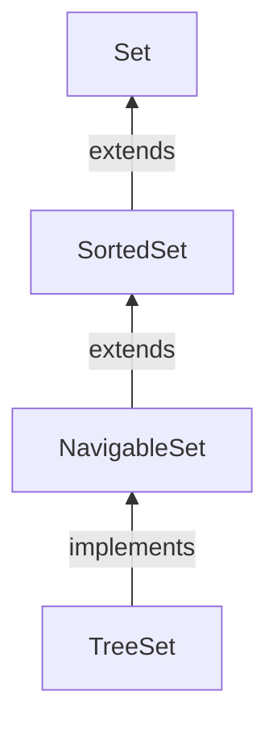

#Java #Collection #TreeSet

## Java TreeSet

2024-04-09 14:57

Класс _TreeSet_ Java collections framework обеспечивает функциональность древовидной структуры данных. Он расширяет интерфейс [_NavigableSet_](NavigableSet). 


### Создание TreeSet

Чтобы создать _TreeSet_, мы должны сначала импортировать `java.util.TreeSet` пакет.
Как только мы импортируем пакет, вот как мы можем создать _TreeSet_ в Java.
```java
TreeSet<Integer> numbers = new TreeSet<>();
```
Здесь мы создали _TreeSet_ без каких-либо аргументов. В этом случае элементы в _TreeSet_ отсортированы естественным образом (в порядке возрастания).

Однако мы можем настроить сортировку элементов с помощью интерфейса [Comparator](Comparator). 

### Методы TreeSet

Класс _TreeSet_ предоставляет различные методы, которые позволяют нам выполнять различные операции над набором.

### Вставка элементов в TreeSet

- `add()` - вставляет указанный элемент в набор
- `addAll()` - вставляет все элементы указанной коллекции в set

Например,
```java
import java.util.TreeSet;

class Main {
    public static void main(String[] args) {

        TreeSet<Integer> evenNumbers = new TreeSet<>();

        // Using the add() method
        evenNumbers.add(2);
        evenNumbers.add(4);
        evenNumbers.add(6);
        System.out.println("TreeSet: " + evenNumbers);

        TreeSet<Integer> numbers = new TreeSet<>();
        numbers.add(1);

        // Using the addAll() method
        numbers.addAll(evenNumbers);
        System.out.println("New TreeSet: " + numbers);
    }
}
```
**Вывод**
<p style="background-color: navy; color: yellow">
TreeSet: [2, 4, 6]<br>
New TreeSet: [1, 2, 4, 6]</p>

#### Доступ к элементам TreeSet

Для доступа к элементам _TreeSet_ мы можем использовать метод [iterator()](Iterator). Чтобы использовать этот метод, мы должны импортировать `java.util.Iterator` пакет. Например,
```java
import java.util.TreeSet;
import java.util.Iterator;

class Main {
    public static void main(String[] args) {
        TreeSet<Integer> numbers = new TreeSet<>();
        numbers.add(2);
        numbers.add(5);
        numbers.add(6);
        System.out.println("TreeSet: " + numbers);

        // Calling iterator() method
        Iterator<Integer> iterate = numbers.iterator();
        System.out.print("TreeSet using Iterator: ");
        // Accessing elements
        while(iterate.hasNext()) {
            System.out.print(iterate.next());
            System.out.print(", ");
        }
    }
}
```
**Вывод**
<p style="background-color: navy; color: yellow">
TreeSet: [2, 5, 6]<br>
TreeSet using Iterator: 2, 5, 6,</p>

#### Удалить элементы

- `remove()` - удаляет указанный элемент из набора
- `removeAll()` - удаляет все элементы из набора
Например,
```java
import java.util.TreeSet;

class Main {
    public static void main(String[] args) {
        TreeSet<Integer> numbers = new TreeSet<>();
        numbers.add(2);
        numbers.add(5);
        numbers.add(6);
        System.out.println("TreeSet: " + numbers);

        // Using the remove() method
        boolean value1 = numbers.remove(5);
        System.out.println("Is 5 removed? " + value1);

        // Using the removeAll() method
        boolean value2 = numbers.removeAll(numbers);
        System.out.println("Are all elements removed? " + value2);
    }
}
```
**Вывод**
<p style="background-color: navy; color: yellow">
TreeSet: [2, 5, 6]<br>
Is 5 removed? true<br>
Are all elements removed? true</p>

#### Методы навигации

Поскольку _TreeSet_ класс реализует [_NavigableSet_](NavigableSet), он предоставляет различные методы для навигации по элементам набора деревьев.

#### 1. Методы first() и last()

- `first()` - возвращает первый элемент набора
- `last()` - возвращает последний элемент набора

Например,
```java
import java.util.TreeSet;

class Main {
    public static void main(String[] args) {
        TreeSet<Integer> numbers = new TreeSet<>();
        numbers.add(2);
        numbers.add(5);
        numbers.add(6);
        System.out.println("TreeSet: " + numbers);

        // Using the first() method
        int first = numbers.first();
        System.out.println("First Number: " + first);

        // Using the last() method
        int last = numbers.last();
        System.out.println("Last Number: " + last);
    }
}
```
**Вывод**
<p style="background-color: navy; color: yellow">
TreeSet: [2, 5, 6]<br>
First Number: 2<br>
Last Number: 6</p>

#### 2. Методы ceiling(), floor(), higher() и lower()

- **higher(element)** - возвращает наименьший элемент среди тех элементов, которые больше указанного `element`.
- **lower(element)** - возвращает наибольший элемент среди тех элементов, которые меньше указанного `element`.
- **ceiling(element)** - возвращает наименьший элемент среди тех элементов, которые больше указанного element. Если element переданное существует в древовидном наборе, оно возвращает `element` переданное в качестве аргумента.
- **floor(element)** - возвращает наибольший элемент среди тех элементов, которые меньше указанного `element`. Если element переданное существует в древовидном наборе, оно возвращает `element` переданное в качестве аргумента.

Например,
```java
import java.util.TreeSet;

class Main {
    public static void main(String[] args) {
        TreeSet<Integer> numbers = new TreeSet<>();
        numbers.add(2);
        numbers.add(5);
        numbers.add(4);
        numbers.add(6);
        System.out.println("TreeSet: " + numbers);
        // Using higher()
        System.out.println("Using higher: " + numbers.higher(4));
        // Using lower()
        System.out.println("Using lower: " + numbers.lower(4));
        // Using ceiling()
        System.out.println("Using ceiling: " + numbers.ceiling(4));
        // Using floor()
        System.out.println("Using floor: " + numbers.floor(3));
    }
}
```
**Вывод**
<p style="background-color: navy; color: yellow">
TreeSet: [2, 4, 5, 6]<br>
Using higher: 5<br>
Using lower: 2<br>
Using ceiling: 4<br>
Using floor: 2</p>

#### 3. Методы pollfirst() и pollLast()

- `pollFirst()` - возвращает и удаляет первый элемент из набора
- `pollLast()` - возвращает и удаляет последний элемент из набора

Например,
```java
import java.util.TreeSet;

class Main {
    public static void main(String[] args) {
        TreeSet<Integer> numbers = new TreeSet<>();
        numbers.add(2);
        numbers.add(5);
        numbers.add(4);
        numbers.add(6);
        System.out.println("TreeSet: " + numbers);

        // Using pollFirst()
        System.out.println("Removed First Element: " + numbers.pollFirst());

        // Using pollLast()
        System.out.println("Removed Last Element: " + numbers.pollLast());

        System.out.println("New TreeSet: " + numbers);
    }
}
```
**Вывод**
<p style="background-color: navy; color: yellow">
TreeSet: [2, 4, 5, 6]<br>
Removed First Element: 2<br>
Removed Last Element: 6<br>
New TreeSet: [4, 5]</p>

#### 4. Методы headSet(), tailSet() и subSet()

#### headSet (element, booleanValue)

Метод `headSet()` возвращает все элементы дерева, установленные до указанного element (который передается в качестве аргумента).

Параметр booleanValue необязателен. Его значение по умолчанию - `false`.

Если `true` передается как booleanValue, метод возвращает все элементы перед указанным элементом, включая указанный элемент.

Например,
```java
import java.util.TreeSet;

class Main {
    public static void main(String[] args) {
        TreeSet<Integer> numbers = new TreeSet<>();
        numbers.add(2);
        numbers.add(5);
        numbers.add(4);
        numbers.add(6);
        System.out.println("TreeSet: " + numbers);

        // Using headSet() with default boolean value
        System.out.println("Using headSet without boolean value: " + numbers.headSet(5));

        // Using headSet() with specified boolean value
        System.out.println("Using headSet with boolean value: " + numbers.headSet(5, true));
    }
}
```
**Вывод**
<p style="background-color: navy; color: yellow">
TreeSet: [2, 4, 5, 6]<br>
Using headSet without boolean value: [2, 4]<br>
Using headSet with boolean value: [2, 4, 5]</p>

#### tailSet(element, booleanValue)

Метод `tailSet()` возвращает все элементы набора деревьев после указанного element (который передается в качестве параметра), включая указанный element.

Параметр booleanValue необязателен. Его значение по умолчанию - `true`.

Если `false` передается как booleanValue, метод возвращает все элементы после указанного element, не включая указанный element.

Например,
```java
import java.util.TreeSet;

class Main {
    public static void main(String[] args) {
        TreeSet<Integer> numbers = new TreeSet<>();
        numbers.add(2);
        numbers.add(5);
        numbers.add(4);
        numbers.add(6);
        System.out.println("TreeSet: " + numbers);

        // Using tailSet() with default boolean value
        System.out.println("Using tailSet without boolean value: " + numbers.tailSet(4));

        // Using tailSet() with specified boolean value
        System.out.println("Using tailSet with boolean value: " + numbers.tailSet(4, false));
    }
}
```
**Вывод**
<p style="background-color: navy; color: yellow">
TreeSet: [2, 4, 5, 6]<br>
Using tailSet without boolean value: [4, 5, 6]<br>
Using tailSet with boolean value: [5, 6]</p>

#### subSet (e1, bv1, e2, bv2)

`subSet()` Метод возвращает все элементы между e1 и e2 включая e1.

bv1 И bv2 являются необязательными параметрами. Значение по умолчанию bv1 равно `true`, а значение по умолчанию bv2 равно `false`.

Если `false` передается как bv1, метод возвращает все элементы между e1 и e2 без включения `e1`.

Если `true` передается как bv2, метод возвращает все элементы между e1 и e2, включая e1.

Например,
```java
import java.util.TreeSet;

class Main {
    public static void main(String[] args) {
        TreeSet<Integer> numbers = new TreeSet<>();
        numbers.add(2);
        numbers.add(5);
        numbers.add(4);
        numbers.add(6);
        System.out.println("TreeSet: " + numbers);

        // Using subSet() with default boolean value
        System.out.println("Using subSet without boolean value: " + numbers.subSet(4, 6));

        // Using subSet() with specified boolean value
        System.out.println("Using subSet with boolean value: " + numbers.subSet(4, false, 6, true));
    }
}
```
**Вывод**
<p style="background-color: navy; color: yellow">
TreeSet: [2, 4, 5, 6]<br>
Using subSet without boolean value: [4, 5]<br>
Using subSet with boolean value: [5, 6]</p>

### Операции с наборами

Методы класса _TreeSet_ также могут использоваться для выполнения различных операций с множествами.

#### Объединение множеств

Для выполнения объединения между двумя наборами мы используем метод `addAll()`. Например,
```java
import java.util.TreeSet;;

class Main {
    public static void main(String[] args) {
        TreeSet<Integer> evenNumbers = new TreeSet<>();
        evenNumbers.add(2);
        evenNumbers.add(4);
        System.out.println("TreeSet1: " + evenNumbers);

        TreeSet<Integer> numbers = new TreeSet<>();
        numbers.add(1);
        numbers.add(2);
        numbers.add(3);
        System.out.println("TreeSet2: " + numbers);

        // Union of two sets
        numbers.addAll(evenNumbers);
        System.out.println("Union is: " + numbers);

    }
}
```
**Вывод**
<p style="background-color: navy; color: yellow">
TreeSet1: [2, 4]<br>
TreeSet2: [1, 2, 3]<br>
Union is: [1, 2, 3, 4]</p>

#### Пересечение множеств

Чтобы выполнить пересечение между двумя наборами, мы используем метод `retainAll()`. Например,
```java
import java.util.TreeSet;;

class Main {
    public static void main(String[] args) {
        TreeSet<Integer> evenNumbers = new TreeSet<>();
        evenNumbers.add(2);
        evenNumbers.add(4);
        System.out.println("TreeSet1: " + evenNumbers);

        TreeSet<Integer> numbers = new TreeSet<>();
        numbers.add(1);
        numbers.add(2);
        numbers.add(3);
        System.out.println("TreeSet2: " + numbers);

        // Intersection of two sets
        numbers.retainAll(evenNumbers);
        System.out.println("Intersection is: " + numbers);
    }
}
```
**Вывод**
<p style="background-color: navy; color: yellow">
TreeSet1: [2, 4]<br>
TreeSet2: [1, 2, 3]<br>
Intersection is: [2]</p>

#### Разница в наборах

Чтобы вычислить разницу между двумя наборами, мы можем использовать метод `removeAll()`. Например,
```java
import java.util.TreeSet;;

class Main {
    public static void main(String[] args) {
        TreeSet<Integer> evenNumbers = new TreeSet<>();
        evenNumbers.add(2);
        evenNumbers.add(4);
        System.out.println("TreeSet1: " + evenNumbers);

        TreeSet<Integer> numbers = new TreeSet<>();
        numbers.add(1);
        numbers.add(2);
        numbers.add(3);
        numbers.add(4);
        System.out.println("TreeSet2: " + numbers);

        // Difference between two sets
        numbers.removeAll(evenNumbers);
        System.out.println("Difference is: " + numbers);
    }
}
```
**Вывод**
<p style="background-color: navy; color: yellow">
TreeSet1: [2, 4]<br>
TreeSet2: [1, 2, 3, 4<br>]
Difference is: [1, 3]</p>

#### Подмножество набора

Чтобы проверить, является ли набор подмножеством другого набора или нет, мы используем метод `containsAll()`. Например,
```java
import java.util.TreeSet;

class Main {
    public static void main(String[] args) {
        TreeSet<Integer> numbers = new TreeSet<>();
        numbers.add(1);
        numbers.add(2);
        numbers.add(3);
        numbers.add(4);
        System.out.println("TreeSet1: " + numbers);

        TreeSet<Integer> primeNumbers = new TreeSet<>();
        primeNumbers.add(2);
        primeNumbers.add(3);
        System.out.println("TreeSet2: " + primeNumbers);

        // Check if primeNumbers is subset of numbers
        boolean result = numbers.containsAll(primeNumbers);
        System.out.println("Is TreeSet2 subset of TreeSet1? " + result);
    }
}
```
**Вывод**
<p style="background-color: navy; color: yellow">
TreeSet1: [1, 2, 3, 4]<br>
TreeSet2: [2, 3]<br>
Is TreeSet2 subset of TreeSet1? True</p>

#### Другие методы TreeSet

| Метод        | Описание                                                                          |
| ------------ | --------------------------------------------------------------------------------- |
| `clone()`    | Создает копию _TreeSet_                                                           |
| `contains()` | Выполняет поиск в _TreeSet_ указанного элемента и возвращает логический результат |
| `isEmpty()`  | Проверяет, является ли _TreeSet_ пустым                                           |
| `size()`     | Возвращает размер _TreeSet_                                                       |
| `clear()`    | Удаляет все элементы из _TreeSet_                                                 |

Чтобы узнать больше, посетите [Java TreeSet (официальная документация Java)](https://docs.oracle.com/javase/7/docs/api/java/util/TreeSet.html).

### Сравнение TreeSet с [HashSet](HashSet)

Как в _TreeSet_, так и в [_HashSet_](HashSet) реализует [_Set_](Set) интерфейс. Однако между ними существуют некоторые различия.
- В отличие от [_HashSet_](HashSet), элементы в _TreeSet_ хранятся в определенном порядке. Это потому, что _TreeSet_ также реализует [_SortedSet_](SortedSet) интерфейс.
- _TreeSet_ предоставляет некоторые методы для удобной навигации. Например, `first()`, `last()`, `headSet(`), `tailSet()` и т.д. Это потому, что _TreeSet_ также реализует _NavigableSet_ интерфейс.
- [_HashSet_](HashSet) работает быстрее, чем _TreeSet_ для базовых операций, таких как добавление, удаление, содержит и размер.

### [Компаратор](Comparator) TreeSet

Во всех приведенных выше примерах элементы _TreeSet_ отсортированы естественным образом. Однако мы также можем настроить порядок элементов.

Для этого нам нужно создать наш собственный класс [Comparator](Comparator), основанный на том, какие элементы в _TreeSet_ сортируются. Например,
```java
import java.util.TreeSet;
import java.util.Comparator;

class Main {
    public static void main(String[] args) {

        // Creating a tree set with a customized comparator
        TreeSet<String> animals = new TreeSet<>(new CustomComparator());

        animals.add("Dog");
        animals.add("Zebra");
        animals.add("Cat");
        animals.add("Horse");
        System.out.println("TreeSet: " + animals);
    }

    // Creating a comparator class
    public static class CustomComparator implements Comparator<String> {

        @Override
        public int compare(String animal1, String animal2) {
            int value =  animal1.compareTo(animal2);

            // elements are sorted in reverse order
            if (value > 0) {
                return -1;
            }
            else if (value < 0) {
                return 1;
            }
            else {
                return 0;
            }
        }
    }
}
```
**Вывод**
<p style="background-color: navy; color: yellow">
TreeSet: [Zebra, Horse, Dog, Cat]</p>

В приведенном выше примере мы создали _TreeSet_, передающий CustomComparator класс в качестве аргумента.

CustomComparator Класс реализует [_Comparator_](Comparator) интерфейс.

Затем мы переопределяем метод `compare()`. Теперь метод будет сортировать элементы в обратном порядке.

Чтобы узнать больше, посетите [Java Comparator (официальная документация Java)](https://docs.oracle.com/javase/8/docs/api/java/util/Comparator.html).