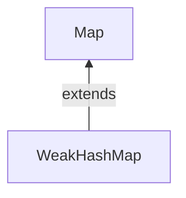

#Java #Map #HashMap #WeakHashMap

## Java WeakHashMap

2024-04-15 10:09

Класс _WeakHashMap_ — реализация хеширования, которая содержит [[TypeReference#Weak Reference|_WeakReference_]] для своих ключей. Запись в _WeakHashMap_ будет автоматически удалена, когда ее ключ больше не используется в обычном режиме, а это означает, что нет ни одной ссылки, указывающей на этот ключ. Когда процесс сборки мусора (GC) отбрасывает ключ, его запись фактически удаляется из карты, поэтому этот класс ведет себя несколько иначе, чем другие реализации [_Map_](Map). Как и [_HashMap_](HashMap), он также поддерживает null ключ и null значения.
Он реализует [интерфейс карты](Map).

Мы можем создать _WeakHashMap_, используя один из доступных конструкторов:
- **WeakHashMap()**: создает пустой _WeakHashMap_ с емкостью по умолчанию (16) и коэффициентом загрузки по умолчанию (0,75).
- **WeakHashMap(int initialCapacity)**: создает пустой _WeakHashMap_ с заданной емкостью и коэффициентом загрузки по умолчанию.
- **WeakHashMap(int initialCapacity, float loadFactor)**: использует заданную начальную емкость и коэффициент загрузки для создания экземпляра _WeakHashMap_.
- **WeakHashMap`(Map <? Extends K, extends V> map)`**: создает новый _WeakHashMap_ с теми же отображениями, что и указанная карта

### Создайте WeakHashMap

Чтобы создать _WeakHashMap_, мы должны сначала импортировать `java.util.WeakHashMap` пакет. Как только мы импортируем пакет, вот как мы можем создавать _WeakHashMap_ в Java.
```java
//WeakHashMap creation with capacity 8 and load factor 0.6
WeakHashMap<Key, Value> numbers = new WeakHashMap<>(8, 0.6);
```
В приведенном выше коде мы создали слабую хэш-карту с именем numbers.
Здесь,
- Key - уникальный идентификатор, используемый для связывания каждого элемента (значения) на карте
- Value - элементы, связанные ключами на карте

Обратите внимание на часть `new WeakHashMap<>(8, 0.6)`. Здесь первым параметром является **емкость**, а вторым параметром является **loadFactor**.
- **емкость** - емкость этой карты равна 8. Это означает, что она может хранить 8 записей.
- **loadFactor** - коэффициент загрузки этой карты равен 0.6. Это означает, что всякий раз, когда наша хэш-таблица заполняется на 60%, записи перемещаются в новую хэш-таблицу вдвое большего размера, чем исходная хэш-таблица.

**Емкость и коэффициент загрузки по умолчанию**

Можно создать _WeakHashMap_ без определения ее емкости и коэффициента загрузки. Например,
```java
// WeakHashMap with default capacity and load factor
WeakHashMap<Key, Value> numbers1 = new WeakHashMap<>();
```
По умолчанию,
- объем карты составит 16
- коэффициент загрузки будет равен 0.75

### Различия между HashMap и WeakHashMap

Давайте посмотрим на реализацию _WeakHashMap_ в Java.
```java
import java.util.WeakHashMap;

class Main {
    public static void main(String[] args) {
        // Creating WeakHashMap of numbers
        WeakHashMap<String, Integer> numbers = new WeakHashMap<>();

        String two = new String("Two");
        Integer twoValue = 2;
        String four = new String("Four");
        Integer fourValue = 4;

        // Inserting elements
        numbers.put(two, twoValue);
        numbers.put(four, fourValue);
        System.out.println("WeakHashMap: " + numbers);

        // Make the reference null
        two = null;

        // Perform garbage collection
        System.gc();

        System.out.println("WeakHashMap after garbage collection: " + numbers);
    }
}
```
**Вывод**
<p style="background-color: navy; color: yellow">
WeakHashMap: {Four=4, Two=2}<br>
WeakHashMap after garbage collection: {Four}</p>

Как мы можем видеть, когда ключу two _WeakHashMap_ присваивается значение `null` и выполняется сборка мусора, ключ удаляется.

Это потому, что в отличие от [_HashMap_](HashMap), ключи _WeakHashMap_ имеют **слабый ссылочный** тип. Это означает, что запись карты удаляется сборщиком мусора, если ключ к этой записи больше не используется. Это полезно для экономии ресурсов.

Теперь давайте посмотрим на ту же реализацию в HashMap.
```java
import java.util.HashMap;

class Main {
    public static void main(String[] args) {
        // Creating HashMap of even numbers
        HashMap<String, Integer> numbers = new HashMap<>();

        String two = new String("Two");
        Integer twoValue = 2;
        String four = new String("Four");
        Integer fourValue = 4;

        // Inserting elements
        numbers.put(two, twoValue);
        numbers.put(four, fourValue);
        System.out.println("HashMap: " + numbers);

        // Make the reference null
        two = null;

        // Perform garbage collection
        System.gc();

        System.out.println("HashMap after garbage collection: " + numbers);
    }
}
```
**Вывод**
<p style="background-color: navy; color: yellow">
HashMap: {Four=4, Two=2}<br>
HashMap after garbage collection: {Four=4, Two=2}</p>

Здесь, когда ключу two [_HashMap_](HashMap) присваивается значение `null` и выполняется сборка мусора, ключ не удаляется.

Это связано с тем, что, в отличие от _WeakHashMap_, ключи [_HashMap_](HashMap) имеют **сильный ссылочный** тип. Это означает, что запись карты не удаляется сборщиком мусора, даже если ключ к этой записи больше не используется.

**Примечание**: Все функциональные возможности [_HashMap_](HashMap) и _WeakHashMap_ аналогичны, за исключением того, что ключи _WeakHashMap_ имеют слабую ссылку, тогда как ключи [_HashMap_](HashMap) имеют сильную ссылку.

### Создание WeakHashMap из других карт

Вот как мы можем создать _WeakHashMap_ из других карт.
```java
import java.util.HashMap;
import java.util.WeakHashMap;

class Main {
    public static void main(String[] args) {
        // Creating a hashmap of even numbers
        HashMap<String, Integer> evenNumbers = new HashMap<>();

        String two = new String("Two");
        Integer twoValue = 2;
        evenNumbers.put(two, twoValue);
        System.out.println("HashMap: " + evenNumbers);

        // Creating a weak hash map from other hashmap
        WeakHashMap<String, Integer> numbers = new WeakHashMap<>(evenNumbers);

        System.out.println("WeakHashMap: " + numbers);
    }
}
```
**Вывод**
<p style="background-color: navy; color: yellow">
HashMap: {Two=2}<br>
WeakHashMap: {Two=2}</p>

### Методы WeakHashMap

Класс _WeakHashMap_ предоставляет методы, которые позволяют нам выполнять различные операции над картой.

#### Вставка элементов в WeakHashMap

- `put()` - вставляет указанное сопоставление ключа / значения в карту
- `putAll()` - вставляет все записи с указанной карты на эту карту
- `putIfAbsent()` - вставляет указанное сопоставление ключа / значения на карту, если указанный ключ отсутствует на карте

Например,
```java
import java.util.WeakHashMap;

class Main {
    public static void main(String[] args) {
        // Creating WeakHashMap of even numbers
        WeakHashMap<String, Integer> evenNumbers = new WeakHashMap<>();

        String two = new String("Two");
        Integer twoValue = 2;

        // Using put()
        evenNumbers.put(two, twoValue);

        String four = new String("Four");
        Integer fourValue = 4;

        // Using putIfAbsent()
        evenNumbers.putIfAbsent(four, fourValue);
        System.out.println("WeakHashMap of even numbers: " + evenNumbers);

        //Creating WeakHashMap of numbers
        WeakHashMap<String, Integer> numbers = new WeakHashMap<>();

        String one = new String("One");
        Integer oneValue = 1;
        numbers.put(one, oneValue);

        // Using putAll()
        numbers.putAll(evenNumbers);
        System.out.println("WeakHashMap of numbers: " + numbers);
    }
}
```
**Вывод**
<p style="background-color: navy; color: yellow">
WeakHashMap of even numbers: {Four=4, Two=2}<br>
WeakHashMap of numbers: {Two=2, Four=4, One=1}</p>

#### Доступ к элементам WeakHashMap

**1. Использование entrySet(), keySet() и values()**
- `entrySet()` - возвращает набор всех сопоставлений ключей и значений карты
- `keySet()` - возвращает набор всех ключей карты
- `values()` - возвращает набор всех значений карты

Например,
```java
import java.util.WeakHashMap;

class Main {
    public static void main(String[] args) {
        // Creating WeakHashMap of even numbers
        WeakHashMap<String, Integer> numbers = new WeakHashMap<>();

        String one = new String("One");
        Integer oneValue = 1;
        numbers.put(one, oneValue);

        String two = new String("Two");
        Integer twoValue = 2;
        numbers.put(two, twoValue);

        System.out.println("WeakHashMap: " + numbers);

        // Using entrySet()
        System.out.println("Key/Value mappings: " + numbers.entrySet());

        // Using keySet()
        System.out.println("Keys: " + numbers.keySet());

        // Using values()
        System.out.println("Values: " + numbers.values());
    }
}
```
**Вывод**
<p style="background-color: navy; color: yellow">
WeakHashMap: {Two=2, One=1}<br>
Key/Value mappings: [Two=2, One=1]<br>
Keys: [Two, One]<br>
Values: [1, 2]</p>

**2. Использование get() и getOrDefault()**
- `get()` - Возвращает значение, связанное с указанным ключом. Возвращает `null`, если ключ не найден.
- `getOrDefault()` - Возвращает значение, связанное с указанным ключом. Возвращает указанное значение по умолчанию, если ключ не найден.

Например,
```java
import java.util.WeakHashMap;

class Main {
    public static void main(String[] args) {
        // Creating WeakHashMap of even numbers
        WeakHashMap<String, Integer> numbers = new WeakHashMap<>();

        String one = new String("One");
        Integer oneValue = 1;
        numbers.put(one, oneValue);

        String two = new String("Two");
        Integer twoValue = 2;
        numbers.put(two, twoValue);

        System.out.println("WeakHashMap: " + numbers);

        // Using get()
        int value1 = numbers.get("Two");
        System.out.println("Using get(): " + value1);

        // Using getOrDefault()
        int value2 = numbers.getOrDefault("Four", 4);
        System.out.println("Using getOrDefault(): " + value2);

    }
}
```
**Вывод**
<p style="background-color: navy; color: yellow">
WeakHashMap: {Two=2, One=1}<br>
Using get(): 2<br>
Using getOrDefault(): 4</p>

#### Удалить элементы WeakHashMap

- `remove(key)` - возвращает и удаляет запись, связанную с указанным ключом, с карты
- `remove(key, value)` - удаляет запись с карты только в том случае, если указанный ключ сопоставлен с указанным значением и возвращает логическое значение

Например,
```java
import java.util.WeakHashMap;

class Main {
    public static void main(String[] args) {
        // Creating WeakHashMap of even numbers
        WeakHashMap<String, Integer> numbers = new WeakHashMap<>();

        String one = new String("One");
        Integer oneValue = 1;
        numbers.put(one, oneValue);

        String two = new String("Two");
        Integer twoValue = 2;
        numbers.put(two, twoValue);

        System.out.println("WeakHashMap: " + numbers);

        // Using remove() with single parameter
        int value = numbers.remove("Two");
        System.out.println("Removed value: " + value);

        // Using remove() with 2 parameters
        boolean result = numbers.remove("One", 3);
        System.out.println("Is the entry {One=3} removed? " + result);

        System.out.println("Updated WeakHashMap: " + numbers);
    }
}
```
**Вывод**
<p style="background-color: navy; color: yellow">
WeakHashMap: {Two=2, One=1}<br>
Removed value: 2<br>
Is the entry {One=3} removed? false<br>
Updated WeakHashMap: {One=1}</p>

### Другие методы WeakHashMap

| Метод             | Описание                                                                          |
| ----------------- | --------------------------------------------------------------------------------- |
| `clear()`         | Удаляет все записи с карты                                                        |
| `containsKey()`   | Проверяет, содержит ли карта указанный ключ, и возвращает логическое значение     |
| `containsValue()` | Проверяет, содержит ли карта указанное значение, и возвращает логическое значение |
| `size()`          | Возвращает размер карты                                                           |
| `isEmpty()`       | Проверяет, пуста ли карта, и возвращает логическое значение                       |

### Сравнение [HashMap](HashMap) и WeakHashMap

Важные различия между [_HashMap_](HashMap) и _WeakHashMap_:

| HashMap                                                                                                                                     | WeakHashMap                                                                                                 |
| ------------------------------------------------------------------------------------------------------------------------------------------- | ----------------------------------------------------------------------------------------------------------- |
| Сохраненный объект записи не подходит для сборки мусора                                                                                     | Запись в _WeakHashMap_ будет автоматически удалена, когда ее ключ потеряет все сильные и мягкие ссылки      |
| [_HashMap_](HashMap) содержит сильные ссылки для своих ключевых объектов                                                                    | Слабые ссылки на ключи хранятся в случае _WeakHashMap_                                                      |
| Метод size () всегда будет возвращать одно и то же значение, если только мы явно не добавим или не удалим записи                            | Метод size () может возвращать меньшее значение, поскольку GC может автоматически удалять несколько записей |
| [_HashMap_](HashMap) реализует интерфейс [_Cloneable_](Cloneable), и его метод clone () возвращает поверхностную копию [_HashMap_](HashMap) | Не реализует [_Cloneable_](Cloneable)                                                                       |
| Реализует интерфейс [_Serializable_](Serializable)                                                                                          | Не поддерживает сериализацию                                                                                |
