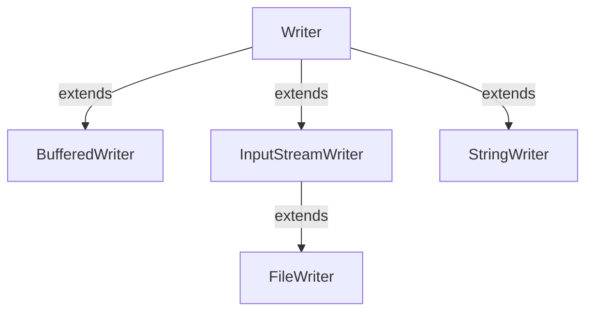

#Java #Writer
### Класс Writer ###

2023-12-06 11:59

Класс Writer из java.io пакета - это абстрактный суперкласс, представляющий поток символов. Поскольку Writer является абстрактным классом, сам по себе он бесполезен. Однако его подклассы можно использовать для записи данных.

Чтобы использовать функциональность Writer, мы можем использовать его подклассы. Некоторые из них: 
- BufferedWriter
- OutputStreamWriter 
- FileWriter
- StringWriter


Чтобы создать Writer, мы должны сначала импортировать пакет java.io.Writer.
```java
// Creates a Writer
Writer output = new FileWriter();
```
Здесь мы создали writer с именем output, используя класс FileWriter. Это потому, что Writer является абстрактным классом. Следовательно, мы не можем создать объект Writer.
#### Методы Writer ####

Класс Writer предоставляет различные методы, которые реализуются его подклассами. Вот некоторые из методов:
- write(char[] array) - записывает символы из указанного массива в выходной поток 
- write(String data) - записывает указанную строку в writer 
- append(char c) - вставляет указанный символ в текущий writer
- flush() - принудительно записывает все данные, присутствующие в writer в соответствующее место назначения
- close() - закрывает программу записи

Вот как мы можем реализовать Writer, используя класс FileWriter.
```java
import java.io.FileWriter;
import java.io.Writer;

public class Main {
    public static void main(String args[]) {
        String data = "This is the data in the output file";
        try {
            // Creates a Writer using FileWriter
            Writer output = new FileWriter("output.txt");
            // Writes string to the file
            output.write(data);
            // Closes the writer
            output.close();
        }
        catch (Exception e) {
            e.getStackTrace();
        }
    }
}
```
В приведенном выше примере мы создали writer, используя класс FileWriter. writer связано с файлом output.txt.
```java
Writer output = new FileWriter("output.txt");
```
Чтобы записать данные в файл output.txt, мы реализовали эти методы.
```java
output.write();      // To write data to the file
output.close();      // To close the writer
```
Когда мы запускаем программу, файл output.txt заполняется следующим содержимым.
<p style="color: yellow">This is a line of text inside the file.</p>
